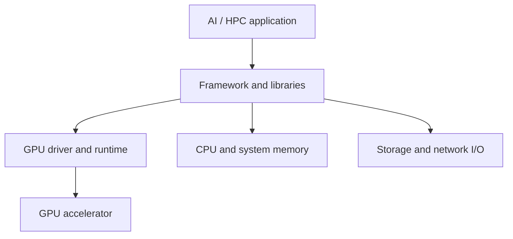
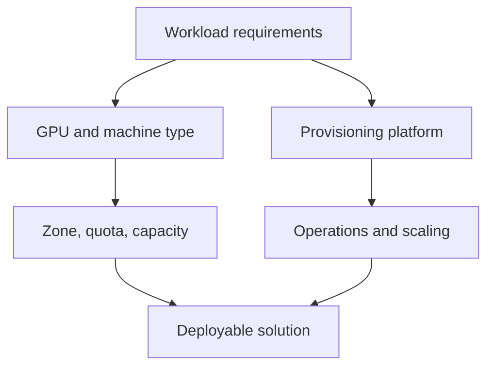
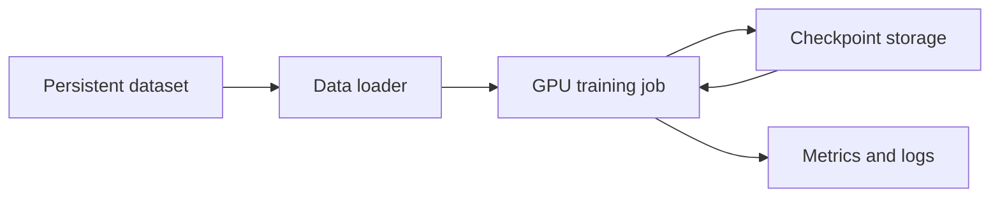

# AI Infrastructure: Cloud GPUs

> Google Skills 課程：https://www.skills.google/paths/11/course_templates/1403<br>
> 課程難度：Intermediate｜時間：約 1 小時｜整理目標：Associate Cloud Engineer（ACE）<br>
> 官方公開目標：理解 GPU 的價值與架構、選擇 GPU machine type 與 provisioning platform、探索 GPU 使用最佳化方法。<br>
> 文件核對日期：2026-08-24（Asia/Taipei）

### 使用方式與範圍說明

- 本課程屬於 AI Infrastructure 延伸課程，並非 ACE 核心主線。
- 公開頁面沒有提供完整影片逐字稿、投影片與細部單元標題，因此以下三章是依官方公開 Objectives 重組，不冒充原始章節名稱。
- ACE 應優先掌握：Compute Engine VM 建立與管理、machine type、Zone、Quota、Provisioning model、成本與可用性取捨。
- GPU 型號的深度效能比較、分散式訓練拓撲及 AI Hypercomputer 調校，列為延伸理解。
- 未提供 Cloud Shell 執行紀錄，因此本文不建立「我的實際操作」，也不虛構 Terminal Output。

---

## Chapter 1 — The Value and Architecture of GPUs
中文名稱：GPU 的價值與架構

### 1. Learning Objectives

- 說明 CPU、GPU 與 TPU 的基本差異。
- 理解 GPU 為何適合 AI/ML、HPC、圖形與大量平行運算。
- 認識 GPU workload 不只需要 accelerator，也依賴 CPU、記憶體、儲存與網路。
- 判斷工作負載是否真的需要 GPU。

### 2. 核心概念摘要

GPU 擁有大量適合平行運算的運算核心，特別適合矩陣乘法、向量運算和可批次處理的工作。CPU 則擅長控制流程、序列邏輯與一般用途運算。TPU 是 Google 為機器學習張量運算設計的專用加速器。

真正的 AI 系統不是「只有 GPU」：CPU 負責資料準備與協調，儲存提供資料與 checkpoint，網路連接多個節點，框架與驅動讓應用程式使用 accelerator。

### 3. 詳細知識點

#### 3.1 CPU、GPU、TPU 比較

| 項目 | CPU | GPU | TPU |
|---|---|---|---|
| 定位 | 通用處理器 | 大量平行運算加速器 | Google ML 專用加速器 |
| 強項 | 控制流程、序列工作、低延遲一般運算 | 矩陣、向量、影像、訓練與推論 | 大規模張量運算與特定 ML 框架工作負載 |
| 彈性 | 最高 | 高，CUDA 生態成熟 | 針對支援的 ML 工作負載最佳化 |
| 常見用途 | Web、API、資料前處理 | AI/ML、HPC、渲染、轉碼 | 大型模型訓練與推論 |
| ACE 深度 | 核心 | 知道如何附加、選 Zone、Quota 與成本 | 辨識產品定位即可 |

#### 3.2 為什麼 GPU 能加速 AI

- 模型訓練包含大量可平行化的矩陣運算。
- GPU 的高記憶體頻寬可快速搬移 tensor 資料。
- Tensor Cores 可加速 FP16、BF16、TF32、FP8 或 INT8 等不同精度；實際支援依 GPU 架構而異。
- Mixed precision 可降低記憶體需求並提高吞吐量，但需確認模型收斂與數值穩定性。

#### 3.3 Training 與 Inference

| 工作負載 | 主要需求 | 選型思考 |
|---|---|---|
| Training | 高吞吐量、大量 GPU memory、多 GPU 通訊 | 模型大小、batch size、訓練時間、網路與儲存吞吐 |
| Fine-tuning | 視模型與方法而定，通常低於預訓練 | Full fine-tuning、LoRA 等方法需求差異很大 |
| Batch inference | 吞吐量與成本效率 | 可接受排程或中斷時，可評估 Spot／彈性容量 |
| Online inference | 延遲、可用性、容量預測 | 需要穩定容量、autoscaling 與服務層設計 |
| Graphics / video | GPU 圖形能力、編碼器、vWS | 不應只用 AI 訓練效能判斷 |

#### 3.4 系統瓶頸不一定在 GPU

- GPU utilization 低可能是資料讀取、CPU preprocessing 或網路不足。
- GPU memory 不足不代表運算能力不足，可能需降低 batch size、使用 mixed precision 或調整模型切分。
- 多 GPU 不一定線性加速；同步通訊、資料切分與 straggler 會造成 overhead。
- Local SSD 吞吐量高但資料生命週期與 VM 綁定，不應作為唯一持久副本。

### 4. Resource Scope

| Resource | Scope | 說明與影響 |
|---|---|---|
| Compute Engine VM instance | Zonal | VM 建立在特定 Zone；GPU 型號也必須在該 Zone 有供應 |
| GPU accelerator type | Zonal availability | 同一 GPU 不一定在所有 Zone 可用 |
| GPU quota | Regional model quota + Global total quota | 有 Quota 不等於該 Zone 當下有實體容量 |
| Persistent Disk | Zonal 或 Regional | 依磁碟類型決定容錯與 VM 搭配方式 |
| VPC network | Global | Subnet 為 Regional；GPU VM 的 NIC 連到 Subnet |

### 5. Architecture



### 6. Google Cloud Console

查看 Compute Engine 可用 accelerator：

`Console > Compute Engine > VM instances > Create instance > Machine configuration > GPUs`

實際選項會隨 Region、Zone、配額、專案資格與產品供應變動，Console 標籤也可能調整。

### 7. Cloud Shell / gcloud

列出專案可見的 Compute Engine accelerator types：

```bash
gcloud compute accelerator-types list
```

- Command group：`gcloud compute`
- Resource：`accelerator-types`
- Action：`list`
- 可使用 `--filter="zone:(ZONE)"` 篩選特定 Zone。

```bash
gcloud compute accelerator-types list --filter="zone:(us-central1-a)"
```

### 8. Command Output

實際輸出通常包含 accelerator 的名稱與 Zone。結果取決於目前專案及 Google Cloud 供應狀態；本文不提供假造輸出。

### 9. 認證考點

- ACE 情境題先判斷是否需要 accelerator，不要看到 AI 就一律選 GPU。
- VM 與 GPU 是 Zonal 部署；建立前需同時確認 Zone support、Quota 和 capacity。
- Quota 是允許使用的上限，不是容量保證。
- GPU VM 仍要處理 OS image、driver、IAM、VPC、disk、monitoring 與成本。

### 10. 教材與現行文件差異

| 類型 | 內容 | 官方來源 |
|---|---|---|
| 教材內容 | 強調 CPU、GPU、TPU 差異與 GPU 對 AI 工作負載的價值 | [課程公開頁](https://www.skills.google/paths/11/course_templates/1403) |
| 現行官方文件 | GPU 系列、型號、Zone 與限制持續更新，不宜背固定清單 | [GPU machine types](https://docs.cloud.google.com/compute/docs/gpus) |
| 備考建議 | ACE 以資源選型與基本維運為主，不需背 TFLOPS | 依 ACE 工作範圍做的讀書建議 |

### 11. 本章快速複習

1. CPU 通用、GPU 平行、TPU 專用。
2. Training 重吞吐與 GPU memory；online inference 更重延遲與可用性。
3. GPU utilization 低時，要一併檢查 CPU、storage 與 network。
4. GPU 型號可用性與 VM 一樣受 Zone 影響。

---

## Chapter 2 — Selecting GPU Machine Types and Provisioning Platforms
中文名稱：選擇 GPU Machine Type 與佈建平台

### 1. Learning Objectives

- 依 training、inference、graphics 或 HPC 需求選擇 GPU。
- 區分 accelerator-optimized machine family 與 N1 attached GPU。
- 理解 Compute Engine、GKE、Vertex AI 與 Slurm 等平台的責任邊界。
- 了解 Standard、Spot、Flex-start 與 reservation 的基本取捨。

### 2. 核心概念摘要

選 GPU 不應只比較最高效能，而要同時考量 GPU memory、運算精度、GPU 數量、CPU／RAM 比例、網路、儲存、Zone、Quota、capacity、可中斷性及總成本。

平台選型則看你希望管理多少基礎設施：Compute Engine 提供最大控制權；GKE 適合容器化與叢集排程；Vertex AI 提供較高階的受管 ML 體驗；Slurm 常見於 HPC 批次與多節點排程。

### 3. 詳細知識點

#### 3.1 Compute Engine GPU machine family

依 2026-08 官方文件：

- Accelerator-optimized family：A4X Max、A4X、A4、A3、A2、G4、G2；GPU 與 machine type 綁定。
- N1 general-purpose：可附加部分較早期 GPU，例如 T4、V100、P100、P4；shared-core N1 不支援。
- A 系列偏 AI training、serving 與 HPC。
- G 系列偏 inference、graphics、video 與 virtual workstation，也能處理部分小型訓練。
- 型號與支援狀態會變動，選型時應查即時官方表格，不背死清單。

#### 3.2 Accelerator-optimized 與 N1 attached GPU

| 比較 | Accelerator-optimized | N1 + attached GPU |
|---|---|---|
| GPU 配置 | GPU 已包含於特定 machine type | 在支援的 N1 machine type 上附加 GPU |
| 適用 | 高效能 AI、HPC、現代 inference/graphics | 較小規模、舊型 GPU、需要 CPU/RAM 彈性的工作 |
| 變更 | 多數系列受 machine type 固定組合限制 | 通常需停止 VM 才能增減 GPU |
| ACE 記憶 | 選 machine type 時連帶決定 accelerator | 使用 `--accelerator` 指定 type/count |

#### 3.3 Provisioning platform

| 平台 | 適合情境 | 你需要管理的內容 |
|---|---|---|
| Compute Engine | 單機、客製 OS、直接控制 VM/GPU | VM、driver、runtime、排程、擴縮與修補 |
| GKE | 容器化 AI 工作負載、多節點 GPU cluster | Kubernetes、node pool、Pod request、autoscaling |
| Vertex AI | 訓練、調參、endpoint 與 ML workflow | 模型與 job 設定；底層較受管 |
| Slurm | HPC 與批次排程 | Slurm cluster、queue、node 與作業生命週期 |

ACE 通常更著重 Compute Engine 與 GKE 的基本管理，不要求深入 Slurm 或大型 AI cluster topology。

#### 3.4 Provisioning model 與容量

| 模式 | 特性 | 適用 |
|---|---|---|
| Standard | 一般按需 VM，較適合持續性與不可中斷工作 | 線上服務、重要訓練 |
| Spot VM | 大幅折扣但可能被中斷 | 可 checkpoint、可重試的 batch/training |
| Flex-start | 工作可等待容量後再啟動 | 有期限但不要求立即開始的工作 |
| Reservation | 預留指定資源容量 | 必須確保特定時間／位置有 GPU |

重點：Quota、reservation、commitment 是不同概念。

- Quota：限制你最多可使用多少資源。
- Reservation：保留容量，提高指定資源可取得性。
- Commitment：承諾使用量以換取折扣；不一定等於保留容量。

#### 3.5 選型決策順序

1. Workload：training、inference、graphics 或 HPC。
2. 模型／資料：GPU memory 與資料集大小。
3. 單機或多機：GPU 數量、網路與同步方式。
4. 軟體：CUDA、driver、framework 與 image 相容性。
5. Location：資料所在地、延遲、GPU Zone availability。
6. Capacity：Quota、實際供應與是否需要 reservation。
7. Reliability：能否中斷、checkpoint、重試。
8. Cost：GPU 時數、CPU/RAM、disk、network egress 與閒置率。

### 4. Resource Scope

| Resource | Scope | 說明與影響 |
|---|---|---|
| Compute Engine GPU VM | Zonal | Zone 必須支援該 GPU／machine type |
| Instance template | Global 或 Regional | 依 template 類型；可供 MIG 建立一致 VM |
| Managed instance group | Zonal 或 Regional | GPU capacity 不足時可能無法達到 target size |
| GKE cluster | Zonal 或 Regional | GPU node pool 的 nodes 仍落在特定 Zones |
| Reservation | Zonal | 必須與消耗該 reservation 的 VM 條件匹配 |
| Compute quota | 多為 Regional，另有 Global GPU quota | 需同時確認各 GPU model quota 與總量 quota |

### 5. Architecture



### 6. Google Cloud Console

建立 GPU VM 的一般路徑：

`Console > Compute Engine > VM instances > Create instance > Region and Zone > Machine configuration > GPUs`

建立前應檢查：

- 選定 Zone 是否提供該 GPU。
- Quotas 頁面是否同時具有 model-specific regional quota 與 global GPU quota。
- Boot disk image 與 NVIDIA driver 支援。
- Standard、Spot 或其他 provisioning model 是否符合可中斷性。
- VPC、Subnet、service account 與 least privilege。

### 7. Cloud Shell / gcloud

#### 列出特定 Zone 的 accelerator

```bash
gcloud compute accelerator-types list \
    --filter="zone:(ZONE)"
```

`ZONE` 是 placeholder，例如 `us-central1-a`。

#### 建立 N1 + T4 的示意命令

```bash
gcloud compute instances create VM_NAME \
    --zone=ZONE \
    --machine-type=n1-standard-4 \
    --accelerator=count=1,type=nvidia-tesla-t4 \
    --maintenance-policy=TERMINATE \
    --boot-disk-size=40GB
```

- Command group：`gcloud compute`
- Resource：`instances`
- Action：`create`
- `--accelerator`：指定 accelerator count 與 type。
- `--maintenance-policy=TERMINATE`：GPU VM 不能以一般 live migration 處理 host maintenance。
- `--boot-disk-size=40GB`：官方 GPU VM 建立文件建議至少 40 GB。
- 正式部署還要明確選擇支援 GPU 的 image／image family，並安裝相容 driver。

#### Spot VM

```bash
gcloud compute instances create VM_NAME \
    --zone=ZONE \
    --machine-type=MACHINE_TYPE \
    --provisioning-model=SPOT \
    --instance-termination-action=STOP
```

此命令只展示 provisioning flags；`MACHINE_TYPE` 必須是該 Zone 可用的 GPU machine type，且不同系列可能還有額外建立條件。

### 8. Command Output

- `accelerator-types list`：預期列出 accelerator name 與 Zone。
- `instances create`：成功時通常顯示 VM 資源欄位；若失敗，常見原因包含 Quota、Zone 不支援、capacity 不足、machine type／GPU 組合不相容。
- 未提供實際執行輸出，因此不附範例結果。

### 9. 認證考點

- 「Quota 已核准但仍建立失敗」可能是 Zone capacity，不是再調高 Quota 就一定解決。
- 需要不中斷的服務不應只為省錢使用 Spot；可重試、可 checkpoint 的批次工作才適合。
- 需要直接控制 OS／driver：Compute Engine；容器化叢集與排程：GKE；受管 ML workflow：Vertex AI。
- 使用 GPU 前要確認 machine family、Zone、Quota、image、driver 與 maintenance policy。
- Reservation 解決容量保證問題；commitment 主要解決折扣問題。

### 10. 教材與現行文件差異

| 類型 | 內容 | 官方來源 |
|---|---|---|
| 教材內容 | 要求能選擇適當 GPU machine type 與 provisioning platform | [課程資訊與 Objectives](https://www.cloudskillsboost.google/paths/2806/course_templates/1403) |
| 現行官方文件 | 目前 accelerator-optimized 包含多個 A/G 系列，N1 僅能附加特定 GPU | [About GPU instances](https://docs.cloud.google.com/compute/docs/gpus/about-gpus) |
| 現行官方文件 | GPU 需要 model-specific regional quota 與額外 global quota | [Create VM with GPUs](https://docs.cloud.google.com/compute/docs/gpus/create-vm-with-gpus) |
| 備考建議 | 不背完整 GPU 型號表，重點是依 workload、Zone、Quota、capacity、成本選擇 | 依 ACE 操作型情境整理 |

### 11. 本章快速複習

1. Accelerator-optimized VM 的 GPU 通常與 machine type 綁定。
2. N1 可附加特定 GPU，但不是所有 N1 machine type 都支援。
3. Spot 便宜但可被中斷；Reservation 用於容量保障。
4. Quota 不代表 Capacity。
5. Machine type、GPU 與 Zone 必須相容。

---

## Chapter 3 — Optimizing GPU Usage
中文名稱：最佳化 GPU 使用率與成本

### 1. Learning Objectives

- 從利用率、資料管線、精度與排程改善 GPU 效率。
- 理解 driver、runtime、image 與 framework 相容性。
- 使用 Spot、autoscaling、checkpoint 與 right-sizing 控制成本。
- 認識 GPU workload 的可觀測性與常見故障方向。

### 2. 核心概念摘要

GPU 最佳化不是只換更快的型號。應先量測 GPU utilization、GPU memory、CPU、disk I/O 與 network，再找出瓶頸。若昂貴 GPU 長時間等待資料或閒置，擴大 GPU 規格反而增加浪費。

### 3. 詳細知識點

#### 3.1 提高利用率

- 調整 batch size，增加單次送入 GPU 的工作量。
- 使用資料 prefetch、parallel data loading 與快取，減少 GPU 等待。
- 使用 mixed precision 或量化，但要驗證準確率。
- 將多個小型 inference request 合併成 batch。
- 避免把 GPU 長時間保留給沒有工作量的 VM／Pod。

#### 3.2 GPU memory 與模型大小

- 模型參數、optimizer state、activation 與 batch 都會占用 GPU memory。
- Out of memory 不一定要換最大 GPU，可先降低 batch、gradient accumulation、mixed precision 或模型切分。
- 訓練的記憶體需求通常高於純 inference。

#### 3.3 Driver 與軟體相容性

NVIDIA GPU 需要相容的 NVIDIA driver，應確認：

- GPU 型號要求的最低 driver version。
- CUDA runtime 與 framework 版本。
- OS image 是否支援 GPU。
- Deep Learning VM Images 是否能降低自行安裝負擔。

在 Linux 中常用以下命令驗證 driver 與 GPU 狀態：

```bash
nvidia-smi
```

這是作業系統內的 NVIDIA 工具，不是 `gcloud`。它可顯示 driver、GPU、memory 與 utilization 等資訊；不同版本輸出不同，本文不虛構結果。

#### 3.4 Spot 與 checkpoint

Spot VM 可降低成本，但工作可能中斷，因此應：

- 定期將 checkpoint 寫入持久性儲存。
- 讓 job 可以從 checkpoint 重啟。
- 將無狀態或可重試工作與不可中斷工作分開。
- 若使用 MIG，理解它會嘗試重建 VM，但仍受 GPU capacity 影響。

#### 3.5 成本構成

GPU workload 的總成本可能包含：

- GPU 與 VM 的 vCPU／memory。
- Persistent Disk、Hyperdisk 或 Local SSD。
- Network egress。
- Premium OS 或 NVIDIA RTX Virtual Workstation license。
- 閒置但未停止／刪除的 VM。
- reservation 或 commitment 的使用效率。

#### 3.6 常見錯誤判斷

| 症狀 | 可能原因 | 優先檢查 |
|---|---|---|
| 無法建立 GPU VM | Zone、Quota、capacity、組合不支援 | accelerator availability、quota、錯誤訊息 |
| OS 看不到 GPU | driver 未裝或版本不相容 | `nvidia-smi`、driver log、image |
| GPU utilization 很低 | data loader、CPU、I/O、batch 太小 | CPU、disk/network、pipeline metrics |
| OOM | 模型／activation／batch 超過 GPU memory | batch、precision、model placement |
| Spot job 常重跑 | 無 checkpoint 或恢復設計 | checkpoint、termination handling |

### 4. Resource Scope

| Resource | Scope | 說明與影響 |
|---|---|---|
| Cloud Monitoring metrics | 依 monitored resource 聚合 | 應搭配 VM、GKE 與應用層 metrics 判讀 |
| Cloud Logging log bucket | Regional | 實際儲存位置依 bucket 設定 |
| Cloud Storage bucket | Location-defined | 適合保存 dataset、artifact 與 checkpoint |
| Spot VM | Zonal VM | 可被中斷，GPU 隨 VM 生命週期存在 |
| MIG | Zonal 或 Regional | 可重建 Spot VM，但不能保證 GPU 當下有容量 |

### 5. Architecture



### 6. Google Cloud Console

常用檢查位置：

- `Console > Compute Engine > VM instances > VM_NAME > Observability`
- `Console > IAM & Admin > Quotas & System Limits`
- `Console > Monitoring > Metrics explorer`
- `Console > Logging > Logs Explorer`

Console 名稱可能調整；排錯時應先保留原始錯誤訊息與 operation details。

### 7. Cloud Shell / gcloud

#### 查看 VM 設定

```bash
gcloud compute instances describe VM_NAME --zone=ZONE
```

- Resource：`instances`
- Action：`describe`
- Parameters：`VM_NAME`
- Flag：`--zone=ZONE`

#### 停止不使用的 VM

```bash
gcloud compute instances stop VM_NAME --zone=ZONE
```

停止 VM 可停止多數 VM 與 GPU 的執行計費，但 Persistent Disk、保留的 external IP 或其他資源仍可能產生費用；正式判斷應查當期 pricing 文件。

#### 刪除不再需要的 VM

```bash
gcloud compute instances delete VM_NAME --zone=ZONE
```

刪除前必須確認 boot disk auto-delete、資料備份及其他 attached disk 是否要保留。這是破壞性操作，考試情境中要先理解資源生命週期。

### 8. Command Output

沒有使用者提供的操作紀錄。`describe` 會回傳 VM machine type、accelerator、disk、network interface、scheduling 等設定；欄位依資源與 API 版本而異。

### 9. 認證考點

- 成本最佳化先 right-size、停止閒置資源，再考慮 Spot 或 commitment。
- Spot 適用可中斷工作，checkpoint 應放在持久性儲存，而非只放 Local SSD。
- `nvidia-smi` 用於 guest OS 內檢查；`gcloud` 管理 Google Cloud 資源，兩者角色不同。
- `stop` 與 `delete` 不同；停止 VM 後部分獨立資源仍可能計費。
- 排錯時按「location → quota → capacity → machine/GPU combination → image/driver」順序檢查。

### 10. 教材與現行文件差異

| 類型 | 內容 | 官方來源 |
|---|---|---|
| 教材內容 | 探索 GPU utilization 最佳化技巧 | [課程公開頁](https://www.skills.google/paths/11/course_templates/1403) |
| 現行官方文件 | NVIDIA GPU 需要符合型號要求的 device driver | [Install GPU drivers](https://docs.cloud.google.com/compute/docs/gpus/install-drivers-gpu) |
| 現行官方文件 | Spot GPU 與 VM 共同遵循 preemption 生命週期 | [Spot VMs](https://docs.cloud.google.com/compute/docs/instances/spot) |
| 備考建議 | ACE 優先熟悉資源生命週期、Quota、Zone、Spot 與基礎排錯 | 依 ACE 操作型能力整理 |

### 11. 本章快速複習

1. 先量測再最佳化，不要直接升級 GPU。
2. Driver、CUDA、framework 與 image 必須相容。
3. Spot workload 要能 checkpoint 與重試。
4. Local SSD 不是 checkpoint 的唯一持久副本。
5. 停止 VM 不代表所有附屬資源都停止計費。

---

## 認證重點統整

### ACE 重點

#### 必須優先掌握

- Compute Engine VM 是 Zonal resource。
- GPU 型號只在特定 Zones 提供。
- 建立 GPU VM 前需確認 Zone availability、regional GPU model quota、global GPU quota 與實際 capacity。
- Accelerator-optimized machine type 的 GPU 通常為固定配置；N1 可附加特定 GPU。
- GPU VM 需要相容的 OS image、NVIDIA driver 與 runtime。
- Spot VM 適合可中斷、可重試、可 checkpoint 的工作。
- Quota、capacity、reservation 與 commitment 不可混為一談。
- `gcloud compute accelerator-types list` 可查看 accelerator types。
- 使用完畢後應停止或刪除不需要的 GPU VM，並檢查 disk、IP 等獨立資源。

#### 延伸理解，不需死背

- A/G 系列每個型號的 GPU memory、TFLOPS 與網路頻寬。
- 大型模型分散式訓練拓撲。
- GPUDirect、NCCL、Slurm 與 AI Hypercomputer 深度調校。
- FP8、BF16、TF32 等數值精度的硬體細節。

### 服務選型與比較

| 情境 | 建議服務／方式 | 理由 | 常見誤解 |
|---|---|---|---|
| 單一 VM、需完整 OS 控制 | Compute Engine GPU VM | 可直接管理 image、driver 與 VM | AI 工作不一定非 Vertex AI |
| 容器化、多節點 GPU workload | GKE GPU node pool | Kubernetes 排程與擴縮 | GKE 不會消除 GPU capacity 限制 |
| 受管模型訓練與部署 | Vertex AI | 減少底層基礎設施管理 | 受管不等於無需 Quota／成本管理 |
| 可中斷批次 inference | Spot VM + checkpoint/retry | 降低運算成本 | 不適合無法容忍中斷的線上服務 |
| 必須確保特定 Zone 有 GPU | Reservation | 保留容量 | Quota 核准不等於保留容量 |
| 小型一般用途加速、需較彈性 CPU/RAM | N1 + supported GPU | GPU 可作為 attached accelerator | 不是所有 machine family 都能任意附加 GPU |

### 常見 ACE 情境題陷阱

1. **有 Quota 就一定能建立 VM**：錯。仍可能沒有 Zone capacity。
2. **GPU 是 Regional resource**：錯。GPU VM 部署於 Zone，型號 availability 也按 Zone 判斷。
3. **Spot 適合所有便宜需求**：錯。必須能容忍中斷。
4. **Commitment 保證容量**：不一定。容量保障要看 reservation 等機制。
5. **停止 VM 後完全免費**：錯。disk、IP 等資源可能繼續計費。
6. **AI workload 必選最強 GPU**：錯。應按模型、memory、延遲、吞吐、成本與供應選型。
7. **VM 建好就能直接使用 GPU**：錯。Guest OS 仍需相容 driver/runtime。

### gcloud 指令速查

```bash
# 列出 accelerator types
gcloud compute accelerator-types list

# 只看某個 Zone
gcloud compute accelerator-types list --filter="zone:(ZONE)"

# 查看 VM 設定
gcloud compute instances describe VM_NAME --zone=ZONE

# 停止 VM
gcloud compute instances stop VM_NAME --zone=ZONE
```

### 考前自我檢查

- [ ] 我能解釋 CPU、GPU、TPU 的差異。
- [ ] 我知道 GPU VM、GPU 型號供應與 Zone 的關係。
- [ ] 我能區分 Quota、Capacity、Reservation、Commitment。
- [ ] 我知道 Spot VM 適合哪些工作負載。
- [ ] 我知道 accelerator-optimized 與 N1 attached GPU 的差異。
- [ ] 我知道 GPU VM 需要 driver，並能用 `nvidia-smi` 檢查。
- [ ] 我知道停止 VM 後仍要檢查 disk 與其他計費資源。
- [ ] 我能依 location、quota、capacity、configuration、driver 排查建立／使用失敗。

### 待補材料與限制

- 課程公開頁沒有完整單元清單、影片逐字稿或投影片，本文依三項公開 Objectives 重組章節。
- 未取得登入後教材，因此沒有逐句轉錄講師敘述，也沒有宣稱本文等同完整逐字稿。
- 未提供課程 Lab 或個人 Cloud Shell 紀錄，因此未建立「我的實際操作」或 Terminal Output。
- GPU 產品線、可用 Zone、Quota 名稱、效能與價格變動快速，實作前應重新查閱官方文件。

### 官方參考資料

- [AI Infrastructure: Cloud GPUs 課程](https://www.skills.google/paths/11/course_templates/1403)
- [GPU machine types](https://docs.cloud.google.com/compute/docs/gpus)
- [About GPU instances](https://docs.cloud.google.com/compute/docs/gpus/about-gpus)
- [Create an instance with attached GPUs](https://docs.cloud.google.com/compute/docs/gpus/create-vm-with-gpus)
- [Install GPU drivers](https://docs.cloud.google.com/compute/docs/gpus/install-drivers-gpu)
- [Spot VMs](https://docs.cloud.google.com/compute/docs/instances/spot)
- [`gcloud compute accelerator-types list`](https://docs.cloud.google.com/sdk/gcloud/reference/compute/accelerator-types/list)
- [`gcloud compute instances create`](https://docs.cloud.google.com/sdk/gcloud/reference/compute/instances/create)
