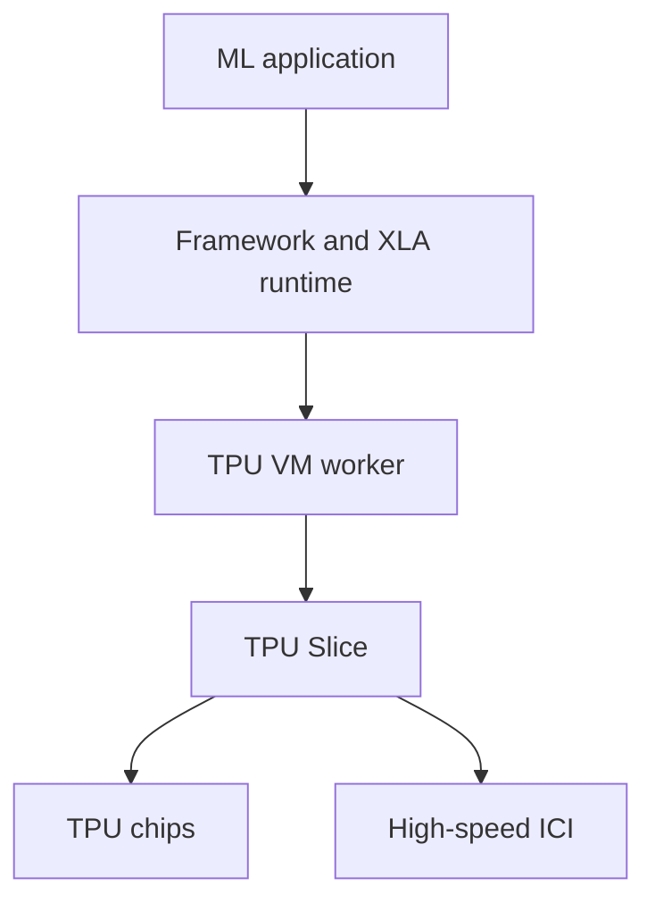
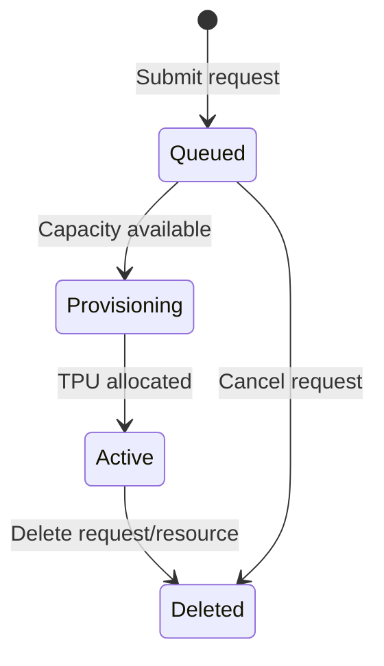
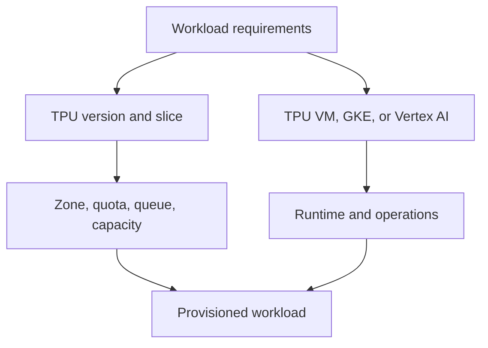
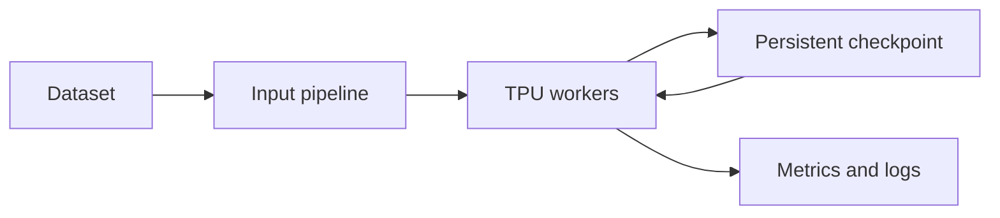

# AI Infrastructure: Cloud TPUs

> Google Skills 課程：https://www.skills.google/paths/11/course_templates/1405<br>
> 課程難度：Intermediate｜公開頁面時間：約 1 小時｜整理目標：Associate Cloud Engineer（ACE）<br>
> 核對日期：2026-08-24（Asia/Taipei）

### 課程定位與閱讀方式

- 課程公開說明包含：TPU 的優缺點、TPU accelerator 選型、效能與效率最佳化、GPU／TPU interoperability，以及實際 demonstration。
- 此課程屬 AI Infrastructure 延伸領域，不是 ACE 的主要考試主線。
- ACE 應優先掌握 Cloud TPU 的產品定位、TPU VM、Zone、Quota、Queued Resources、Spot、IAM、VPC 與資源生命週期。
- TPU Pod topology、XLA 深度調校、SparseCore 與大型分散式訓練列為進階延伸。
- 公開頁面沒有完整影片逐字稿、投影片與正式細部單元名稱；以下章節依公開課程敘述重組，不冒充原始章名。
- 未提供 Cloud Shell 執行紀錄，因此不建立「我的實際操作」或虛構 Terminal Output。

---

## Chapter 1 — Cloud TPU Fundamentals and Architecture
中文名稱：Cloud TPU 基礎與系統架構

### 1. Learning Objectives

- 說明 Tensor Processing Unit（TPU）的目的與適用工作負載。
- 比較 CPU、GPU、TPU 的定位。
- 認識 TPU chip、TensorCore、Pod、Slice、TPU VM 與 inter-chip interconnect（ICI）。
- 理解單一 host 與 multi-host 工作負載的差異。

### 2. 核心概念摘要

TPU 是 Google 為機器學習張量運算設計的專用 accelerator，著重矩陣運算、大規模訓練與推論效率。Cloud TPU 不是單純插在一般 VM 上的任意硬體；使用者通常透過 TPU VM、GKE 或 Vertex AI 存取 TPU 資源。

TPU VM 是直接連接 TPU device 的 Linux VM。使用者可透過 SSH 登入、執行程式並檢查 compiler/runtime logs。多顆 TPU chips 可以透過高速 ICI 組成 Slice，而完整或大型 TPU 集合稱為 Pod。

### 3. 詳細知識點

#### 3.1 CPU、GPU、TPU

| 項目 | CPU | GPU | TPU |
|---|---|---|---|
| 設計定位 | 通用運算 | 大量平行運算 | ML 張量運算專用 accelerator |
| 強項 | 控制流程、序列邏輯、一般應用 | CUDA 生態、AI、HPC、graphics | 大規模矩陣運算、Google ML stack 整合 |
| 軟體彈性 | 最高 | 高 | 需考慮 XLA、framework 與 op 支援 |
| 常見框架 | 幾乎所有框架 | PyTorch、TensorFlow、JAX 等 | JAX、TensorFlow、PyTorch/XLA 等 |
| ACE 深度 | 核心 Compute | 認識 accelerator 與 VM 管理 | 認識定位與基本資源管理 |

#### 3.2 TPU 的優勢

- 為 dense matrix multiplication 與 tensor workload 最佳化。
- TPU Pod／Slice 可利用高速 ICI 擴展到多 chips。
- 與 JAX、TensorFlow、PyTorch/XLA 等 ML stack 整合。
- 適合可被 XLA 有效編譯的規模化 training／inference。
- 特定工作負載可得到良好的 performance-per-cost 與能源效率。

#### 3.3 TPU 的限制與取捨

- 非所有模型 operation 都能同樣有效地映射至 TPU。
- 首次 XLA compilation 可能增加啟動時間。
- TPU version、slice size、runtime 與 framework 需要相容。
- Location、Quota 與實際 capacity 會限制部署。
- 更換 chip count 或 topology 時，可能需要重新調整 batch、sharding 與 parallelism。
- CUDA-specific workload 不能直接假設可無修改搬到 TPU。

#### 3.4 TPU 系統元件

| 元件 | 說明 |
|---|---|
| TPU chip | 實體 TPU 晶片；內含一個或多個 TensorCores，依版本而異 |
| TensorCore | 包含 matrix-multiply units、vector unit 與 scalar unit 等運算單元 |
| ICI | TPU chips 之間的高速 inter-chip interconnect |
| TPU Pod | 透過專用網路連接的一組連續 TPU 資源 |
| Slice | 同一 Pod 內、透過 ICI 連接的一組 chips |
| TPU VM / worker | 與 TPU device 直接連接的 Linux VM，可 SSH 登入 |

#### 3.5 Single host、multi-host、sub-host

- Single host：工作負載使用一個 TPU VM。
- Multi-host：工作分散到多個 TPU VMs，需處理資料與模型分割、同步及故障。
- Sub-host：不使用該 TPU VM 上的全部 chips；並非所有版本或配置都支援相同方式。

### 4. Resource Scope

| Resource | Scope | 說明與影響 |
|---|---|---|
| TPU VM / TPU node | Zonal | 建立時必須指定支援該 TPU version 的 Zone |
| TPU accelerator availability | Zonal | 每種版本與配置只在特定 Zones 提供 |
| TPU quota | Version、usage type、size、Zone 相關 | On-demand 與 preemptible quota 分開考量 |
| VPC network | Global | TPU VM 可連接 VPC；Subnet 是 Regional |
| Cloud Storage bucket | Location-defined | 常用於 dataset、artifact 與 checkpoint |

### 5. Architecture



### 6. Google Cloud Console

查看或建立 TPU：

`Console > Compute Engine > TPUs > Create TPU`

通常需指定：

- Name
- Zone
- TPU type / accelerator type
- TPU software version / runtime version
- Network 與 IP 設定
- On-demand、Spot 或 reservation 等消費方式

Console 標籤會持續調整，實際操作以當期介面為準。

### 7. Cloud Shell / gcloud

列出 TPU VMs：

```bash
gcloud compute tpus tpu-vm list --zone=ZONE
```

- Command group：`gcloud compute tpus`
- Resource：`tpu-vm`
- Action：`list`
- Flag：`--zone=ZONE`

列出指定 Zone 可用的 TPU runtime versions：

```bash
gcloud compute tpus tpu-vm versions list --zone=ZONE
```

### 8. Command Output

`list` 預期顯示 TPU VM 的名稱、Zone、accelerator type、runtime version、network 與 state 等資訊；實際欄位依指令版本和資源狀態而異。本文沒有使用者輸出，故不提供假造結果。

### 9. 認證考點

- TPU VM 是 Zonal resource，建立前先檢查 Zone availability。
- Quota 不等於 capacity；有使用額度仍可能排不到資源。
- TPU 是專用 ML accelerator，不適合所有一般運算或 CUDA-specific workload。
- TPU VM 可 SSH 登入並具較直接的執行環境控制；Vertex AI 則提供較受管的 ML workflow。
- ACE 不需死背 TensorCore 數量或 Pod topology，應理解資源與維運關係。

### 10. 教材與現行文件差異

| 類型 | 內容 | 官方來源 |
|---|---|---|
| 教材內容 | 探討 TPU 在不同情境的優缺點 | [課程公開頁](https://www.skills.google/paths/11/course_templates/1405) |
| 現行官方文件 | TPU VM 是與 TPU device 直接連接、可 SSH 的 Linux worker | [TPU architecture](https://docs.cloud.google.com/tpu/docs/system-architecture-tpu-vm) |
| 備考建議 | ACE 掌握定位、Zone 與基本管理即可，不背硬體規格 | 依 ACE 操作情境整理 |

### 11. 本章快速複習

1. TPU 是為 ML tensor workload 設計的專用 accelerator。
2. TPU VM 是直接存取 TPU device 的 Linux worker。
3. Slice 是同一 Pod 中透過 ICI 連接的 chips 集合。
4. TPU version、slice size、runtime 和 framework 必須相容。
5. TPU VM 與型號供應均受 Zone 限制。

---

## Chapter 2 — Selecting and Provisioning Cloud TPUs
中文名稱：Cloud TPU 選型與資源佈建

### 1. Learning Objectives

- 依 training、fine-tuning、inference 與模型規模選擇 TPU。
- 理解 TPU version、accelerator type、slice size 和 software version。
- 區分 on-demand、Spot、reservation 與 Flex-start。
- 使用 TPU VM、GKE 或 Vertex AI 佈建 TPU workload。

### 2. 核心概念摘要

選 TPU 不應只選最新世代。應先評估工作負載、模型大小、training 或 inference、記憶體、精度、chip count、單機／多機、framework、資料位置、開始時間與可中斷性，再確認 Zone、Quota 與 capacity。

依 2026-08 官方文件，目前可見世代包含 TPU7x（Ironwood）、v6e、v5p、v5e、v4、v3、v2；型號和供應變動快速，不建議為 ACE 背完整清單。

### 3. 詳細知識點

#### 3.1 選型維度

1. Workload：training、fine-tuning 或 inference。
2. Model：參數量、embedding、稀疏／密集運算。
3. Memory：模型、activation、optimizer state 與 batch。
4. Scale：單 chip、小型 slice 或大型 multi-host。
5. Software：JAX、TensorFlow、PyTorch/XLA 與 op support。
6. Location：資料所在地、Zone availability 與法規。
7. Availability：是否能等待 capacity、是否能中斷。
8. Cost：on-demand、Spot、reservation 與閒置率。

#### 3.2 TPU version 與 accelerator type

`accelerator-type` 同時表達 TPU 世代與配置大小，例如部分版本使用 `v5litepod-8`、`v6e-256` 等形式。名稱與支援配置隨版本不同，不能假設所有世代都使用相同命名規則。

`version` 則是 TPU software/runtime version，不能和 TPU hardware generation 混淆。

| 欄位 | 意義 | 常見混淆 |
|---|---|---|
| Zone | 實體部署位置 | Region 不是 TPU VM 的直接 location |
| Accelerator type | TPU 硬體版本與大小／配置 | 不是 runtime version |
| Runtime version | 安裝在 TPU VM 的 software stack | 不是晶片世代 |
| Slice | 一組互連 chips | 不等於獨立 Region |

#### 3.3 Consumption options

| 模式 | 行為 | 適用情境 |
|---|---|---|
| On-demand | 不需預先承諾，但容量不保證 | 一般測試、彈性工作 |
| Spot | 顯著較低價格，但可隨時被中斷 | 可 checkpoint、可重試的低優先工作 |
| Reservation | 預留特定 TPU capacity | 必須在計畫時間取得資源 |
| Flex-start | 請求進入 queue，取得容量後開始 | 可等待啟動、但希望不中斷完成的工作 |

#### 3.4 Queued Resources

Queued Resources API 讓 TPU 建立請求進入服務維護的 queue；當容量可用時，資源才分配給專案。現行官方文件建議使用 queued resources 建立 TPU VMs；Multislice 必須使用 queued resources。

重要生命週期：



Queued resource 即使尚未分配，也可能占用 quota；使用完畢或不再需要時應刪除 request，避免阻塞後續申請。

#### 3.5 TPU 平台選擇

| 平台 | 適合情境 | 管理責任 |
|---|---|---|
| TPU VM | 需要 SSH、root access 與直接控制 runtime | VM、套件、job、儲存與恢復 |
| GKE | 容器化、多工作負載與 Kubernetes 排程 | Cluster、node pool、Pod、autoscaling |
| Vertex AI | 受管 training、tuning、prediction workflow | 聚焦 model/job，底層基礎設施較受管 |

### 4. Resource Scope

| Resource | Scope | 說明與影響 |
|---|---|---|
| TPU VM | Zonal | Zone 必須支援 accelerator type |
| Queued resource | Zonal request | 指定 Zone、accelerator type 與 runtime |
| TPU quota | Version／Zone／usage type 相關 | On-demand 與 preemptible quota 不同 |
| GKE TPU node pool | Zonal placement within cluster | 仍受 TPU location 與 capacity 影響 |
| Reservation | 與指定 location/configuration 匹配 | 需要以相符 request 消耗 |

### 5. Architecture



### 6. Google Cloud Console

`Console > Compute Engine > TPUs > Create TPU`

建立前檢查：

- Cloud TPU API 是否啟用。
- Zone 是否支援目標 TPU version／configuration。
- On-demand 或 preemptible quota 是否足夠。
- TPU software version 是否相容。
- VPC、Subnet、external/internal IP 和 IAM 權限。
- 工作能否容忍 queue 等待或 Spot interruption。

### 7. Cloud Shell / gcloud

#### 直接建立 TPU VM

```bash
gcloud compute tpus tpu-vm create TPU_NAME \
    --project=PROJECT_ID \
    --zone=ZONE \
    --accelerator-type=ACCELERATOR_TYPE \
    --version=RUNTIME_VERSION
```

- Command group：`gcloud compute tpus`
- Resource：`tpu-vm`
- Action：`create`
- Parameters：`TPU_NAME`
- Flags：project、zone、accelerator type、runtime version。
- 所有大寫值皆為 placeholders，需依當期支援表格替換。

現行官方文件建議一般優先使用 queued resources；上述命令是理解 TPU VM resource 的基礎建立方式。

#### 查看 TPU VM

```bash
gcloud compute tpus tpu-vm describe TPU_NAME --zone=ZONE
```

#### SSH 連線

```bash
gcloud compute tpus tpu-vm ssh TPU_NAME --zone=ZONE
```

#### Queued Resources

目前 queued-resource 命令可能仍位於 `gcloud alpha`，代表 CLI surface 可能變動。實作前需重新確認當期官方 reference，不應將 alpha syntax 視為永久穩定介面。

### 8. Command Output

建立成功時資源通常進入 provisioning 後到 READY／ACTIVE 類型狀態；queued request 可能先等待 capacity。實際狀態名稱與欄位依 API／CLI 版本為準，本文不製造示範輸出。

### 9. 認證考點

- `accelerator-type` 是硬體類型／規模，`version` 是 TPU runtime。
- TPU VM 是 Zonal；Zone、Quota 與 capacity 都要滿足。
- Spot 便宜但可中斷；Flex-start 可等待容量，目的不同。
- Quota 允許使用，不等於 capacity 已保留；Reservation 才處理容量保障。
- Queued request 使用完要清理，否則可能持續占用 quota。

### 10. 教材與現行文件差異

| 類型 | 內容 | 官方來源 |
|---|---|---|
| 教材內容 | 比較 TPU accelerators，協助選擇合適方案 | [課程公開頁](https://www.skills.google/paths/11/course_templates/1405) |
| 現行官方文件 | 建議以 Queued Resources API 建立 TPU VM；Multislice 必須使用 | [Create Cloud TPU VMs](https://docs.cloud.google.com/tpu/docs/create-tpu-vm) |
| 現行官方文件 | Quota 依 TPU version，並區分 on-demand／preemptible | [Plan Cloud TPU resources](https://docs.cloud.google.com/tpu/docs/plan-tpus) |
| 備考建議 | ACE 重點是選型與資源管理，不背每代 chips／topology | 依 ACE 實務操作整理 |

### 11. 本章快速複習

1. 先選 workload，再選 TPU version 與 slice size。
2. Hardware accelerator type 與 runtime version 不同。
3. TPU VM、Queued Resource 與 TPU availability 都和 Zone 有關。
4. Spot 可中斷；Flex-start 可排隊等待開始。
5. Quota、Capacity、Reservation 不可混淆。

---

## Chapter 3 — TPU Performance, Efficiency, and GPU Interoperability
中文名稱：TPU 效能、效率與 GPU 互通性

### 1. Learning Objectives

- 認識 TPU performance 的常見瓶頸。
- 理解 XLA compilation、batch、sharding、data pipeline 與 precision。
- 為 Spot／可中斷工作設計 checkpoint。
- 理解 GPU／TPU interoperability 的價值與限制。

### 2. 核心概念摘要

TPU 最佳化應先量測，而不是直接擴大 slice。若 input pipeline、CPU、Cloud Storage、network 或 compilation 成為瓶頸，增加 chips 可能只增加成本。GPU／TPU interoperability 的目標是讓模型與工作流程能在不同 accelerator 間調度，但不代表 CUDA 程式碼能無修改在 TPU 上執行。

### 3. 詳細知識點

#### 3.1 效能最佳化方向

- 提高 batch size，讓矩陣運算更有效率，但需注意 memory 與收斂。
- 使用 mixed precision／適當 data type，並驗證數值結果。
- 預先準備、prefetch、parallelize input pipeline，避免 TPU 等資料。
- 對 multi-host workload 設計 data、tensor 或 model parallelism。
- 減少頻繁 recompilation，保持 input shapes 和程式結構穩定。
- 使用 profiler 和 runtime logs 找到 host、input 或 interconnect bottleneck。

#### 3.2 XLA compilation

TPU 通常透過 XLA 將模型 computation graph 編譯為可在 TPU 執行的程式。優點是能進行 operation fusion、layout 等最佳化；代價是首次 compilation latency，且 dynamic shapes 或不支援 operations 可能造成問題。

#### 3.3 Checkpoint 與故障恢復

- 長時間 training 應定期將 checkpoint 寫入持久性儲存。
- Checkpoint 不應只留在 worker 的本機暫存空間。
- Spot job 必須能從 checkpoint 重啟。
- Multi-host workload 需確保 checkpoint 一致性及所有 workers 的恢復流程。
- 儲存頻率需在 I/O overhead 與可接受重算時間間取捨。

#### 3.4 GPU／TPU interoperability

互通性可能包含：

- 相同模型原始碼透過支援的 framework backend 在 GPU 或 TPU 執行。
- 訓練使用 TPU、serving 使用 GPU，或反向配置。
- 使用可攜式 checkpoint／model format 轉移流程。
- 依成本、location、capacity 與 framework support 選 accelerator。

但需注意：

- CUDA-specific custom kernels 無法直接在 TPU 執行。
- 不同 accelerator 對 precision、operation、memory 與 sharding 支援不同。
- 即使程式可執行，也需重新 benchmark 和 tuning。
- Performance portability 不等於 code portability。

#### 3.5 常見症狀與排查

| 症狀 | 可能原因 | 優先檢查 |
|---|---|---|
| TPU 建立失敗 | Zone、Quota、capacity、accelerator type 不符 | Location、quota、錯誤訊息、queue state |
| Job 長時間未開始 | Queued request 等待 capacity | Queued Resource state 與有效期限 |
| 利用率低 | Input pipeline、compilation、batch 太小 | Profiler、host CPU、storage/network |
| OOM | batch、model、activation、sharding | batch、precision、partitioning |
| Spot 重複失敗 | 無 checkpoint 或重啟流程 | 持久 checkpoint、retry logic |
| GPU 可跑、TPU 失敗 | unsupported op、CUDA kernel、shape | Framework/XLA support 與 logs |

### 4. Resource Scope

| Resource | Scope | 說明與影響 |
|---|---|---|
| TPU VM | Zonal | Worker 和 accelerator 位於指定 Zone |
| Cloud Storage bucket | Location-defined | Dataset／checkpoint location 影響延遲與傳輸成本 |
| Cloud Logging bucket | Regional | 可集中 runtime 與 application logs |
| Cloud Monitoring metrics | Monitored-resource based | 需結合 TPU、VM、storage 與應用層觀測 |
| Queued Resource | Zonal | 等待特定 location 的 TPU capacity |

### 5. Architecture



### 6. Google Cloud Console

排查常用位置：

- `Console > Compute Engine > TPUs`
- `Console > IAM & Admin > Quotas & System Limits`
- `Console > Monitoring > Metrics explorer`
- `Console > Logging > Logs Explorer`
- `Console > Cloud Storage > Buckets`

### 7. Cloud Shell / gcloud

#### 查看資源

```bash
gcloud compute tpus tpu-vm describe TPU_NAME --zone=ZONE
```

#### 停止 TPU VM

```bash
gcloud compute tpus tpu-vm stop TPU_NAME --zone=ZONE
```

#### 刪除 TPU VM

```bash
gcloud compute tpus tpu-vm delete TPU_NAME --zone=ZONE
```

刪除是破壞性操作，執行前應確認 checkpoint、artifact 與資料已保存。若資源由 queued request 建立，也要依其生命週期清理 queued resource，避免殘留 quota 占用。

### 8. Command Output

沒有使用者提供的 Cloud Shell 紀錄。`describe` 通常包含 accelerator type、runtime、network、state 和 metadata；實際輸出依 CLI 版本而異。

### 9. 認證考點

- 成本最佳化先檢查利用率、input bottleneck 與閒置資源，再擴大 TPU。
- Checkpoint 應放入持久儲存，尤其是 Spot workload。
- GPU／TPU 可攜性需依 framework 與 operations 驗證，不能假設完全相容。
- 不再使用的 TPU VM 和 queued request 都應清理。
- 排錯順序：API/IAM → Zone/version → Quota → queue/capacity → runtime/framework → application。

### 10. 教材與現行文件差異

| 類型 | 內容 | 官方來源 |
|---|---|---|
| 教材內容 | 最大化模型效能與效率，理解 GPU／TPU interoperability | [課程公開頁](https://www.skills.google/paths/11/course_templates/1405) |
| 現行官方文件 | 更換 TPU chip/TensorCore 數量時可能需要顯著重新調校 | [TPU architecture](https://docs.cloud.google.com/tpu/docs/system-architecture-tpu-vm) |
| 現行官方文件 | TPU Spot VM 是 preemptible TPU 的現行方式，無舊制 24 小時限制 | [TPU Spot VMs](https://docs.cloud.google.com/tpu/docs/spot) |
| 備考建議 | ACE 以生命週期、Quota、Location 和基本排錯為主 | 依 ACE 操作型情境整理 |

### 11. 本章快速複習

1. 先量測 input、compilation、memory 和 interconnect 再擴容。
2. Spot training 必須 checkpoint 與 retry。
3. GPU／TPU code portability 不等於 performance portability。
4. Runtime／framework／operations 需與 TPU 相容。
5. TPU VM 與 queued request 都要管理生命週期。

---

## 認證重點統整

### ACE 重點

#### 優先掌握

- Cloud TPU 是 ML 專用 accelerator；不是一般 Compute Engine GPU 的同義詞。
- TPU VM 是直接存取 TPU device 的 Linux worker，可使用 SSH。
- TPU VM 是 Zonal resource，版本與 accelerator type 只在特定 Zones 提供。
- `accelerator-type` 表示 TPU 硬體類型／規模；`version` 表示 runtime software。
- TPU Quota 依 version、usage type、size 與 Zone 而異。
- Quota 不保證 capacity；Queued Resources 用來排隊等待資源。
- Spot 成本低但可能中斷；checkpoint 必須持久化。
- GKE 適合容器化 TPU workload；Vertex AI 提供受管 ML workflow。
- 不使用的 TPU VM 與 queued request 應刪除，以控制成本與 Quota。

#### 延伸理解

- TPU Pod、Slice 與 ICI topology。
- XLA compilation、sharding 與 parallelism。
- TPU7x、v6e、v5p、v5e 等硬體規格比較。
- SparseCore、Multislice 與大規模容錯調校。

### 服務選型與比較

| 情境 | 建議服務／方式 | 理由 | 常見誤解 |
|---|---|---|---|
| 需要直接控制 Linux runtime | TPU VM | 可 SSH、root access 與查看 logs | TPU 不是任意附加到所有 VM |
| Kubernetes 容器化排程 | GKE TPU node pool | 使用 Kubernetes 管理 workload | GKE 不會消除 TPU capacity 限制 |
| 受管 training／prediction | Vertex AI | 減少底層 VM 管理 | 仍需注意 location、quota 與成本 |
| 可中斷 training/fine-tuning | TPU Spot VM + checkpoint | 降低成本，可重試 | 不適合不能中斷的 job |
| 可等待開始、希望取得完整 run | Flex-start | 等待 capacity 後開始 | 和可隨時中斷的 Spot 不同 |
| 必須保障指定容量 | Reservation | 預留符合條件的 TPU | Quota 本身不保證容量 |
| CUDA-specific application | GPU | 原生 CUDA 生態 | 不應假設可直接搬到 TPU |

### 常見 ACE 陷阱

1. **TPU 是 Regional resource**：錯，TPU VM 建立於 Zone。
2. **有 TPU Quota 就一定能立即建立**：錯，仍受 capacity 影響。
3. **Accelerator type 就是 runtime version**：錯，兩者是硬體與軟體。
4. **Spot 適合不能中斷的線上服務**：錯。
5. **Queued request 未啟動就不占 Quota**：不一定；現行文件提醒 queued resources 可能持續消耗 Quota。
6. **GPU 程式可無修改在 TPU 執行**：錯，需確認 framework、XLA 與 operations。
7. **停止 TPU 就完成所有清理**：錯，還要檢查 queued request、bucket、disk 或其他資源。

### gcloud 指令速查

```bash
# 列出 TPU VMs
gcloud compute tpus tpu-vm list --zone=ZONE

# 列出 runtime versions
gcloud compute tpus tpu-vm versions list --zone=ZONE

# 查看 TPU VM
gcloud compute tpus tpu-vm describe TPU_NAME --zone=ZONE

# SSH
gcloud compute tpus tpu-vm ssh TPU_NAME --zone=ZONE

# 停止 TPU VM
gcloud compute tpus tpu-vm stop TPU_NAME --zone=ZONE
```

### 考前自我檢查

- [ ] 我能比較 CPU、GPU、TPU 的適用情境。
- [ ] 我知道 TPU VM、Pod、Slice、ICI 的基本關係。
- [ ] 我能分辨 accelerator type 與 runtime version。
- [ ] 我知道 TPU VM 與 TPU availability 是 Zonal。
- [ ] 我能區分 Quota、Capacity、Queued Resource、Reservation。
- [ ] 我知道 Spot 與 Flex-start 的目的不同。
- [ ] 我知道 checkpoint 必須放在持久性儲存。
- [ ] 我能依 API/IAM、Zone、Quota、capacity、runtime 的順序排錯。

### 待補材料與限制

- 公開頁面未提供完整影片、投影片、逐字稿與正式單元標題，本文依公開課程描述重組。
- 未取得登入後 demonstration，因此沒有重建或假造其操作步驟與輸出。
- 未提供個人 Cloud Shell 紀錄，因此沒有「我的實際操作」。
- TPU 世代、Zone、Quota、runtime 與 CLI surface 變動快速；實作前應重新查閱官方文件。

### 官方參考資料

- [AI Infrastructure: Cloud TPUs](https://www.skills.google/paths/11/course_templates/1405)
- [TPU architecture](https://docs.cloud.google.com/tpu/docs/system-architecture-tpu-vm)
- [TPU regions and zones](https://docs.cloud.google.com/tpu/docs/regions-zones)
- [Plan Cloud TPU resources](https://docs.cloud.google.com/tpu/docs/plan-tpus)
- [Create Cloud TPU VMs](https://docs.cloud.google.com/tpu/docs/create-tpu-vm)
- [Manage queued resources](https://docs.cloud.google.com/tpu/docs/queued-resources)
- [Manage TPU Spot VMs](https://docs.cloud.google.com/tpu/docs/spot)
- [`gcloud compute tpus tpu-vm`](https://docs.cloud.google.com/sdk/gcloud/reference/compute/tpus/tpu-vm)
