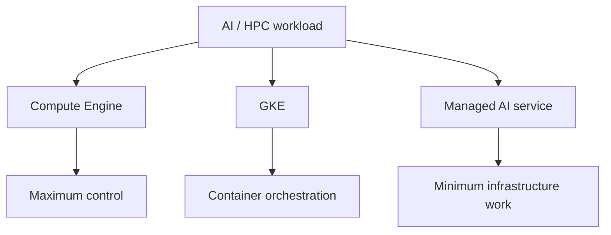
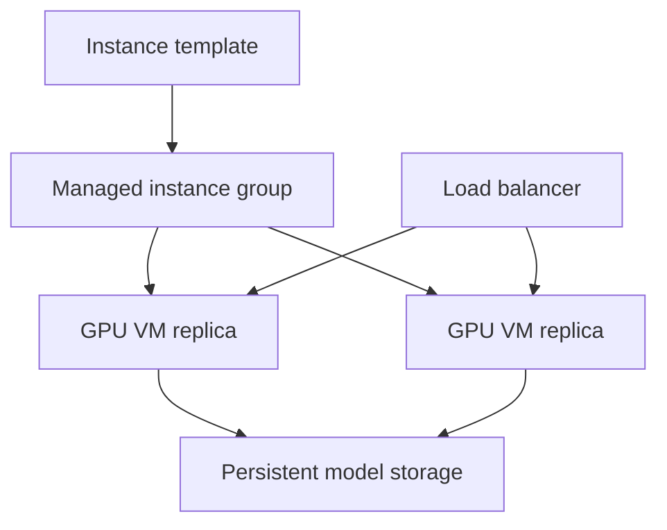
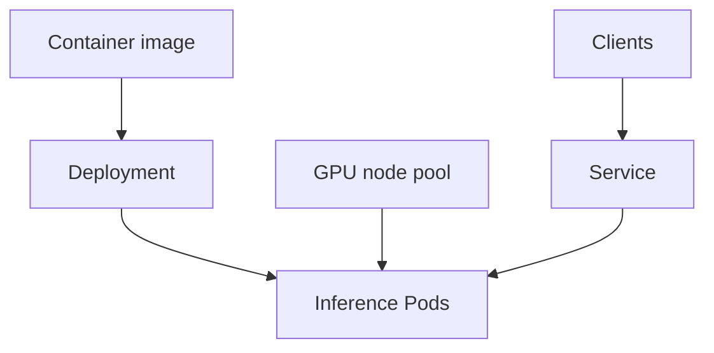
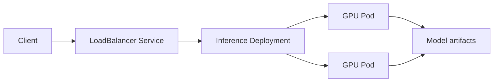

# AI Infrastructure: Deployment Types

> Google Skills 課程：https://www.skills.google/paths/11/course_templates/1554<br>
> 課程時間：約 1 小時 30 分鐘｜難度：Intermediate｜目標證照：Associate Cloud Engineer（ACE）<br>
> 官方公開主題：在 Google Cloud 部署、管理與最佳化 AI／HPC workload；比較 Compute Engine 與 GKE；建立 cluster 並以 GKE 部署 inference。<br>
> 文件核對日期：2026-08-24（Asia/Taipei）

### 課程定位與限制

- 這門課的 Compute Engine、GKE、cluster 與 workload deployment 觀念和 ACE 關聯較高。
- 模型 serving framework、分散式 AI training、HPC scheduler 與低階 accelerator networking 屬延伸知識。
- 公開頁面沒有完整影片、投影片、Lab 指令與正式細部單元名稱，因此以下依公開課程描述重組三章，不冒充原始章名。
- 未提供個人 Cloud Shell 紀錄，本文不建立「我的實際操作」，也不虛構 Terminal Output。

---

## Chapter 1 — Choosing an AI and HPC Deployment Model
中文名稱：選擇 AI 與 HPC 部署模式

### 1. Learning Objectives

- 比較 Compute Engine、GKE 與受管 AI 平台的控制程度。
- 依 workload、團隊技能、擴縮、可用性和維運需求選擇平台。
- 區分 training、batch inference、online inference 與 HPC job。
- 理解 VM、container、cluster 和 managed service 的責任邊界。

### 2. 核心概念摘要

AI Infrastructure 的部署選型不是單看 accelerator。Compute Engine 提供最大的 OS、driver、network 和 scheduler 控制；GKE 提供 Kubernetes orchestration、Deployment、Service、node pool 與 autoscaling；Vertex AI 等受管服務則讓團隊更專注於模型與 job。

ACE 情境題通常應選「滿足需求且維運最少」的方案；只有在需要特定 OS、driver、kernel、排程或網路控制時，才應承擔更高的自行管理成本。

### 3. 詳細知識點

#### 3.1 Workload 類型

| Workload | 主要需求 | 常見部署方式 |
|---|---|---|
| Training | 高吞吐、GPU/TPU memory、checkpoint、多節點通訊 | Compute Engine、GKE、Vertex AI |
| Batch inference | 成本、吞吐、可重試、排程 | VM batch、GKE Job、受管 batch service |
| Online inference | 延遲、可用性、autoscaling、load balancing | GKE Deployment/Service、Vertex AI endpoint |
| HPC | 緊密耦合網路、placement、平行檔案系統、scheduler | Compute Engine cluster、GKE、Slurm |

#### 3.2 Deployment model 比較

| 平台 | 優點 | 管理責任 | 適用情境 |
|---|---|---|---|
| Compute Engine | 最大控制與客製能力 | VM、OS、driver、patch、scaling、health | 單機、客製映像、傳統 HPC、特殊軟體 |
| GKE Standard | 控制 node pool 與 Kubernetes 設定 | Cluster、nodes、Pod、upgrade 與 capacity | 容器化 AI、混合 workload、精細控制 |
| GKE Autopilot | Google 管理 nodes 與多數 scaling | 主要管理 workload specification | 希望降低節點維運的容器 workload |
| Vertex AI | 受管 training／deployment workflow | 模型、資料、job 與 endpoint 設定 | 希望減少 infrastructure 管理 |

#### 3.3 Compute Engine 適用情境

- 需要 root access 或自訂 OS image。
- 需要自行安裝特定 accelerator driver/runtime。
- 使用 VM-native 或無法容器化的應用。
- HPC 軟體依賴特定 kernel、network 或 scheduler。
- 單一 VM 即可處理 workload，Kubernetes 的複雜度沒有必要。

常見陷阱：自行管理 VM 代表要負責 patch、image、driver、instance recovery、capacity 與 scaling。

#### 3.4 GKE 適用情境

- 已採用 container image 與 Kubernetes workflow。
- 需要 declarative deployment、rolling update、self-healing 和 service discovery。
- 需要將 CPU、GPU 或 TPU workload 放在不同 node pools。
- 需要 Horizontal Pod Autoscaler（HPA）或 Cluster Autoscaler。
- 多團隊共享 cluster，但仍需設計 namespace、IAM/RBAC、quota 與 isolation。

#### 3.5 Standard 與 Autopilot

| 項目 | Autopilot | Standard |
|---|---|---|
| Node 管理 | GKE 管理 | 使用者管理 node pools |
| Infrastructure 控制 | 較少 | 較高 |
| Scaling/bin packing | 高度自動化 | 需配置 autoscaling 與 capacity |
| 特殊 privileged／host 設定 | 有較多限制 | 較有彈性 |
| ACE 判斷 | 最少維運優先考慮 | 需求明確要求控制節點時選擇 |

依現行官方文件，Standard cluster 也可對特定 workload 使用 Autopilot mode／compute class；這是較新的能力，不能再把兩者理解成完全互斥的世界。

### 4. Resource Scope

| Resource | Scope | 說明與影響 |
|---|---|---|
| Compute Engine VM | Zonal | VM 與 attached accelerator 位於特定 Zone |
| GKE zonal cluster | Zonal control plane / nodes | 控制層單 Zone；較不適合高可用正式環境 |
| GKE regional cluster | Regional control plane | 控制層跨多 Zones；nodes 依 node locations 配置 |
| GKE node pool | Cluster resource；nodes 為 Zonal | 同一 pool 的 nodes 共享 machine/accelerator 設定 |
| Container image | Artifact Registry repository location | 拉取延遲、資料位置與權限需一併考量 |
| VPC network | Global | Subnet 是 Regional，cluster 使用其 IP ranges |

### 5. Architecture



### 6. Google Cloud Console

- Compute Engine：`Console > Compute Engine > VM instances > Create instance`
- GKE：`Console > Kubernetes Engine > Clusters > Create`
- Vertex AI：`Console > Vertex AI > Training` 或 `Online prediction`

Console 標籤可能變動；正式建立前仍需檢查 project、Region／Zone、Quota、VPC、service account 與成本估算。

### 7. Cloud Shell / gcloud

列出 Compute Engine VMs：

```bash
gcloud compute instances list
```

列出 GKE clusters：

```bash
gcloud container clusters list
```

- `gcloud compute instances list`：Compute Engine → instance → list。
- `gcloud container clusters list`：GKE → cluster → list。
- 可加入 `--project=PROJECT_ID` 明確指定專案。

### 8. Command Output

實際輸出通常包含資源名稱、location、machine/node 數量與狀態等欄位；因未提供課程或個人執行輸出，本文不建立假資料。

### 9. 認證考點

- 需要完整 OS／driver 控制：Compute Engine。
- 需要 Kubernetes orchestration：GKE。
- 希望最少基礎設施管理：優先考慮受管服務或 Autopilot。
- Regional GKE cluster 的控制層可用性高於 zonal cluster。
- GKE cluster、node pool、Pod 是不同層級，不能混稱為同一資源。

### 10. 教材與現行文件差異

| 類型 | 內容 | 官方來源 |
|---|---|---|
| 教材內容 | 從高度可自訂的 Compute Engine 到 GKE managed solution 比較部署方式 | [課程公開頁](https://www.skills.google/paths/11/course_templates/1554) |
| 現行官方文件 | Standard cluster 可讓特定 workload 以 Autopilot mode 執行 | [GKE modes](https://docs.cloud.google.com/kubernetes-engine/docs/concepts/choose-cluster-mode) |
| 備考建議 | 以責任邊界、控制程度與維運負擔判斷，而不是一律選 GKE | 依 ACE 情境題整理 |

### 11. 本章快速複習

1. Compute Engine 控制最高，管理責任也最高。
2. GKE 適合容器 orchestration，不代表免除所有 infrastructure 管理。
3. Autopilot 管理 nodes；Standard 提供更細緻 node pool 控制。
4. Online inference 重視 latency、availability 與 autoscaling。
5. 選擇最少維運且能滿足需求的方案。

---

## Chapter 2 — Building AI Infrastructure on Compute Engine
中文名稱：使用 Compute Engine 建置 AI Infrastructure

### 1. Learning Objectives

- 建立 accelerator-backed VM。
- 理解 image、driver、disk、network、service account 與 maintenance policy。
- 認識單一 VM、Managed Instance Group（MIG）與 cluster 型部署。
- 設計 cost、capacity、recovery 與 checkpoint 策略。

### 2. 核心概念摘要

Compute Engine 適合需要直接控制 VM 的 AI/HPC workload。建立 GPU VM 時，除了 machine type，也要同時確認 Zone availability、Regional model-specific GPU quota、Global GPU quota、實際 capacity、支援的 image/driver 和 host maintenance 行為。

GPU VM 不能使用一般 live migration；host maintenance 時必須停止，因此 stateful training 應使用 persistent checkpoint，線上服務則需多 instance、health check 與可重建架構。

### 3. 詳細知識點

#### 3.1 單 VM 部署元件

- Machine type／accelerator：依 training 或 inference 選擇。
- Boot disk image：應使用 accelerator 支援的 OS 或 Deep Learning VM image。
- NVIDIA driver／CUDA runtime：必須和 GPU、OS、framework 相容。
- Persistent Disk／Hyperdisk：保存持久資料；Local SSD 僅適合暫存和高吞吐 scratch data。
- VPC／Subnet：提供私有連線；是否需要 external IP 要依安全需求判斷。
- Service account：供 workload 存取 Cloud Storage、Artifact Registry 等 API。

#### 3.2 GPU 資源限制

- Accelerator-optimized machine family 的 GPU 通常與 machine type 綁定。
- N1 可附加特定較早期 GPU，但不是所有 machine family 都能任意附加。
- GPU 型號只在部分 Zones 提供。
- Quota 是可使用上限，不保證 Zone 當下有 capacity。
- Standard VM、Spot VM、reservation 解決的是不同可用性與成本問題。

#### 3.3 MIG 與可重建架構

Managed Instance Group 使用 instance template 建立一致 VM，並可搭配：

- Autoscaling
- Autohealing
- Load balancing
- Rolling update
- Zonal 或 Regional deployment

但 accelerator capacity 不足時，MIG 可能無法達到 target size。GPU/TPU workload 的 autoscaling 必須同時評估 accelerator quota、啟動時間與模型載入時間。

#### 3.4 Host maintenance 與資料

GPU VM 無法一般 live migrate。host maintenance 會停止 instance；若 Local SSD 隨 maintenance stop 而遺失，資料不可依賴它作唯一副本。

建議：

- 定期寫 checkpoint 到 Cloud Storage 或持久磁碟。
- 使用 startup script／custom image 自動重建 runtime。
- 線上 inference 使用多 replicas 與 load balancer。
- 對可中斷工作使用 Spot，並設計 retry。

#### 3.5 成本最佳化

- 選擇符合模型 GPU memory 與 throughput 的最小規格。
- 關閉或刪除閒置 VM。
- Batch／可重試工作考慮 Spot。
- 穩定長期用量可評估 commitment；確保容量則看 reservation。
- 一併計算 disk、network egress、license 與 idle time。

### 4. Resource Scope

| Resource | Scope | 說明與影響 |
|---|---|---|
| VM instance | Zonal | Accelerator 必須在相同 Zone 可用 |
| Instance template | Global 或 Regional | 供 MIG 建立一致 VM |
| MIG | Zonal 或 Regional | Regional MIG 可跨 Zones，提高可用性 |
| Persistent Disk | Zonal 或 Regional | 需和 VM attachment 規則相容 |
| GPU quota | Regional model quota + Global total quota | Quota 和實際 capacity 是不同條件 |
| Reservation | Zonal | 必須符合 machine／accelerator 與 consumption 條件 |

### 5. Architecture



### 6. Google Cloud Console

`Console > Compute Engine > VM instances > Create instance > Machine configuration > GPUs`

建立前確認：

- Region／Zone 是否有指定 accelerator。
- Quotas 頁面是否有 regional GPU model quota 與 global quota。
- Machine type、GPU count、boot disk image 與 driver。
- VPC、Subnet、IP、firewall 和 service account。
- Provisioning model 與 maintenance policy。

### 7. Cloud Shell / gcloud

#### 列出 accelerator types

```bash
gcloud compute accelerator-types list --filter="zone:(ZONE)"
```

#### 建立 N1 + T4 VM 的示意命令

```bash
gcloud compute instances create VM_NAME \
    --zone=ZONE \
    --machine-type=n1-standard-4 \
    --accelerator=count=1,type=nvidia-tesla-t4 \
    --maintenance-policy=TERMINATE \
    --boot-disk-size=40GB
```

- Command group：`gcloud compute`
- Resource：`instances`
- Action：`create`
- `VM_NAME`、`ZONE` 為 placeholders。
- 正式部署還需明確選擇相容 image／image family 並安裝 driver。

#### 查看 VM

```bash
gcloud compute instances describe VM_NAME --zone=ZONE
```

### 8. Command Output

建立失敗時常見原因包括 accelerator 不在該 Zone、Quota 不足、capacity 不足、machine/GPU 組合錯誤或 image/driver 不相容。本文沒有真實操作輸出，因此只描述排查方向。

### 9. 認證考點

- GPU VM 是 Zonal；GPU availability 也要查 Zone。
- Quota、Capacity、Reservation、Commitment 各自處理不同問題。
- GPU VM host maintenance 不使用一般 live migration。
- Local SSD 是暫時性儲存，不應保存唯一 checkpoint。
- MIG 可 autoheal／autoscale，但不能創造不存在的 accelerator capacity。

### 10. 教材與現行文件差異

| 類型 | 內容 | 官方來源 |
|---|---|---|
| 教材內容 | Compute Engine 提供高度可自訂的 AI/HPC environment | [課程公開頁](https://www.skills.google/paths/11/course_templates/1554) |
| 現行官方文件 | GPU 需 regional model-specific quota 與額外 global GPU quota | [Create GPU VM](https://docs.cloud.google.com/compute/docs/gpus/create-vm-with-gpus) |
| 現行官方文件 | GPU VM host maintenance 必須停止，不能一般 live migrate | [GPU host maintenance](https://docs.cloud.google.com/compute/docs/gpus/gpu-host-maintenance) |
| 備考建議 | ACE 重點在 VM 生命週期、Zone、Quota、IAM、network 與成本 | 依 ACE 操作能力整理 |

### 11. 本章快速複習

1. 建立 GPU VM 要同時確認 Zone、Quota、capacity、image 與 driver。
2. MIG 提供一致部署、autohealing 與 autoscaling。
3. GPU VM maintenance 需停止，應設計 checkpoint 與重建。
4. Local SSD 不作唯一持久副本。
5. 需要穩定 capacity 時，Quota 不等同 reservation。

---

## Chapter 3 — Deploying GKE for Inference
中文名稱：建立 GKE Cluster 並部署 Inference

### 1. Learning Objectives

- 建立 GKE cluster 與 accelerator node pool。
- 理解 Cluster、Node pool、Node、Pod、Deployment 與 Service。
- 將 inference container 部署為可擴縮 workload。
- 認識 accelerator requests、scheduling、driver、autoscaling 與 observability。

### 2. 核心概念摘要

GKE 將 AI inference 封裝為 container，Deployment 維持 Pods 的 desired state，Service 提供穩定存取入口，node pool 則提供 CPU/GPU/TPU capacity。Kubernetes scheduler 只有在 Pod 正確宣告 accelerator resource，且 node 具有相符 labels、taints/tolerations 和可用資源時，才能完成排程。

### 3. 詳細知識點

#### 3.1 GKE 資源階層

| 資源 | 角色 |
|---|---|
| Cluster | GKE control plane 與整體 worker infrastructure |
| Node pool | 共享 machine、image、accelerator 設定的一組 nodes |
| Node | 實際執行 Pods 的 Compute Engine VM |
| Pod | Kubernetes 最小排程單位，包含一或多個 containers |
| Deployment | 管理 stateless Pods、replicas 與 rolling updates |
| Service | 為 Pods 提供穩定 virtual IP／DNS 或 load balancer |

#### 3.2 Inference deployment flow



典型步驟：

1. 將 model server 建成 container image 並推送 Artifact Registry。
2. 建立 GKE cluster。
3. Standard 模式時建立 accelerator node pool；Autopilot 則由 workload specification 驅動資源。
4. Deployment 宣告 image、replicas、ports、resource requests/limits。
5. Service 暴露內部或外部 endpoint。
6. 設定 health probes、autoscaling、logging 與 monitoring。

#### 3.3 GPU scheduling

GPU node 必須具有：

- 支援的 GPU machine type 與 Zone capacity。
- 相容 NVIDIA driver。
- NVIDIA device plugin 將 GPU capacity 暴露給 Kubernetes API。
- Pod 中宣告 GPU resource limit，例如 `nvidia.com/gpu: 1`。
- 必要時加上 node selector、affinity、taint/toleration。

若沒有宣告 GPU resource，container 不會因為執行 AI model 就自動取得 GPU。

#### 3.4 Autoscaling 的兩個層級

| 層級 | 目的 | 限制 |
|---|---|---|
| HPA | 調整 Pod replicas | 需有適合 inference load 的 metric |
| Cluster Autoscaler / node auto-provisioning | 調整 node capacity | Accelerator capacity 不足時可能無法擴容 |

若 HPA 增加 Pods，但 cluster 沒有足夠 GPU nodes，Pods 會 Pending。只有 node autoscaling 而沒有 Pod scaling，也不能依 inference demand 增加 replicas。

#### 3.5 Service 類型

| Service type | 用途 |
|---|---|
| ClusterIP | 只供 cluster 內存取 |
| LoadBalancer | 建立雲端 load balancer，供外部或依設定內部存取 |
| NodePort | 每個 node 開啟 port，通常作為其他機制的底層組件 |

正式 inference endpoint 還需考慮 authentication、TLS、rate limiting、network policy 與 application-level timeout。

#### 3.6 安全與 IAM

- 人員管理 GKE 使用 Google Cloud IAM。
- Kubernetes 內部授權使用 RBAC。
- Workload 存取 Google Cloud API 應使用 Workload Identity Federation for GKE，而非在 image 內放 service account key。
- Container image 放在 Artifact Registry，授予最小必要讀取權限。
- Private cluster／private nodes 可降低公開暴露面，但需設計控制平面與 egress 存取。

### 4. Resource Scope

| Resource | Scope | 說明與影響 |
|---|---|---|
| GKE cluster | Zonal 或 Regional | 正式環境常優先 Regional control plane |
| Node pool | Cluster-level；nodes 位於 Zones | Accelerator type 必須在 node locations 可用 |
| Deployment | Namespaced | 只存在指定 Kubernetes namespace |
| Service | Namespaced | LoadBalancer 會建立對應 Google Cloud networking resources |
| Artifact Registry repository | Regional／Multi-regional | 建議靠近 cluster，並設定 IAM |
| Pod / Node IP ranges | Subnet secondary ranges | VPC-native cluster 需規劃 Pods 與 Services CIDR |

### 5. Architecture



### 6. Google Cloud Console

- 建立 cluster：`Console > Kubernetes Engine > Clusters > Create`
- 建立 node pool：`Console > Kubernetes Engine > Clusters > CLUSTER_NAME > Nodes > Add node pool`
- 查看 workload：`Console > Kubernetes Engine > Workloads`
- 查看 Service：`Console > Kubernetes Engine > Services & Ingress`

建立時應檢查 cluster mode、location type、release channel、VPC/Subnet、IP ranges、node service account、machine type、accelerator、autoscaling、logging 與 monitoring。

### 7. Cloud Shell / gcloud

#### 建立 Autopilot cluster

```bash
gcloud container clusters create-auto CLUSTER_NAME \
    --region=REGION
```

#### 建立 Standard regional cluster

```bash
gcloud container clusters create CLUSTER_NAME \
    --region=REGION \
    --release-channel=regular
```

#### 取得 cluster credentials

```bash
gcloud container clusters get-credentials CLUSTER_NAME \
    --region=REGION
```

此命令會更新本機 kubeconfig，讓後續 `kubectl` 指向該 cluster。

#### 建立 GPU node pool

```bash
gcloud container node-pools create GPU_POOL_NAME \
    --cluster=CLUSTER_NAME \
    --region=REGION \
    --machine-type=MACHINE_TYPE \
    --accelerator=type=GPU_TYPE,count=1,gpu-driver-version=default \
    --num-nodes=1
```

- Command group：`gcloud container`
- Resource：`node-pools`
- Action：`create`
- `GPU_POOL_NAME`、`CLUSTER_NAME`、`REGION`、`MACHINE_TYPE`、`GPU_TYPE` 都是 placeholders。
- `gpu-driver-version=default` 在支援的 GKE 版本可自動安裝預設 NVIDIA driver；實作前要查版本相容性。

#### 建立基本 Deployment

```bash
kubectl create deployment INFERENCE_DEPLOYMENT \
    --image=REGION-docker.pkg.dev/PROJECT_ID/REPOSITORY/IMAGE:TAG \
    --replicas=1
```

真正的 GPU inference workload 通常應使用 YAML 宣告 GPU resource、ports、probes、env、volume 與 scheduling rules；單一 imperative command 只適合快速示範。

#### 查看資源

```bash
kubectl get deployments
kubectl get pods -o wide
kubectl get services
gcloud container clusters describe CLUSTER_NAME --region=REGION
```

### 8. Command Output

- Cluster 建立成功後，可取得 endpoint、location、版本與 node pool 等資訊。
- Pod 若無法排程，常見狀態是 `Pending`；應使用 `kubectl describe pod POD_NAME` 查看 events，而不是猜測原因。
- 本文沒有課程 demonstration 或使用者 terminal output，因此不填入虛構內容。

### 9. 認證考點

- Deployment 維持 Pod replicas；Service 提供穩定存取方式。
- Node pool 是共享 node configuration 的集合，不等於 Pod。
- HPA 擴 Pod，Cluster Autoscaler 擴 node，兩者解決不同層級。
- GPU workload 必須宣告 GPU resource；scheduler 不會由 image 名稱自動判斷。
- 管理 cluster 的 IAM 與 Kubernetes RBAC 不同。
- Workload 存取 Google APIs 優先使用 Workload Identity Federation for GKE，不使用長期 service account key。

### 10. 教材與現行文件差異

| 類型 | 內容 | 官方來源 |
|---|---|---|
| 教材內容 | 建立 cluster，並部署 GKE 以執行 inference | [課程公開頁](https://www.skills.google/paths/11/course_templates/1554) |
| 現行官方文件 | GKE Standard GPU node pool 可透過 `gpu-driver-version` 選擇自動安裝 driver | [GKE GPU node pools](https://docs.cloud.google.com/kubernetes-engine/docs/how-to/gpus) |
| 現行官方文件 | Autopilot 管理 nodes/scaling；Standard 由使用者控制 node pools | [GKE modes](https://docs.cloud.google.com/kubernetes-engine/docs/concepts/choose-cluster-mode) |
| 備考建議 | ACE 優先掌握 cluster/node pool/Pod/Deployment/Service 與 autoscaling | 依 ACE 管理 GKE 能力整理 |

### 11. 本章快速複習

1. Cluster 包含 control plane 與 nodes；node pool 管理一組同質 nodes。
2. Deployment 管 Pods，Service 提供穩定網路入口。
3. GPU Pod 必須宣告 accelerator resource。
4. HPA 和 Cluster Autoscaler 分別擴 Pod 與 node。
5. 使用 Workload Identity Federation for GKE 取代長期金鑰。

---

## 認證重點統整

### ACE 重點

#### 必須掌握

- Compute Engine、GKE Standard、GKE Autopilot 與受管 AI service 的責任邊界。
- Zonal 與 Regional GKE cluster 的可用性差異。
- Cluster、Node pool、Node、Pod、Deployment、Service 的關係。
- 建立 cluster、取得 credentials、建立 node pool、部署 workload 和檢查狀態。
- GPU/TPU resource 的 Zone、Quota、capacity 與 driver/runtime 前置條件。
- Deployment replicas、HPA 與 Cluster Autoscaler 的層級差異。
- IAM、RBAC、service account 與 Workload Identity Federation for GKE。
- VM、cluster、node pool、Pod 和 LoadBalancer 的成本及生命週期。

#### 延伸理解

- 大型 HPC placement、Slurm 與高速 interconnect。
- GPU sharing、MIG partition、vLLM/KServe 等 serving framework。
- Multi-host training 與低階 collective communication 調校。
- Model server 的 batch、KV cache 與 accelerator profiling。

### 服務選型與比較

| 情境 | 建議服務 | 理由 | 常見誤解 |
|---|---|---|---|
| 單機、需 root/OS/driver 控制 | Compute Engine | 最大自訂能力 | 不必為單一 VM 引入 Kubernetes |
| 容器化、多服務、需 orchestration | GKE | Deployment、Service、node pool、autoscaling | GKE 不會自動解決 accelerator capacity |
| 希望 GKE 最少 node 維運 | GKE Autopilot | Google 管理 nodes 與多數 scaling | 仍需正確宣告 workload resources |
| 需完全控制 accelerator node pools | GKE Standard | 可控制 machine、node pool 與設定 | 管理責任高於 Autopilot |
| 受管 training／endpoint | Vertex AI | 降低 infrastructure 管理 | 仍需 IAM、Quota、location 與成本治理 |
| Stateless inference 多 replicas | Deployment + Service | self-healing、rolling update、穩定入口 | 單一 Pod 不是高可用部署 |
| 必須保存 training 狀態 | Persistent checkpoint | 可在 VM/Pod 重建後恢復 | Local SSD 不可作唯一副本 |

### 常見 ACE 陷阱

1. **Pod 等於 VM**：錯。Pod 是 Kubernetes 排程單位，Node 才通常對應 VM。
2. **Deployment 對外提供固定 IP**：錯。穩定存取由 Service／Ingress 等資源提供。
3. **HPA 會建立 GPU nodes**：錯。HPA 擴 Pods，nodes 由 Cluster Autoscaler／Autopilot 管理。
4. **Image 內有 CUDA 就會自動取得 GPU**：錯。Pod 必須宣告 accelerator resource。
5. **有 Quota 就有 capacity**：錯。
6. **GKE IAM 等於 Kubernetes RBAC**：錯，兩者作用層不同。
7. **將 service account JSON key 放入 image 最簡單**：不安全，應使用 Workload Identity Federation for GKE。
8. **GPU VM 可以 live migrate**：一般情況不行，host maintenance 必須停止。

### gcloud / kubectl 指令速查

```bash
# 列出 GKE clusters
gcloud container clusters list

# 建立 Autopilot cluster
gcloud container clusters create-auto CLUSTER_NAME --region=REGION

# 建立 Standard regional cluster
gcloud container clusters create CLUSTER_NAME --region=REGION --release-channel=regular

# 取得 credentials
gcloud container clusters get-credentials CLUSTER_NAME --region=REGION

# 查看 Kubernetes workloads
kubectl get deployments
kubectl get pods -o wide
kubectl get services
```

### 考前自我檢查

- [ ] 我能依控制程度與管理負擔選 Compute Engine、GKE 或 Vertex AI。
- [ ] 我能區分 Autopilot 與 Standard。
- [ ] 我知道 zonal／regional GKE cluster 的差異。
- [ ] 我能解釋 Cluster、Node pool、Node、Pod、Deployment、Service。
- [ ] 我知道 GPU Pod 必須宣告 resource request/limit。
- [ ] 我能區分 HPA 與 Cluster Autoscaler。
- [ ] 我知道 IAM、RBAC 與 Workload Identity Federation for GKE 的角色。
- [ ] 我能依 Zone、Quota、capacity、driver 與 Pod events 排錯。

### 待補材料與限制

- 公開頁面未提供完整課程章節、影片、逐字稿、Lab 指令與 demonstration output。
- 本文依公開課程說明重組內容，沒有宣稱為逐字稿或完整 Lab 還原。
- 未提供個人 Cloud Shell 執行紀錄，因此沒有「我的實際操作」。
- GKE modes、accelerator、driver、machine type、Zone、Quota 與 CLI flags 可能更新；實作前需再次查閱官方文件。

### 官方參考資料

- [AI Infrastructure: Deployment Types](https://www.skills.google/paths/11/course_templates/1554)
- [GKE modes of operation](https://docs.cloud.google.com/kubernetes-engine/docs/concepts/choose-cluster-mode)
- [Run GPUs in GKE Standard node pools](https://docs.cloud.google.com/kubernetes-engine/docs/how-to/gpus)
- [Create a VM with attached GPUs](https://docs.cloud.google.com/compute/docs/gpus/create-vm-with-gpus)
- [Handle GPU host maintenance](https://docs.cloud.google.com/compute/docs/gpus/gpu-host-maintenance)
- [`gcloud container clusters create`](https://docs.cloud.google.com/sdk/gcloud/reference/container/clusters/create)
- [`gcloud container node-pools create`](https://docs.cloud.google.com/sdk/gcloud/reference/container/node-pools/create)
- [`kubectl create deployment`](https://kubernetes.io/docs/reference/kubectl/generated/kubectl_create/kubectl_create_deployment/)
