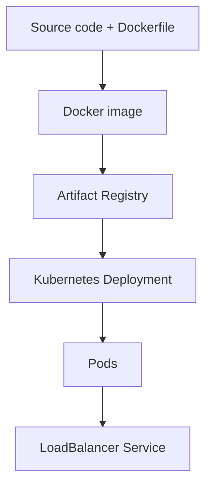
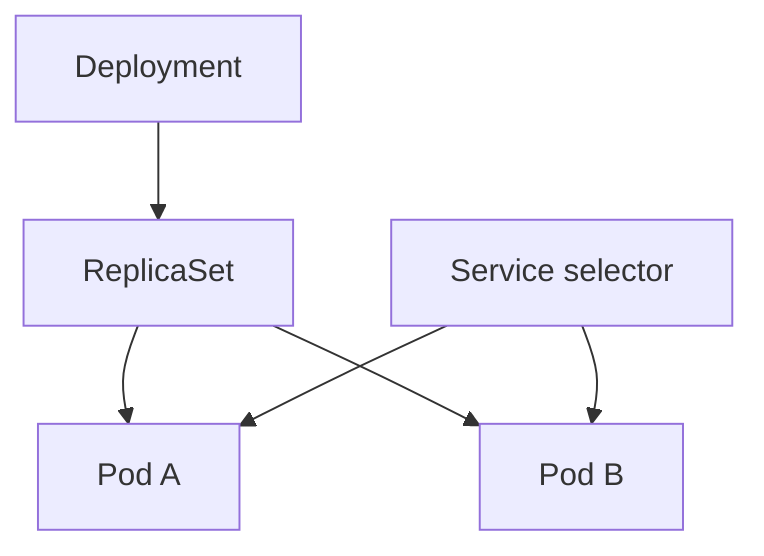

# Deploy Kubernetes Applications on Google Cloud

中文名稱：在 Google Cloud 部署 Kubernetes 應用程式

> 課程：Google Skills `course_templates/663`<br>
> Challenge Lab：GSP318<br>
> 程度：Intermediate<br>
> 公開頁面時數：1 小時 45 分鐘<br>
> 備考目標：Associate Cloud Engineer（ACE）<br>
> 驗證日期：2026-08-25

---

### 1. Learning Objectives

完成本課程後，應能：

1. 閱讀並建立 Dockerfile，將應用程式封裝成 container image。
2. 在本機執行 container，理解 host port 與 container port 的映射。
3. 建立 Artifact Registry Docker repository，完成認證、tag 與 push。
4. 取得 Google Kubernetes Engine（GKE）cluster credentials，使用 `kubectl` 管理 cluster。
5. 閱讀 Kubernetes Deployment 與 Service manifest。
6. 將 Artifact Registry image 部署到 GKE，並以 `LoadBalancer` Service 對外公開。
7. 依照 image → registry → Deployment → Pod → Service 的鏈路排查部署錯誤。

---

### 2. 課程定位與目前可讀範圍

官方課程頁列出的能力包括：

- Configuring and building Docker container images。
- Creating and managing GKE clusters。
- 使用 `kubectl` 管理 cluster。
- 以持續交付（Continuous Delivery，CD）做法部署 Kubernetes applications。

目前公開可完整讀取的實作內容是 GSP318 Challenge Lab，評分項目為：

| 評分項目 | 配分 | 核心能力 |
|---|---:|---|
| Create a Docker image and store the Dockerfile | 25 | Dockerfile、`docker build` |
| Push the Docker image to Artifact Registry | 25 | Repository、authentication、tag、push |
| Create and expose a deployment in Kubernetes | 50 | GKE credentials、Deployment、Service、external IP |

Challenge Lab 另要求先在本機執行 container 測試，但這一步沒有獨立的 checkpoint 配分。

> 公開課程頁沒有列出更多現行章節或逐字稿，因此本文以官方課程能力說明與 2026-06-19 更新、測試的 GSP318 為來源骨架。舊版課程清單僅作歷史參考，不當成現行課綱。

---

### 3. 核心概念摘要

#### 完整部署鏈



#### 各元件角色

| 元件 | 角色 | ACE 應會判斷 |
|---|---|---|
| Dockerfile | Image 的建置配方 | `FROM`、`COPY`、`RUN`、`ENTRYPOINT` 的用途 |
| Container image | 不可變的應用程式封裝 | Tag 是可變標籤；digest 才是內容識別 |
| Artifact Registry | 儲存與管理 image | 完整路徑、repository location、IAM、認證 |
| GKE cluster | 受管理的 Kubernetes 執行環境 | Cluster、node、control plane 的關係 |
| Deployment | 宣告 Pod template 與 replicas | Rolling update、自我修復、擴縮 |
| Pod | Kubernetes 最小可部署單位 | 一或多個緊密耦合 containers |
| Service | 為 Pods 提供穩定存取端點 | `ClusterIP`、`NodePort`、`LoadBalancer` |
| `kubectl` | Kubernetes API client | 依 kubeconfig/context 操作正確 cluster |

---

## Chapter 1 — Container Image Fundamentals

中文名稱：容器映像檔基礎

### 1. Learning Objectives

- 分辨 image 與 container。
- 看懂課程 Dockerfile。
- 建立、列出與執行 image。
- 理解 port mapping 與背景執行。

### 2. 核心概念摘要

- **Image**：唯讀分層範本，包含應用程式、runtime 與必要檔案。
- **Container**：image 的執行實例，具有自己的 process 與可寫層。
- **Dockerfile**：描述如何從 base image 建立新 image。
- **Build context**：`docker build` 最後的路徑；`COPY` 只能讀取 context 內的檔案。

### 3. 詳細知識點

#### 3.1 課程 Dockerfile

GSP318 指定內容：

```dockerfile
FROM golang:1.10
WORKDIR /go/src/app
COPY source .
RUN go install -v
ENTRYPOINT ["app","-single=true","-port=8080"]
```

| 指令 | 建置或執行階段 | 說明 |
|---|---|---|
| `FROM golang:1.10` | Build | 使用 Go 1.10 base image |
| `WORKDIR /go/src/app` | Build/runtime | 設定後續指令的工作目錄 |
| `COPY source .` | Build | 將 build context 中的 `source` 複製進 image |
| `RUN go install -v` | Build | 建置 Go application，產生可執行檔 |
| `ENTRYPOINT [...]` | Runtime | Container 啟動時執行 `app` 並傳入參數 |

JSON array 格式的 `ENTRYPOINT` 不經 shell 展開，訊號處理通常比 shell form 清楚。

#### 3.2 Image tag 與 digest

```text
IMAGE_NAME:TAG
```

- Tag 例如 `v1`、`latest`，是人類可讀標籤，可能改指向其他 digest。
- Digest 例如 `sha256:...`，識別特定 image content。
- Production 若要求完全可重現，可以 digest pinning 或 immutable tags 降低漂移。

#### 3.3 Port mapping

```bash
docker run -p 8080:8080 IMAGE_NAME:TAG &
```

`-p HOST_PORT:CONTAINER_PORT`：將 Cloud Shell／host 的 8080 導向 container 8080。最後的 `&` 是 shell 的背景執行符號，不是 Docker flag。

### 4. Resource Scope

| Resource | Scope | 說明與影響 |
|---|---|---|
| Local Docker image | Cloud Shell VM local | 尚未 push 前，其他主機與 GKE 無法直接使用 |
| Running container | Cloud Shell VM local | Lab 結束或 Cloud Shell 環境重建後不應視為持久部署 |
| Container port | Container network namespace | 必須與應用程式實際監聽 port 一致 |
| Host port | Docker host | 供 Web Preview 或 host client 連線 |

### 5. Cloud Shell / CLI

下載並解壓 Lab source：

```bash
gcloud storage cp gs://spls/gsp318/valkyrie-app.tgz .
tar -xzf valkyrie-app.tgz
cd valkyrie-app
```

建立 `Dockerfile` 後，以 Lab 顯示的動態 image name 與 tag 建置：

```bash
docker build -t <IMAGE_NAME>:<TAG> .
docker images
```

指令解釋：

- Command group：`docker`
- Action：`build`
- `-t`：設定 image repository/name 與 tag。
- `.`：目前目錄是 build context；Dockerfile 預設也從此尋找。

本機測試：

```bash
docker run --name valkyrie-test \
  -p 8080:8080 \
  <IMAGE_NAME>:<TAG> &
```

可用 Cloud Shell 的 `Web preview > Preview on port 8080` 檢查。

排查：

```bash
docker ps
docker logs valkyrie-test
curl http://localhost:8080
```

### 6. 認證考點

- Build image 不等於 push registry，也不等於部署到 GKE。
- Container 應用程式必須監聽與 Service `targetPort` 對應的 port。
- `docker images` 只顯示本機 image。
- `docker run -p` 是本機測試；GKE 對外存取由 Kubernetes Service 管理。
- 不應在 production image 內保存 service account key 或其他長效祕密。

### 7. 教材與現行文件差異

| 類型 | 內容 | 官方來源 |
|---|---|---|
| 教材內容 | Lab 明確要求 `FROM golang:1.10` | GSP318 Task 1 |
| 現行官方文件 | 此 base image 版本非常舊；課程指定值只適合 Lab 評分，不應直接當作 production 標準 | 依版本年代判斷；正式環境應使用受支援並完成弱點評估的 image |
| 備考建議 | ACE 重點是 container/image lifecycle 與部署流程，不需背 Go 版本 | 推論，非官方考綱聲明 |

### 8. 本章快速複習

```text
Dockerfile → docker build → local image → docker run → local container
```

---

## Chapter 2 — Artifact Registry

中文名稱：Artifact Registry 映像檔儲存庫

### 1. Learning Objectives

- 建立 Docker-format repository。
- 設定 Docker authentication。
- 正確組成完整 image path。
- Tag 並 push image。

### 2. 核心概念摘要

Artifact Registry 是 Google Cloud 建議使用的 artifact 管理服務，可儲存 Docker/OCI images 與多種 package formats。Repository 必須先建立，之後才能 push。

完整 Docker image path：

```text
LOCATION-docker.pkg.dev/PROJECT_ID/REPOSITORY/IMAGE:TAG
```

### 3. 詳細知識點

#### 3.1 路徑的五個部分

| 部分 | 範例格式 | 說明 |
|---|---|---|
| `LOCATION` | `us-central1` | Repository location，須使用 Lab 指定值 |
| `PROJECT_ID` | `my-project` | Google Cloud project ID，不是 project name |
| `REPOSITORY` | `valkyrie-repo` | Artifact Registry repository 名稱 |
| `IMAGE` | `valkyrie-app` | Image 名稱 |
| `TAG` | `v1` | Image version label |

#### 3.2 認證

```bash
gcloud auth configure-docker <LOCATION>-docker.pkg.dev
```

這會更新 Docker credential helper 設定，讓 Docker 使用目前 `gcloud` 身分向指定 registry hostname 認證。它不會自動授予 IAM 權限；執行者仍需有 push/pull 所需角色。

#### 3.3 GKE 拉取 image 的身分

`docker push` 使用的是操作者／建置服務身分；GKE node 或 workload 拉取 image 時，則使用執行環境所配置的身分與權限。跨 project repository 特別需要確認 Artifact Registry Reader 權限。

### 4. Resource Scope

| Resource | Scope | 說明與影響 |
|---|---|---|
| Artifact Registry repository | Regional / Multi-regional | GSP318 指定用 Lab region 建立 regional repository |
| Container image | Repository 內 | 由完整 repository path、name、tag/digest 識別 |
| IAM policy | Project 或 repository | 可在 repository 層授予較細緻的存取控制 |

### 5. Google Cloud Console

```text
Console > Artifact Registry > Repositories > Create repository
```

設定：

- Format：Docker
- Mode：Standard（若 Lab 未另行指定）
- Location type / Region：使用 Lab 分配 region
- Repository ID：使用 Lab 指定名稱

Console 名稱可能隨介面更新，Challenge Lab 評分以實際 resource 屬性為準。

### 6. Cloud Shell / gcloud

先設定動態值：

```bash
export PROJECT_ID="$(gcloud config get-value project)"
export REGION="<LAB_ASSIGNED_REGION>"
export REPOSITORY="<LAB_ASSIGNED_REPOSITORY>"
export IMAGE_NAME="<LAB_ASSIGNED_IMAGE_NAME>"
export TAG="<LAB_ASSIGNED_TAG>"
```

建立 repository：

```bash
gcloud artifacts repositories create "$REPOSITORY" \
  --repository-format=docker \
  --location="$REGION"
```

指令解釋：

- Command group：`gcloud artifacts`
- Resource：`repositories`
- Action：`create`
- `--repository-format=docker`：建立 Docker repository。
- `--location`：repository 的實體位置／scope。

設定認證：

```bash
gcloud auth configure-docker "${REGION}-docker.pkg.dev"
```

建立完整路徑、重新 tag 並 push：

```bash
export AR_IMAGE="${REGION}-docker.pkg.dev/${PROJECT_ID}/${REPOSITORY}/${IMAGE_NAME}:${TAG}"

docker tag "${IMAGE_NAME}:${TAG}" "$AR_IMAGE"
docker push "$AR_IMAGE"
```

驗證 repository 內 images：

```bash
gcloud artifacts docker images list \
  "${REGION}-docker.pkg.dev/${PROJECT_ID}/${REPOSITORY}" \
  --include-tags
```

### 7. Command Output

使用者未提供終端機輸出，因此不建立「我的實際操作」。預期 `docker push` 會逐層上傳或顯示已存在的 layers，最後顯示 image digest；實際文字依 Docker 版本與 image 狀態而異。

### 8. 認證考點

- Artifact Registry repository 必須先建立；不能只靠第一次 push 自動建立。
- `gcloud auth configure-docker` 處理 credential helper，不取代 IAM。
- `LOCATION` 必須和 repository 實際 location 一致。
- `PROJECT_ID`、repository、image、tag 任一錯誤都可能造成 GKE `ImagePullBackOff`。
- Tag 可變；digest 對應特定內容。
- Repository 與 GKE 在相近 location 通常有利於延遲、可用性規劃與資料傳輸成本，但需依正式需求選擇。

### 9. 教材與現行文件差異

| 類型 | 內容 | 官方來源 |
|---|---|---|
| 教材內容 | GSP318 現行任務要求 push 到 Artifact Registry | [GSP318](https://www.skills.google/focuses/10457?parent=catalog) |
| 現行官方文件 | Image path 為 `LOCATION-docker.pkg.dev/PROJECT-ID/REPOSITORY/IMAGE:TAG` | [Push and pull images](https://docs.cloud.google.com/artifact-registry/docs/docker/pushing-and-pulling) |
| 現行官方文件 | `gcloud` credential helper 是最簡單的互動式設定方式；大量自動化情境可考慮 standalone helper | [Artifact Registry authentication](https://docs.cloud.google.com/artifact-registry/docs/docker/authentication) |

### 10. 本章快速複習

```text
create repository → configure-docker → docker tag → docker push
```

---

## Chapter 3 — Google Kubernetes Engine and kubectl

中文名稱：GKE 與 kubectl 叢集管理

### 1. Learning Objectives

- 理解 GKE cluster 基本架構。
- 使用 `get-credentials` 更新 kubeconfig。
- 分辨 `gcloud` 與 `kubectl` 的管理範圍。
- 使用基本診斷指令。

### 2. 核心概念摘要

GKE 是 Google Cloud 的受管理 Kubernetes 服務：

- **Control plane**：Kubernetes API、排程與 cluster 狀態管理；由 Google 管理。
- **Nodes**：執行 Pods 的運算資源。Standard 通常提供較多 node 控制；Autopilot 進一步由 Google 管理 infrastructure configuration。
- **Workload**：Deployment、StatefulSet、Job 等 Kubernetes objects。

### 3. 詳細知識點

#### 3.1 `gcloud` 與 `kubectl`

| 工具 | 主要 API | 用途 |
|---|---|---|
| `gcloud container clusters ...` | Google Cloud GKE API | 建立、描述 cluster，取得 credentials |
| `kubectl ...` | Kubernetes API server | 建立 Deployment、Service，查看 Pod 與 logs |

#### 3.2 kubeconfig 與 context

```bash
gcloud container clusters get-credentials valkyrie-dev \
  --zone="<LAB_ASSIGNED_ZONE>"
```

此指令取得 cluster endpoint 與 authentication 資訊，寫入 kubeconfig 並切換 current context。若 project、location 或 cluster name 錯誤，後續 `kubectl` 可能連不到 cluster，或操作到錯誤環境。

#### 3.3 GKE Standard 與 Autopilot

| 模式 | 適合情境 | 管理責任重點 |
|---|---|---|
| Autopilot | 希望降低 node/infrastructure 維運，多數一般 production workloads | Google 管理較多 node、scaling、安全預設 |
| Standard | 需要 node pool、machine、system configuration 等較細控制 | 使用者承擔更多 node 與 cluster 配置責任 |

本 Lab 使用既有 `valkyrie-dev` cluster，不要求建立或選擇模式；ACE 情境題則應理解兩者取捨。

### 4. Resource Scope

| Resource | Scope | 說明與影響 |
|---|---|---|
| GKE zonal cluster | Zonal | Lab 使用 `--zone` 取得 credentials |
| GKE regional cluster | Regional | Control plane 與 nodes 可跨 region 內 zones 配置，命令使用 `--region` |
| Node pool | Cluster 內／location follows cluster | 一組具有共同設定的 nodes |
| Namespace | Kubernetes cluster 內 | 邏輯隔離 Kubernetes resources；不是 Google Cloud region |
| kubeconfig context | Client local | 決定 `kubectl` 目前連線的 cluster/user/namespace |

### 5. Google Cloud Console

```text
Console > Kubernetes Engine > Clusters
Console > Kubernetes Engine > Workloads
Console > Kubernetes Engine > Gateways, Services & Ingress
```

### 6. Cloud Shell / gcloud

取得 credentials：

```bash
gcloud container clusters get-credentials valkyrie-dev \
  --zone="$ZONE" \
  --project="$PROJECT_ID"
```

確認 context 與 cluster：

```bash
kubectl config current-context
kubectl cluster-info
kubectl get nodes
```

基本排查：

```bash
kubectl get deployments,pods,services
kubectl describe deployment valkyrie-dev
kubectl get events --sort-by=.metadata.creationTimestamp
```

### 7. 認證考點

- `get-credentials` 不會建立 cluster，只更新 client access configuration。
- Zonal cluster 用 `--zone`；regional cluster 用 `--region`。
- `kubectl` 指令失敗先確認 current context、project、cluster location 與 IAM/RBAC。
- Kubernetes RBAC 與 Google Cloud IAM 是不同層次；GKE access 可能同時涉及兩者。
- Cluster `RUNNING` 不代表所有 Pods ready。

### 8. 本章快速複習

```text
gcloud 管 GKE 資源；kubectl 管 Kubernetes objects；kubeconfig context 決定 kubectl 的目標。
```

---

## Chapter 4 — Kubernetes Deployment and Service

中文名稱：Kubernetes Deployment 與 Service

### 1. Learning Objectives

- 看懂 Deployment 的 selector、Pod template、replicas 與 image。
- 看懂 Service selector、port、targetPort 與 type。
- 部署 manifests 並驗證 rollout、Pod 與 external IP。

### 2. 核心概念摘要

Deployment 負責維持所需的 Pods；Service 透過 label selector 找到 Pods，提供穩定存取端點。



### 3. 詳細知識點

#### 3.1 Deployment 關鍵欄位

```yaml
apiVersion: apps/v1
kind: Deployment
metadata:
  name: valkyrie-dev
spec:
  replicas: 2
  selector:
    matchLabels:
      app: valkyrie
  template:
    metadata:
      labels:
        app: valkyrie
    spec:
      containers:
      - name: valkyrie
        image: LOCATION-docker.pkg.dev/PROJECT_ID/REPOSITORY/IMAGE:TAG
        ports:
        - containerPort: 8080
```

這是概念範例，不代表 Lab 已提供 manifest 的完整原文。Lab 要求修改現有 `k8s/deployment.yaml` 中的 image placeholder，不應覆寫其他既有設定。

必要關係：

- `spec.selector.matchLabels` 必須匹配 Pod template labels。
- `image` 必須是完整 Artifact Registry path。
- `containerPort` 是資訊與工具整合欄位；真正服務是否監聽仍由應用程式決定。
- Deployment 更新 Pod template 後通常建立新 ReplicaSet 並 rolling update。

#### 3.2 Service 關鍵欄位

```yaml
apiVersion: v1
kind: Service
metadata:
  name: valkyrie-dev
spec:
  type: LoadBalancer
  selector:
    app: valkyrie
  ports:
  - protocol: TCP
    port: 80
    targetPort: 8080
```

| 欄位 | 意義 |
|---|---|
| `selector` | 選出接受流量的 Pods |
| `port` | Client 連到 Service 的 port |
| `targetPort` | Service 將流量送到 Pod 的 port |
| `type: LoadBalancer` | 要求 cloud controller 建立外部負載平衡資源 |

#### 3.3 Service 類型

| Type | 可達範圍 | 典型用途 |
|---|---|---|
| `ClusterIP` | Cluster 內 | 內部微服務，預設 type |
| `NodePort` | Node IP + nodePort | 基礎外部存取或其他 LB 的底層機制 |
| `LoadBalancer` | Cloud load balancer IP | 對外或搭配 annotation 建立內部 L4 LB |
| `ExternalName` | DNS alias | 將 Service 名稱映射到外部 DNS |

GKE 建立 external `LoadBalancer` Service 時，cloud controller 會佈建 regional external passthrough Network Load Balancer。這與建立 Kubernetes Ingress 所形成的 Application Load Balancer 不同。

### 4. Resource Scope

| Resource | Scope | 說明與影響 |
|---|---|---|
| Deployment | Namespace-scoped | 同一 namespace 內名稱唯一 |
| ReplicaSet | Namespace-scoped | 通常由 Deployment 管理，不宜手動修改 |
| Pod | Namespace-scoped；排程到 node | Pod IP 與生命週期不應視為永久 |
| Service | Namespace-scoped | 提供穩定 virtual IP/DNS name |
| External LoadBalancer frontend | Regional（一般 GKE external LB Service） | 由 GKE cloud controller 代為建立 |

### 5. Google Cloud Console

Lab 驗證路徑：

```text
Console > Kubernetes Engine > Gateways, Services & Ingress
```

找到 `valkyrie-dev` Service，等待 external IP 配置完成，再開啟 IP 驗證。

### 6. Cloud Shell / kubectl

先查看 Lab 提供的 manifests：

```bash
cd ~/valkyrie-app
sed -n '1,240p' k8s/deployment.yaml
sed -n '1,240p' k8s/service.yaml
```

尋找 placeholder：

```bash
grep -RIn 'IMAGE\|PROJECT\|REPOSITORY\|LOCATION' k8s
```

把 `deployment.yaml` 的 image 替換成前面建立的 `$AR_IMAGE`。修改後確認：

```bash
grep -n 'image:' k8s/deployment.yaml
```

套用 manifests：

```bash
kubectl apply -f k8s/deployment.yaml
kubectl apply -f k8s/service.yaml
```

雖然 Lab 文字可能使用 `kubectl create -f`，`apply` 是可重複執行的宣告式管理方式；若評分器或課程明確要求初次 `create`，則遵照 Lab：

```bash
kubectl create -f k8s/deployment.yaml
kubectl create -f k8s/service.yaml
```

驗證 rollout：

```bash
kubectl rollout status deployment/valkyrie-dev
kubectl get deployments
kubectl get pods -o wide
kubectl get services
```

取得 external IP：

```bash
kubectl get service valkyrie-dev \
  --watch
```

當 `EXTERNAL-IP` 不再是 `<pending>` 後停止 watch，再以瀏覽器或 `curl` 測試。

### 7. Command Output

使用者未提供實際輸出，因此不虛構紀錄。預期狀態判斷：

| 指令 | 成功時應觀察 |
|---|---|
| `kubectl rollout status` | Deployment rollout successfully completed |
| `kubectl get pods` | Pods 為 `Running` 且 READY 數符合 containers |
| `kubectl get svc` | `valkyrie-dev` 有 external IP；配置可能需要數分鐘 |
| `kubectl get endpoints` | 應出現符合 selector 且 ready 的 Pod endpoints |

### 8. 認證考點

- Deployment 管 replicas 與 rollout；Service 管 stable networking。
- Service selector 與 Pod labels 不符時，Service 可能存在但沒有 endpoints。
- `port` 是 Service port；`targetPort` 是 Pod application port。
- `LoadBalancer` Service 通常提供 L4 load balancing；HTTP path routing 使用 Ingress/Gateway/Application Load Balancer。
- External IP `<pending>` 可能只是 provisioning 尚未完成，也可能是 quota、permission 或 configuration 問題。
- `ImagePullBackOff` 優先檢查 image path、tag/digest、repository location、image 是否存在與 pull IAM。
- `CrashLoopBackOff` 優先查看 `kubectl logs`、command/args、environment 與 application error。

### 9. 本章快速複習

```text
Deployment 選 Pod template；Service 用 labels 選 Pods；LoadBalancer Service 建立外部 L4 frontend。
```

---

## Chapter 5 — GSP318 Challenge Lab Workflow

中文名稱：GSP318 挑戰研究室操作脈絡

### 1. Learning Objectives

- 依動態參數完成四項任務。
- 避免使用硬編碼的 region、zone、repository、image 與 tag。
- 建立可驗證、可排錯的部署流程。

### 2. Lab 動態值

GSP318 的 image name、tag、repository、region 與 zone 由 Lab 工作階段指定。公開頁面可能顯示空白模板，因此本文不猜測固定答案。

```bash
export PROJECT_ID="$(gcloud config get-value project)"
export REGION="<LAB_ASSIGNED_REGION>"
export ZONE="<LAB_ASSIGNED_ZONE>"
export REPOSITORY="<LAB_ASSIGNED_REPOSITORY>"
export IMAGE_NAME="<LAB_ASSIGNED_IMAGE_NAME>"
export TAG="<LAB_ASSIGNED_TAG>"
```

#### Task 1：Build image

```bash
source <(gcloud storage cat gs://spls/gsp318/script.sh)

gcloud storage cp gs://spls/gsp318/valkyrie-app.tgz .
tar -xzf valkyrie-app.tgz
cd valkyrie-app

docker build -t "${IMAGE_NAME}:${TAG}" .
docker images
```

Lab 要求將指定內容保存為 `~/valkyrie-app/Dockerfile`。建立前確認目前路徑，避免把 Dockerfile 放進 `source/`。

#### Task 2：Run and test

```bash
docker run --name valkyrie-test \
  -p 8080:8080 \
  "${IMAGE_NAME}:${TAG}" &

docker ps
curl http://localhost:8080
```

完成測試後若 port 被佔用：

```bash
docker stop valkyrie-test
docker rm valkyrie-test
```

#### Task 3：Push Artifact Registry

```bash
gcloud artifacts repositories create "$REPOSITORY" \
  --repository-format=docker \
  --location="$REGION"

gcloud auth configure-docker "${REGION}-docker.pkg.dev"

export AR_IMAGE="${REGION}-docker.pkg.dev/${PROJECT_ID}/${REPOSITORY}/${IMAGE_NAME}:${TAG}"

docker tag "${IMAGE_NAME}:${TAG}" "$AR_IMAGE"
docker push "$AR_IMAGE"
```

#### Task 4：Deploy and expose

```bash
gcloud container clusters get-credentials valkyrie-dev \
  --zone="$ZONE" \
  --project="$PROJECT_ID"
```

把 `k8s/deployment.yaml` 中的 placeholder 替換成 `$AR_IMAGE`，確認後建立：

```bash
kubectl apply -f k8s/deployment.yaml
kubectl apply -f k8s/service.yaml

kubectl rollout status deployment/valkyrie-dev
kubectl get pods
kubectl get service valkyrie-dev
```

### 3. 排查決策表

| 症狀 | 第一批檢查 | 常見原因 |
|---|---|---|
| `docker build` 找不到檔案 | `pwd`、`ls`、Dockerfile、build context | Dockerfile 位置錯、`COPY source .` 找不到 source |
| 本機 container 無法連 | `docker ps`、`docker logs`、port mapping | Application 未啟動、8080 已被佔用 |
| `docker push` denied | active account、repository、IAM、registry hostname | 未 configure-docker、repository 不存在、權限不足 |
| Pod `ImagePullBackOff` | `kubectl describe pod` | Image path/tag 錯、image 不存在、pull permission |
| Pod `CrashLoopBackOff` | `kubectl logs`、`describe pod` | Process 結束、command/config 錯、runtime error |
| Service 沒 endpoints | Service selector、Pod labels、Pod readiness | Selector 與 labels 不一致 |
| External IP `<pending>` | `describe svc`、events、quota | LB provisioning 中、permission/quota/config 問題 |
| Lab checkpoint 不通過 | Dynamic names、region/zone、resource format | 資源能運作但名稱或屬性不符合評分器 |

### 4. 本章快速複習

```text
Build → Test → Create repository → Authenticate → Tag → Push
→ Get credentials → Update manifest → Apply → Verify rollout/service
```

---

## 認證重點統整

### ACE 重點

#### 最重要的資源關係

| 問題 | 應想到的資源／指令 |
|---|---|
| 封裝 application | Dockerfile + `docker build` |
| 集中保存 image | Artifact Registry repository |
| Docker push 認證 | `gcloud auth configure-docker HOSTNAME` + IAM |
| 讓 kubectl 連 GKE | `gcloud container clusters get-credentials` |
| 維持 Pod replicas 與 rollout | Deployment |
| 讓 Pods 有穩定內部位址 | ClusterIP Service |
| 以外部 L4 IP 公開 | LoadBalancer Service |
| HTTP host/path routing | Ingress／Gateway + Application Load Balancer，而非單純 LoadBalancer Service |
| 更新 image | 更新 Deployment Pod template 的 image，觀察 rollout |
| 查看 application error | `kubectl logs` |
| 查看 scheduling、pull、probe 事件 | `kubectl describe pod`、`kubectl get events` |

#### 服務選型與比較

| 情境 | 建議服務／資源 | 理由 | 常見誤解 |
|---|---|---|---|
| 想少管理 nodes，部署一般容器 workload | GKE Autopilot | Google 管理較多 infrastructure configuration | Autopilot 不是 Cloud Run，也仍使用 Kubernetes API |
| 需要控制 node pool/machine/system settings | GKE Standard | 提供較細 node 與 cluster 控制 | Standard 不代表 control plane 要自行安裝 |
| Cluster 內部微服務 | `ClusterIP` Service | 穩定的 cluster-internal endpoint | 不會提供 public external IP |
| 對外公開 TCP/UDP service | `LoadBalancer` Service | GKE 建立 L4 load balancer | 不等於 HTTP path routing |
| 多服務 HTTP routing | Ingress 或 Gateway | 可依 host/path routing | 不應只建立多個 NodePort 手動拼接 |
| 儲存 private container images | Artifact Registry | 整合 IAM、locations 與 Google Cloud runtimes | Push 前仍需建立 repository |

#### 常見陷阱

1. 把 Docker local tag 誤當成 Artifact Registry 完整路徑。
2. 只做 `configure-docker`，卻忽略 Artifact Registry IAM。
3. 把 project name 當 project ID。
4. `get-credentials` 使用錯誤 zone/region，或 current context 指到其他 cluster。
5. Deployment selector 與 Pod labels 不一致。
6. Service selector 與 Pod labels 不一致，導致沒有 endpoints。
7. 把 Service `port`、`targetPort`、container 實際監聽 port 混為一談。
8. Image tag 已 push，但 manifest 還是 placeholder 或舊 tag。
9. External IP 尚在 provisioning 就判定部署失敗。
10. 把 LoadBalancer Service 誤認為 Layer 7 Application Load Balancer。

#### 考前速記

```text
ImagePullBackOff：查 image path、tag、registry、IAM
CrashLoopBackOff：查 logs、command、config、application
Service 無流量：查 selector、labels、endpoints、targetPort、readiness
kubectl 連錯：查 project、location、credentials、context
```

### 教材與現行文件差異

| 類型 | 內容 | 官方來源 |
|---|---|---|
| 教材內容 | 課程能力說明包含 Docker、GKE、kubectl 與 CD | [Course template 663](https://www.skills.google/course_templates/663) |
| 教材內容 | 現行 GSP318 實作使用 Artifact Registry，並部署至既有 `valkyrie-dev` cluster | [GSP318](https://www.skills.google/focuses/10457?parent=catalog) |
| 現行官方文件 | `get-credentials` 會為 cluster 產生 kubeconfig entry | [Configure cluster access for kubectl](https://docs.cloud.google.com/kubernetes-engine/docs/how-to/cluster-access-for-kubectl) |
| 現行官方文件 | `LoadBalancer` Service 會觸發 GKE 建立 regional external passthrough Network Load Balancer | [Exposing applications using Services](https://docs.cloud.google.com/kubernetes-engine/docs/how-to/exposing-apps) |
| 備考建議 | 課程提到 CD，但公開 Challenge Lab 目前主要驗證 build、push、deploy/expose，沒有完整 pipeline 建置任務 | 依目前公開 Lab 內容推論，非官方考綱聲明 |

### 待補材料與限制

- 課程公開頁沒有提供逐章講義或逐字稿，因此本文不包含雙語逐字稿。
- Lab 的 repository、image、tag、region 與 zone 為工作階段動態值，本文不虛構固定答案。
- 使用者未提供 Cloud Shell 實際執行紀錄，因此沒有建立「我的實際操作」與實際 output 區塊。
- 若提供 GSP318 畫面、`deployment.yaml`、`service.yaml` 或終端機紀錄，可進一步補成逐行 manifest 與實際操作版。

---

### 官方資料來源

- [Deploy Kubernetes Applications on Google Cloud](https://www.skills.google/course_templates/663)
- [GSP318：Deploy Kubernetes Applications on Google Cloud—Challenge Lab](https://www.skills.google/focuses/10457?parent=catalog)
- [GKE overview](https://docs.cloud.google.com/kubernetes-engine/docs/concepts/kubernetes-engine-overview)
- [GKE cluster architecture](https://docs.cloud.google.com/kubernetes-engine/docs/concepts/cluster-architecture)
- [Install kubectl and configure cluster access](https://docs.cloud.google.com/kubernetes-engine/docs/how-to/cluster-access-for-kubectl)
- [Artifact Registry：Authenticate Docker](https://docs.cloud.google.com/artifact-registry/docs/docker/authentication)
- [Artifact Registry：Push and pull images](https://docs.cloud.google.com/artifact-registry/docs/docker/pushing-and-pulling)
- [Artifact Registry repository and image names](https://docs.cloud.google.com/artifact-registry/docs/docker/names)
- [GKE：Understand Kubernetes Services](https://docs.cloud.google.com/kubernetes-engine/docs/concepts/service)
- [GKE：Exposing applications using Services](https://docs.cloud.google.com/kubernetes-engine/docs/how-to/exposing-apps)
- [GKE Autopilot overview](https://docs.cloud.google.com/kubernetes-engine/docs/concepts/autopilot-overview)

> Cloud products、Kubernetes versions、Console labels 與 Lab 動態值可能更新。Challenge Lab 以當次題目顯示值為準；正式環境則應再次核對最新官方文件與組織安全政策。
