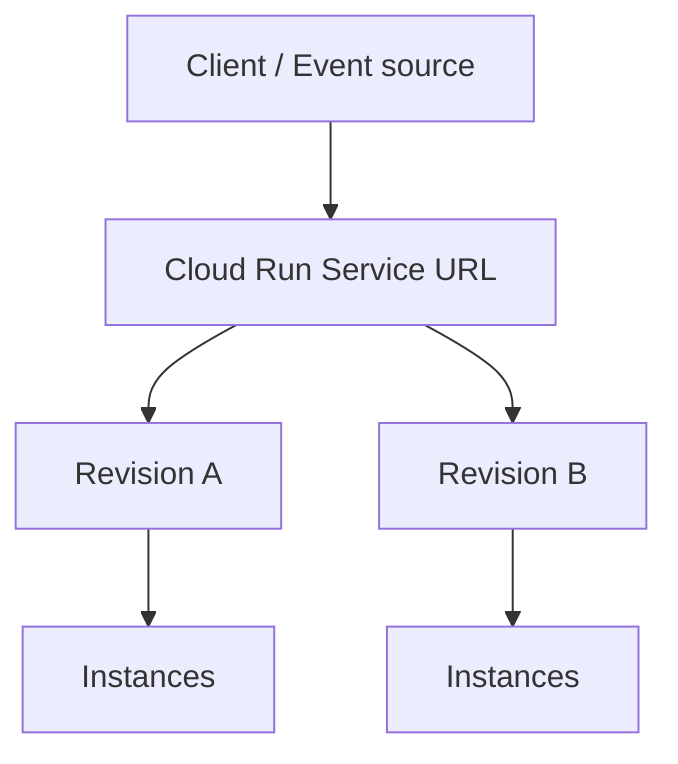
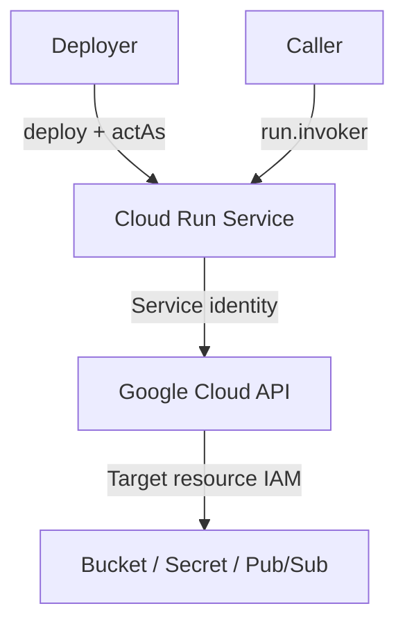
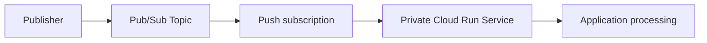
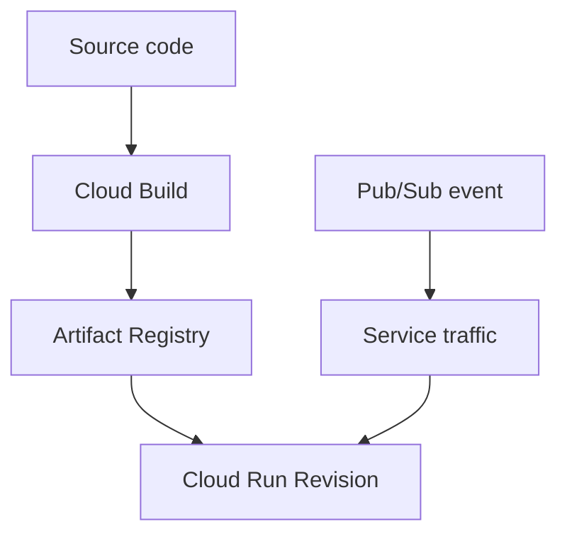

# Developing Applications with Cloud Run on Google Cloud: Fundamentals

> 課程連結：https://www.skills.google/paths/11/course_templates/559<br>
> 課程長度：公開頁面目前標示約 8 小時<br>
> 適用證照：Associate Cloud Engineer（ACE）<br>
> 整理與文件校正日期：2026-08-23<br>
> 說明：依公開課程綱要與可存取的課程描述整理，並以現行 Google Cloud 官方文件校正。未取得的影片逐字稿、測驗題目與 Lab 實際輸出不臆造。

## 課程結構與 ACE 優先度

| Module | 課程主題 | ACE 優先度 | 本筆記處理方式 |
|---:|---|---:|---|
| 1 | Course introduction | 低 | 說明學習路徑 |
| 2 | Fundamentals of Cloud Run | 很高 | 深入整理 Resource model、Container lifecycle、Autoscaling、IAM |
| 3 | Service identity and authentication | 很高 | 深入整理 Service Account、最小權限、Secret Manager |
| 4 | Application development, testing, and integration | 很高 | 深入整理部署、Revision、流量、Pub/Sub 整合 |
| 5 | Course review | 中 | ACE 情境題與操作速查 |

公開綱要顯示課程包含兩個實作：**Implementing Least Privilege IAM Policy Bindings in Cloud Run** 與 **Using Cloud PubSub with Cloud Run**。因未取得個人 Lab 執行紀錄，本筆記提供可重現的標準操作與檢查點，不虛構執行結果。

## Chapter 1 — Course Introduction
中文名稱：課程介紹

### 1. Learning Objectives

- 理解 Cloud Run 在 Google Cloud 運算服務中的定位。
- 掌握課程從執行模型、安全性到整合服務的學習路徑。
- 建立 ACE 情境題的基本判斷順序。

### 2. 核心概念摘要

Cloud Run 是用來執行容器化應用程式的全代管 Serverless 平台。使用者提供容器映像或原始碼，平台負責底層基礎設施、HTTPS Endpoint、自動擴縮與 Revision 管理。

ACE 解題時，不應看到「Container」就直接選 GKE。若應用程式可採無狀態、請求或事件驅動模式，且不需要 Kubernetes API、Node 控制或特殊叢集能力，Cloud Run 通常具有較低維運負擔。

### 3. 詳細知識點

#### 3.1 Cloud Run 適用情境

- Web API、網站後端、Webhook。
- 事件驅動處理，例如由 Pub/Sub 或 Eventarc 觸發。
- 可封裝為符合 Cloud Run Container runtime contract 的應用程式。
- 流量波動大，希望自動擴縮甚至閒置時縮至零。

#### 3.2 不應只因「Serverless」而選擇 Cloud Run

題目若要求完整 VM／OS 控制，考慮 Compute Engine；要求 Kubernetes API、DaemonSet 或精細 Node 管理，考慮 GKE；單一目的函式及事件處理也可能適合 Cloud Run functions。

### 9. 認證考點

依現行 [ACE 官方考試指南](https://cloud.google.com/learn/certification/guides/cloud-engineer)，應能：

- 在 Compute Engine、GKE、Cloud Run 等運算選項間選型。
- 部署 Cloud Run 應用程式並更新 Scaling、Revision／版本與 Traffic splitting。
- 部署接收 Pub/Sub 或 Cloud Storage 事件的應用程式。
- 管理 Cloud Run 的自動擴縮與流量分配。

### 11. 本章快速複習

- Cloud Run = 全代管 Serverless 容器平台。
- 核心判斷是「是否需要 Kubernetes／Node 控制」，不是單看是否使用 Container。
- ACE 著重部署、擴縮、Revision、流量、事件與 IAM。

## Chapter 2 — Fundamentals of Cloud Run
中文名稱：Cloud Run 基礎

### 1. Learning Objectives

- 理解 Cloud Run Resource model。
- 說明 Service、Revision、Container instance 的關係。
- 理解 Container lifecycle、Concurrency 與 Autoscaling。
- 區分服務呼叫者存取權與執行中服務身分。

### 2. 核心概念摘要

Cloud Run Service 是對外提供穩定 Endpoint 與流量設定的 Regional 資源。每次部署新的映像或修改影響執行環境的設定，會產生不可變的 Revision。Revision 接收流量後，Cloud Run 依請求、事件、CPU 與 Concurrency 等訊號建立或縮減 Container instances。

### 3. 詳細知識點

#### 3.1 Resource model

| 元件 | 定義 | 關係與行為 |
|---|---|---|
| Service | Cloud Run 應用程式的邏輯入口 | 擁有固定 `run.app` URL、IAM 與 Traffic 設定 |
| Revision | Service 的不可變部署版本 | 映像或設定變更會建立新 Revision；可切流、回滾、加 Tag 測試 |
| Instance | 實際執行 Revision 容器的運算執行個體 | 依負載水平擴縮；單一 Instance 可並行處理多個請求 |
| Container image | 應用程式與相依套件封裝 | 通常儲存在 Artifact Registry，由 Revision 參照 |

依現行 [Cloud Run Revision 官方文件](https://cloud.google.com/run/docs/managing/revisions)，Revision 不可變；新 Revision 可接收全部、部分或零流量，也能使用 Revision tag 在未承接正式流量時測試。

#### 3.2 Service URL 與 Revision

Service 的 `run.app` URL 不會因部署新 Revision 而改變。Client 呼叫 Service URL，Cloud Run 再依 Traffic 設定把請求導向 Revision。不要把 Revision 當作另一個需要自行維護 Load Balancer 的 VM 群組。

#### 3.3 Container runtime contract

Cloud Run Service 的 Ingress container 必須啟動 HTTP Server，並監聽平台提供的 `PORT` 環境變數；常見值為 `8080`。應監聽 `0.0.0.0`，不能只監聽 `127.0.0.1`。容器檔案系統是可寫但非持久化，Instance 消失後本機資料不應被視為永久保存。

容器應能處理 `SIGTERM` 並優雅關閉。依現行 [Container runtime contract](https://cloud.google.com/run/docs/container-contract)，Cloud Run 關閉 Service instance 前會傳送 `SIGTERM`，之後才強制終止；應用程式不可假設 Instance 永久存在。

#### 3.4 Concurrency

Concurrency 是每個 Instance 同時處理的最大請求數。較高 Concurrency 可提高資源利用率，但若程式非 Thread-safe、每個請求耗用大量 CPU／Memory，可能增加延遲或錯誤；較低 Concurrency 可能建立更多 Instance，成本與下游連線數也可能上升。

#### 3.5 Autoscaling

Cloud Run 預設依流量與資源使用情況自動調整 Instance 數量。沒有流量的 Revision 預設可縮至零；設定 Minimum instances 可降低 Cold start，但會產生持續成本。Maximum instances 可控制成本並保護 Cloud SQL 等下游資源，但流量超過容量時可能排隊或失敗。

依 2026-08-23 查閱的 [Cloud Run Autoscaling 官方文件](https://cloud.google.com/run/docs/about-instance-autoscaling)，現行自動擴縮會考量 CPU 與 Concurrency utilization，也受 Minimum／Maximum instance 限制；請勿把課程中的數值預設當作永遠不變的考點。

#### 3.6 Cold start

縮至零後的第一批請求需要啟動 Instance，可能產生 Cold start。降低啟動時間、減小映像、延遲載入非必要資源或設定 Minimum instances 都能改善，但要在延遲與成本間取捨。

#### 3.7 Ingress 與 Authentication

- Ingress：限制請求可以從哪些網路路徑進入。
- IAM Authentication：判斷哪個 Principal 可呼叫服務。

兩者處理不同層次。Private／內部需求不能只做其中一項就假設完全受保護。

公開服務通常授予 `allUsers` Cloud Run Invoker；私有服務則由具有 Invoker 權限的 Principal 攜帶 Identity token 呼叫。不要把 OAuth Access token 與用於呼叫 Cloud Run 的 ID token 混為一談。

### 4. Resource Scope

| Resource | Scope | 說明與影響 |
|---|---|---|
| Cloud Run Service | Regional | Service 建立於特定 Region；延遲、資料位置與相依服務位置都要考慮 |
| Revision | Regional／隸屬 Service | 不可變；流量由 Service 分派 |
| Service URL | 對外穩定入口 | URL 綁定 Service；Revision 更新不改變 Service URL |
| Artifact Registry repository | Regional 或 Multi-regional location | 映像位置會影響部署與資料傳輸考量 |
| IAM Allow policy | 附加於資源並可受階層繼承影響 | Project 層授權通常比 Service 層授權範圍更大 |

### 5. Architecture



Service 管理入口與流量；Revision 表示部署版本；每個 Revision 再依負載擴縮 Instance。

### 6. Google Cloud Console

常見路徑：

- `Console > Cloud Run > Services`：查看 Service 清單與 URL。
- `Console > Cloud Run > Services > 選擇服務 > Revisions`：查看 Revision。
- `Console > Cloud Run > 選擇服務 > Edit and deploy new revision`：修改容器、變數、Scaling 或安全設定。
- `Console > Cloud Run > 選擇服務 > Manage traffic`：調整 Revision 流量。

Console 標籤可能更新，實際操作以目前介面為準。

### 7. Cloud Shell / gcloud

```bash
gcloud services enable run.googleapis.com artifactregistry.googleapis.com cloudbuild.googleapis.com

gcloud run deploy SERVICE_NAME \
  --image=REGION-docker.pkg.dev/PROJECT_ID/REPOSITORY/IMAGE:TAG \
  --region=REGION \
  --no-allow-unauthenticated

gcloud run services list --region=REGION

gcloud run services describe SERVICE_NAME \
  --region=REGION \
  --format=yaml
```

- Command group：`gcloud run`，操作 Cloud Run。
- Resource：`service`／`services`。
- Action：`deploy` 建立或更新；`list` 列出；`describe` 查看設定。
- `--image`：完整映像 URI。
- `--region`：Cloud Run Service 所在 Region。
- `--no-allow-unauthenticated`：不為 `allUsers` 開放未驗證呼叫。

`SERVICE_NAME`、`REGION`、`PROJECT_ID`、`REPOSITORY`、`IMAGE`、`TAG` 都是 Placeholder，必須替換。

### 8. Command Output

使用者未提供本課程 Cloud Shell 實際輸出，因此不建立「我的實際操作」。成功部署時應檢查 Service URL、最新 Revision、Traffic 百分比與 Ready 狀態；實際值以執行結果為準。

### 9. 認證考點

- Service URL 穩定，Revision 不可變。
- 新映像或執行設定變更通常建立新 Revision。
- Minimum instances：降低 Cold start，但增加成本。
- Maximum instances：限制擴張並保護下游，但可能無法承接尖峰。
- Concurrency 是每個 Instance 的同時請求量，不是整個 Service 的最大請求數。
- Cloud Run Service 是 Regional；不是 Global 資源。
- 公開／私有呼叫與 Ingress 是兩個不同設定面向。

### 10. 教材與現行文件差異

| 類型 | 內容 | 官方來源 |
|---|---|---|
| 教材內容 | Resource model、Container lifecycle、Autoscaling、IAM access control | Fundamentals of Cloud Run |
| 現行官方文件 | Autoscaling 行為與可調控制項持續演進，現行文件同時描述 metrics-based 與 on-demand scaling | [Autoscaling](https://cloud.google.com/run/docs/about-instance-autoscaling) |
| 備考建議 | 記住設定的目的與權衡，不死背可能變動的預設數字 | 推論，非考綱原文 |

### 11. 本章快速複習

- Service → Revision → Instance。
- Revision 不可變，Service 負責穩定 URL 與切流。
- Scale to zero 省成本但可能有 Cold start。
- Min／Max instances 與 Concurrency 都會影響延遲、成本和下游容量。

## Chapter 3 — Service Identity and Authentication
中文名稱：服務身分與驗證

### 1. Learning Objectives

- 區分 Deployer identity、Service identity 與 Service caller。
- 依最小權限原則設定 Service Account。
- 理解 IAM Resource hierarchy 的繼承影響。
- 安全地提供 Secret 與一般環境變數。

### 2. 核心概念摘要

Cloud Run 的權限題至少要辨認三個角色：誰能部署、誰能呼叫、執行中的程式以誰的身分呼叫 Google Cloud API。這三者可能是不同 Principal，所需 IAM Role 也不同。

### 3. 詳細知識點

#### 3.1 三種身分視角

| 視角 | 問題 | 常見權限 |
|---|---|---|
| Deployer identity | 誰能建立／更新 Service 與 Revision？ | Cloud Run Developer／Admin，並需 `iam.serviceAccounts.actAs` 才能附加 Service Account |
| Caller identity | 誰能呼叫私有 Cloud Run Service？ | Cloud Run Invoker（`roles/run.invoker`） |
| Service identity | 執行中的程式以誰的身分呼叫其他 Google Cloud API？ | 指派給 Revision 的 Service Account，授予目標資源所需最小 Role |

依現行 [Cloud Run Service identity 文件](https://cloud.google.com/run/docs/securing/service-identity)，Service identity 是部署 Revision 或執行 Job 時指派給執行環境的 Service Account。

#### 3.2 Service Account：同時是 Resource 與 Principal

- 作為 Resource：Deployer 要能對它執行 `actAs`，通常需 `roles/iam.serviceAccountUser`。
- 作為 Principal：該 Service Account 要在目標資源上取得必要權限，例如讀取某個 Cloud Storage Bucket。

常見陷阱是只給 Deployer Cloud Run Admin，卻忘記其無權附加指定 Service Account；或把 API 存取權授給 Deployer，而不是實際執行程式的 Service identity。

#### 3.3 Principle of least privilege

- 每個應用程式使用專用、User-managed Service Account。
- 只在必要資源範圍授予必要 Role。
- 優先使用 Predefined role，避免直接使用 Owner／Editor。
- 應用程式透過 Application Default Credentials（ADC）取得短期憑證，不把 Service Account key 放入映像或環境變數。

#### 3.4 Resource hierarchy 與繼承

Organization → Folder → Project → Resource。上層 IAM Allow policy 的授權會向下生效。若只需要一個 Bucket 或一個 Cloud Run Service，直接在整個 Project 授權會擴大權限範圍。

#### 3.5 Environment variables 與 Secrets

一般非敏感設定可用 Environment variable；密碼、API key、Certificate 等應存於 Secret Manager，再以 Volume 或 Secret-backed environment variable 提供。

依現行 [Cloud Run Secret 文件](https://cloud.google.com/run/docs/configuring/services/secrets)：

- Volume 方式讀取時會向 Secret Manager 取得所指定版本，適合 Secret rotation。
- Environment variable 在 Instance 啟動時解析；官方建議使用特定版本，不要用 `latest`，使 Revision 可重現。
- Service identity 必須具有 `roles/secretmanager.secretAccessor` 或等價最小權限。

不要把真正秘密直接寫在一般 `--set-env-vars`、Dockerfile、Source repository 或容器映像中。

### 4. Resource Scope

| Resource | Scope | 說明與影響 |
|---|---|---|
| Service Account | Project 中建立、IAM 資源 | 可作為跨資源 Principal；授權位置決定可存取範圍 |
| IAM Role binding | Organization／Folder／Project／Resource | 上層授權向下生效，可能造成過度授權 |
| Secret Manager Secret | Global secret resource | 與 Cloud Run Service identity 的權限需分開設定 |
| Cloud Run Service IAM | 特定 Service | 適合只授予單一 Service 的 Invoker |

### 5. Architecture



### 6. Google Cloud Console

- `Console > IAM & Admin > Service Accounts > Create service account`。
- `Console > Cloud Run > Services > Deploy container` 或 `Edit and deploy new revision > Security > Service account`。
- `Console > Security > Secret Manager > 選擇 Secret > Permissions`：授予 Service identity 存取權。
- `Console > Cloud Run > Service > Permissions`：管理 Caller 的 Invoker 權限。

### 7. Cloud Shell / gcloud

```bash
gcloud iam service-accounts create cloud-run-app \
  --display-name="Cloud Run application identity"

gcloud projects add-iam-policy-binding PROJECT_ID \
  --member="serviceAccount:cloud-run-app@PROJECT_ID.iam.gserviceaccount.com" \
  --role="roles/pubsub.subscriber"

gcloud run deploy SERVICE_NAME \
  --image=IMAGE_URL \
  --region=REGION \
  --service-account=cloud-run-app@PROJECT_ID.iam.gserviceaccount.com
```

- `gcloud iam service-accounts create`：建立 User-managed Service Account。
- `projects add-iam-policy-binding`：在整個 Project 授權；正式設計若可在更小的目標資源授權，應優先縮小範圍。
- `--service-account`：把該 Service Account 設為 Cloud Run Service identity。

將 Secret 以環境變數提供：

```bash
gcloud run deploy SERVICE_NAME \
  --image=IMAGE_URL \
  --region=REGION \
  --update-secrets=DB_PASSWORD=DB_PASSWORD_SECRET:1
```

`DB_PASSWORD` 是容器中的環境變數名稱；`DB_PASSWORD_SECRET` 是 Secret 名稱；`1` 是固定 Secret version。

### 8. Command Output

未提供課程 Lab 的 IAM Policy、Principal Email 或終端輸出，故不虛構。驗證時應查看：Cloud Run Revision 使用的 Service Account、目標資源 IAM binding、Invoker binding，以及應用程式錯誤日誌中的 `PERMISSION_DENIED`。

### 9. 認證考點

- 「能部署」不等於「能附加 Service Account」。
- 「能呼叫 Cloud Run」不等於「執行程式能讀取 Cloud Storage／Secret」。
- `roles/run.invoker` 給 Caller；目標 API Role 給 Service identity。
- 不使用長期 Service Account key；在 Cloud Run 內使用 ADC。
- Secret Manager 優於明文環境變數。
- 權限應授在最低可行資源層級。

### 10. 教材與現行文件差異

| 類型 | 內容 | 官方來源 |
|---|---|---|
| 教材內容 | Service Account、Resource hierarchy、最小權限、Secret 與環境變數 | Service identity and authentication |
| 現行官方文件 | Service identity 同時有「被附加的 Resource」及「呼叫 API 的 Principal」兩種 IAM 視角 | [Configure service identity](https://cloud.google.com/run/docs/configuring/services/service-identity) |
| 備考建議 | 權限題先寫出 Deployer、Caller、Runtime 三個主體，再選 Role | 推論，非考綱原文 |

### 11. 本章快速複習

- Deployer、Caller、Service identity 是三個不同問題。
- Deployer 附加 Service Account 需要 `actAs`。
- Service identity 取得目標資源最小權限。
- 敏感資料放 Secret Manager，不放映像或一般變數。

## Chapter 4 — Application Development, Testing, and Integration
中文名稱：應用程式開發、測試與整合

### 1. Learning Objectives

- 在本機建置及測試符合 Cloud Run Contract 的應用程式。
- 建置映像並部署至 Cloud Run。
- 管理 Revision、Traffic split 與 Rollback。
- 將 Pub/Sub 與 Cloud Run 整合。

### 2. 核心概念摘要

標準流程是 Source code → Container image → Artifact Registry → Cloud Run Revision。部署新版本時保留舊 Revision，可先把少量流量導向新 Revision 進行 Canary，再逐步遷移或回滾。Pub/Sub 可把訊息 Push 到通過驗證的 Cloud Run HTTP Endpoint。

### 3. 詳細知識點

#### 3.1 Local development and testing

應用程式應：

- 從 `PORT` 環境變數取得監聽 Port。
- 不依賴本機持久狀態。
- 將 Log 寫至 `stdout`／`stderr`，由 Cloud Logging 收集。
- 支援並行請求或把 Concurrency 設為符合程式能力的值。
- 能安全地處理重試、重複事件與優雅關閉。

本機 Docker 測試：

```bash
docker build -t cloud-run-app:local .
docker run --rm -p 8080:8080 -e PORT=8080 cloud-run-app:local
curl http://localhost:8080
```

#### 3.2 Build and deploy

```bash
gcloud artifacts repositories create REPOSITORY \
  --repository-format=docker \
  --location=REGION

gcloud builds submit \
  --tag=REGION-docker.pkg.dev/PROJECT_ID/REPOSITORY/APP:TAG .

gcloud run deploy SERVICE_NAME \
  --image=REGION-docker.pkg.dev/PROJECT_ID/REPOSITORY/APP:TAG \
  --region=REGION \
  --service-account=SERVICE_ACCOUNT_EMAIL
```

- `gcloud artifacts repositories create`：建立 Artifact Registry Docker Repository。
- `gcloud builds submit`：把 Source context 交給 Cloud Build，建置並推送指定 Tag。
- `gcloud run deploy`：建立或更新 Service，並產生 Revision。

#### 3.3 Revision and traffic management

Revision 不可變；需要修正就重新部署。流量可以：

- 全部導向最新 Revision。
- 在多個 Revision 之間按百分比分配。
- 回滾至已知穩定 Revision。
- 使用 Tag 直接測試未接正式流量的 Revision。

```bash
gcloud run revisions list \
  --service=SERVICE_NAME \
  --region=REGION

gcloud run services update-traffic SERVICE_NAME \
  --region=REGION \
  --to-revisions=REVISION_NEW=10,REVISION_STABLE=90

gcloud run services update-traffic SERVICE_NAME \
  --region=REGION \
  --to-revisions=REVISION_STABLE=100
```

Traffic split 是 Service 層設定。切流前要確認 Revision 名稱、健康狀態與 Region，百分比總和必須符合命令要求。

#### 3.4 Integrating with Pub/Sub

常見模式：Publisher → Pub/Sub Topic → Push subscription → Cloud Run Service。Pub/Sub 以 HTTP POST 推送訊息；Cloud Run 回傳成功狀態才表示訊息處理成功。設計上應考慮重試與 At-least-once delivery，因此 Handler 應具 Idempotency（冪等性）。



安全整合的核心：

1. 建立用於 Push authentication 的 Service Account。
2. 讓該 Service Account 具有目標 Cloud Run Service 的 `roles/run.invoker`。
3. 建立 Push subscription 並指定 OIDC Service Account 與 Cloud Run URL。

課程可能以 Cloud PubSub 稱呼服務；現行正式產品名稱為 **Pub/Sub**。

#### 3.5 Integration with Google Cloud services

Cloud Run 程式使用 Cloud Client Libraries 與 ADC，以 Service identity 存取 Cloud Storage、Firestore、Cloud SQL、Pub/Sub 等。不要把憑證 JSON 包進映像。區域設計時應把 Cloud Run 與資料服務的延遲、跨區流量、可用性與合規一起考慮。

### 4. Resource Scope

| Resource | Scope | 說明與影響 |
|---|---|---|
| Cloud Run Service／Revision | Regional | 部署與流量管理需指定 Region |
| Pub/Sub Topic／Subscription | Global resource | 可與 Regional Cloud Run 整合，但須考慮資料位置政策與延遲 |
| Artifact Registry repository | Location-specific | 映像 URI 含 Location 與 Project |
| Cloud Build build | Project 中的建置作業 | 由 Build Service Account 執行，權限與 Cloud Run Runtime 身分不同 |

### 5. Architecture



### 6. Google Cloud Console

- `Console > Artifact Registry > Repositories`：查看映像與 Tag／Digest。
- `Console > Cloud Build > History`：查看 Build 狀態與 Log。
- `Console > Cloud Run > Services > Deploy container`：部署映像。
- `Console > Cloud Run > Service > Revisions`：查看 Revision。
- `Console > Cloud Run > Service > Manage traffic`：進行 Canary／Rollback。
- `Console > Pub/Sub > Subscriptions > Create subscription > Push`：設定 Push Endpoint 與驗證。

### 7. Cloud Shell / gcloud

查看服務 URL 與 Logs：

```bash
gcloud run services describe SERVICE_NAME \
  --region=REGION \
  --format='value(status.url)'

gcloud logging read \
  'resource.type="cloud_run_revision" AND resource.labels.service_name="SERVICE_NAME"' \
  --limit=20 \
  --format=json
```

第一個命令從 Service status 取出 URL；第二個命令使用 Cloud Logging 查詢 Cloud Run Revision Log。`SERVICE_NAME` 必須替換為實際名稱。

### 8. Command Output

未提供課程 Lab 實際輸出，不虛構 Build ID、Revision 名稱、Service URL 或 Pub/Sub Message ID。實作時應保存：Build success evidence、Service URL、Revision Ready 狀態、Traffic 分配、Pub/Sub delivery 與 Cloud Logging 訊息。

### 9. 認證考點

- 新部署不等於必須立刻承接 100% 流量。
- Canary：少量流量到新 Revision；Rollback：把流量切回穩定 Revision。
- 刪除 Cloud Run Service 不會自動刪除 Artifact Registry 映像；依現行 [Service 管理文件](https://cloud.google.com/run/docs/managing/services)，Eventarc Trigger 也不會因刪除 Service 自動刪除。
- Cloud Build 身分、Deployer 身分、Cloud Run Service identity 是不同 Principal。
- Pub/Sub 事件可能重複送達，應用程式需冪等。
- Pub/Sub 呼叫私有 Service，需要適當的 Invoker 身分與驗證設定。

### 10. 教材與現行文件差異

| 類型 | 內容 | 官方來源 |
|---|---|---|
| 教材內容 | Local testing、部署與 Revision 管理、整合 Google Cloud services、Pub/Sub Lab | Application development, testing, and integration |
| 現行官方文件 | Service 擁有長期穩定 URL；部署或設定變更建立 Revision | [Manage services](https://cloud.google.com/run/docs/managing/services)、[Manage revisions](https://cloud.google.com/run/docs/managing/revisions) |
| 現行用語 | 課程 Lab 標題可能寫 Cloud PubSub，正式名稱使用 Pub/Sub | [Pub/Sub 文件](https://cloud.google.com/pubsub/docs/overview) |
| 備考建議 | 熟練部署、切流、回滾及事件驗證；這些直接對應現行 ACE 考綱 | [ACE Exam Guide](https://cloud.google.com/learn/certification/guides/cloud-engineer) |

### 11. 本章快速複習

- Source → Cloud Build → Artifact Registry → Cloud Run Revision。
- Revision 不修改；重新部署產生新版本。
- Service 可對 Revision 切流與回滾。
- Pub/Sub Push 到 Cloud Run 時要處理 IAM、驗證、重試與冪等。

## Chapter 5 — Course Review
中文名稱：課程複習

### 1. Learning Objectives

- 將 Cloud Run 運算、安全、部署與事件整合串成一套 ACE 解題框架。
- 能從題目線索選擇服務、設定與排錯步驟。

### 2. 核心概念摘要

Cloud Run 的完整管理鏈是：選擇 Region → 準備映像 → 指派 Runtime Service Account → 部署 Revision → 設定 Caller access／Ingress → 設定 Scaling → 驗證 Logs → 逐步切流。

### 3. 詳細知識點

#### 3.1 ACE 排錯順序

| 步驟 | 檢查內容 | 常見症狀 |
|---:|---|---|
| 1 | Project、Region、Service 名稱 | CLI 查不到資源 |
| 2 | Revision Ready 與 Container startup | 未監聽 `PORT`、程序退出、Health check 失敗 |
| 3 | Caller IAM 與 Ingress | `403`、外部無法到達 |
| 4 | Service identity 與目標資源 IAM | 呼叫 Google API 得到 `PERMISSION_DENIED` |
| 5 | Secret、Environment variable、設定 | Instance 無法啟動或應用設定錯誤 |
| 6 | Traffic split | 新 Revision 已部署但沒有流量 |
| 7 | Scaling／Concurrency／下游容量 | `429`、高延遲、Cloud SQL 連線耗盡 |
| 8 | Cloud Logging 與 Metrics | 找出 Startup、Request、Application error |

#### 3.2 容易混淆的權限問題

- 部署失敗且提到 `actAs`：檢查 Deployer 是否能使用該 Service Account。
- 呼叫 Service 得到 `403`：檢查 Caller 是否有 `roles/run.invoker` 與正確 ID token。
- 程式呼叫 Secret／Bucket 失敗：檢查 Runtime Service identity 在目標資源的權限。

### 6. Google Cloud Console

ACE 應能用 Console 找到 Services、Revisions、Logs、Metrics、Permissions、Variables and Secrets 與 Traffic 管理畫面；實際標籤可能隨介面更新。

### 7. Cloud Shell / gcloud

```bash
gcloud config list
gcloud run services list --region=REGION
gcloud run revisions list --service=SERVICE_NAME --region=REGION
gcloud run services describe SERVICE_NAME --region=REGION
gcloud run services get-iam-policy SERVICE_NAME --region=REGION
```

先確認 Configuration 與 Scope，再查看 Service、Revision、設定與 IAM；比盲目重新部署更容易定位問題。

### 9. 認證考點

- 先分清是 Deployment permission、Invocation permission 還是 Runtime API permission。
- 先分清 Service、Revision 與 Instance。
- 先判斷 Cold start、Capacity、Concurrency、Downstream quota 哪一層造成效能問題。
- 事件題要考慮 Authentication、Retry 與 Idempotency。

### 11. 本章快速複習

- Scope → Revision status → IAM → Configuration → Traffic → Scaling → Logs。
- `403` 不只一種原因，必須先辨認是哪個 Principal 在做哪個動作。
- 部署成功但沒有流量，優先檢查 Traffic split。

## 認證重點統整

### ACE 重點

#### 必背關係

1. Cloud Run Service 是 Regional 資源並提供穩定 URL。
2. 部署或設定變更建立不可變 Revision。
3. Service 將流量分配至一或多個 Revision。
4. Revision 依流量擴縮 Container instance，預設可縮至零。
5. Caller 用 `roles/run.invoker` 呼叫私有 Service。
6. Runtime 以 Service identity 呼叫 Google Cloud APIs。
7. 敏感設定使用 Secret Manager；一般設定才用 Environment variable。
8. Pub/Sub Push 整合需要驗證、Invoker 權限、重試與冪等處理。

#### 常見情境題

| 題目線索 | 建議選擇 | 理由 |
|---|---|---|
| 流量不固定，希望閒置時不保留執行個體 | Cloud Run，允許 scale to zero | 降低閒置資源成本，但接受 Cold start |
| 第一個請求延遲必須降低 | 設定 Minimum instances | 保留 Warm instance，需承擔成本 |
| Cloud SQL 連線被大量 Instance 耗盡 | 設定 Maximum instances、調整 Concurrency 與 Connection pooling | 限制下游壓力 |
| 新版本先讓少量使用者測試 | Revision Traffic split | Canary rollout |
| 新 Revision 有錯誤 | 將流量切回穩定 Revision | Rollback 不需修改舊 Revision |
| 外部任何人都能呼叫 | 授予 `allUsers` Cloud Run Invoker | 僅適用真正公開服務 |
| 僅 Pub/Sub 可呼叫私有服務 | Push Service Account + `roles/run.invoker` | 驗證式 Push |
| 程式要讀取 Secret | Runtime Service Account + Secret Accessor | 權限給 Service identity，不是一般使用者 |

### 服務選型與比較

| 情境 | 建議服務 | 判斷理由 | 常見誤解 |
|---|---|---|---|
| 無狀態 HTTP／事件容器，最低基礎設施維運 | Cloud Run | 全代管、自動擴縮、穩定 HTTPS Endpoint | 不是看到 Container 就一定選 GKE |
| 需要 Kubernetes API、Node pool 或特殊叢集能力 | GKE | 提供 Kubernetes 控制與生態系 | Cloud Run 不提供 Kubernetes 物件模型 |
| 需要完整 OS、常駐主機或特殊 Agent | Compute Engine | 可控制 VM 與 OS | 維運責任高於 Cloud Run |
| 單一目的函式與事件處理 | Cloud Run functions | 以函式原始碼與 Trigger 為中心 | 現行底層與 Cloud Run 整合，但部署模型不同 |
| 非同步訊息傳遞 | Pub/Sub | Topic／Subscription 解耦 Producer 與 Consumer | Pub/Sub 不負責執行應用程式 |
| 容器映像儲存 | Artifact Registry | 管理 Image、Tag、Digest | Cloud Build 負責建置，不是長期 Registry |
| 容器映像建置 | Cloud Build | 執行 Build pipeline | Cloud Run 主要負責執行部署產物 |

### 指令速查

```bash
# 部署
gcloud run deploy SERVICE_NAME --image=IMAGE_URL --region=REGION

# 查看 Service 與 Revision
gcloud run services describe SERVICE_NAME --region=REGION
gcloud run revisions list --service=SERVICE_NAME --region=REGION

# 切分 Revision 流量
gcloud run services update-traffic SERVICE_NAME \
  --region=REGION \
  --to-revisions=REVISION_A=10,REVISION_B=90

# 指派 Runtime Service Account
gcloud run services update SERVICE_NAME \
  --region=REGION \
  --service-account=SERVICE_ACCOUNT_EMAIL

# 查看 IAM
gcloud run services get-iam-policy SERVICE_NAME --region=REGION
```

### 考前自我檢查

- [ ] 能說明 Service、Revision、Instance 的差異。
- [ ] 能判斷 Cloud Run、GKE、Compute Engine 的適用情境。
- [ ] 能解釋 Scale to zero、Minimum／Maximum instances、Concurrency。
- [ ] 能區分 Deployer、Caller、Service identity。
- [ ] 能說明 `roles/run.invoker` 與 `roles/iam.serviceAccountUser` 的用途差異。
- [ ] 能使用 Artifact Registry 映像部署 Cloud Run Service。
- [ ] 能查看 Revision 並完成 Traffic split／Rollback。
- [ ] 能安全地使用 Secret Manager。
- [ ] 能描述 Pub/Sub Push 至私有 Cloud Run 的驗證流程。
- [ ] 能從 Cloud Logging 排查 Startup、IAM、Traffic 與 Scaling 問題。

### 待補材料與限制

- 公開頁面可取得課程名稱、目標、Module 與 Lesson 綱要，但未取得登入後的完整影片內容與逐字稿。
- 未提供兩個 Lab 的 Cloud Shell 操作紀錄，因此沒有「我的實際操作」與真實 Terminal Output。
- 未取得課程 Quiz 題目；本文沒有還原或猜測測驗答案。
- Cloud Run 功能、Autoscaling 與 Console 介面會更新；考前應再查現行文件與官方考綱。

### 官方參考資料

- [Google Skills 課程頁面](https://www.skills.google/paths/11/course_templates/559)
- [Associate Cloud Engineer Exam Guide](https://cloud.google.com/learn/certification/guides/cloud-engineer)
- [Manage Cloud Run services](https://cloud.google.com/run/docs/managing/services)
- [Manage Cloud Run revisions](https://cloud.google.com/run/docs/managing/revisions)
- [Container runtime contract](https://cloud.google.com/run/docs/container-contract)
- [About instance autoscaling](https://cloud.google.com/run/docs/about-instance-autoscaling)
- [Introduction to service identity](https://cloud.google.com/run/docs/securing/service-identity)
- [Configure service identity](https://cloud.google.com/run/docs/configuring/services/service-identity)
- [Configure secrets for Cloud Run](https://cloud.google.com/run/docs/configuring/services/secrets)
- [Pub/Sub overview](https://cloud.google.com/pubsub/docs/overview)
- [Artifact Registry overview](https://cloud.google.com/artifact-registry/docs/overview)
- [Cloud Build: Build container images](https://cloud.google.com/build/docs/building/build-containers)
