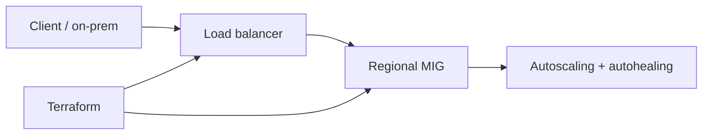
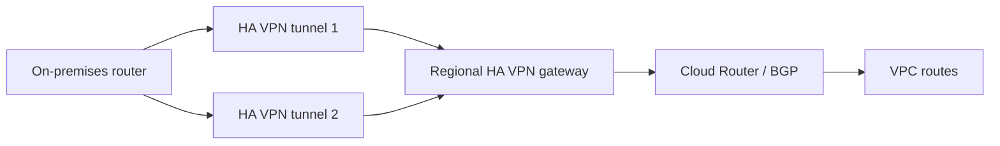
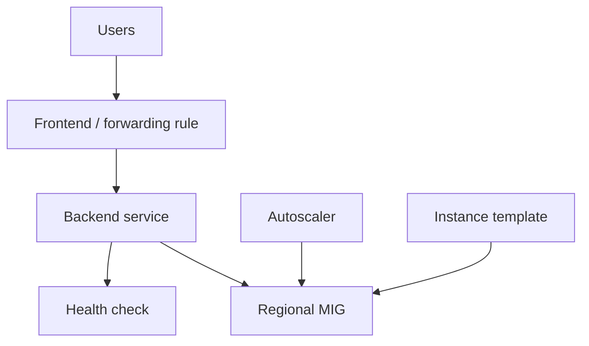
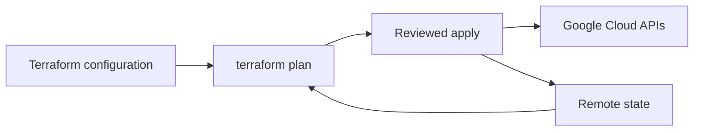
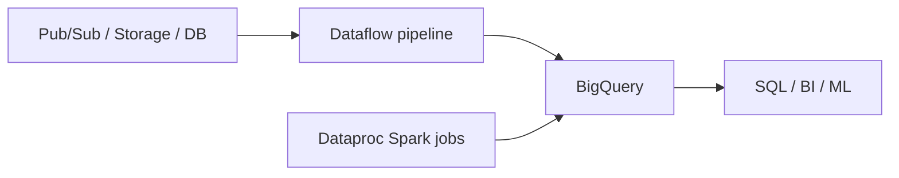

# Elastic Google Cloud Infrastructure: Scaling and Automation

> 課程：<https://www.skills.google/paths/11/course_templates/178><br>
> 目標：Google Cloud Associate Cloud Engineer（ACE）<br>
> 技術核對日期：2026-08-22<br>
> 前置筆記：Essential Google Cloud Infrastructure: Foundation、Core Services

## 課程定位與範圍

本課程約 7 小時，主題是安全互連網路、load balancing、autoscaling、Infrastructure as Code（IaC，基礎架構即程式碼）與 managed services。公開 syllabus 可辨識五個模組：

1. Introduction
2. Interconnecting Networks
3. Load Balancing and Autoscaling
4. Infrastructure Automation
5. Managed Services

全部模組均納入。ACE 複習優先級依序為：Load Balancing/MIG、network connectivity、Terraform、managed-service selection。

## 來源限制

公開頁面可辨識 course/module/lesson 名稱，但完整影片、quiz、lab instructions 與 Cloud Shell output 需要登入。本筆記以公開課程結構為骨架，使用截至 2026-08-22 的官方文件補強；未取得的 lab 指令、畫面與輸出不予臆造。

---

## Chapter 1 — Introduction

中文名稱：課程介紹

### 1. Learning Objectives

- 將前兩門課的 VPC、Compute Engine、IAM 與 monitoring 基礎整合成可擴展架構。
- 理解 elasticity 不只等於 autoscaling，也包含 resilient connectivity、load distribution 與 repeatable deployment。

### 2. 核心概念摘要

一個具彈性的 Compute Engine 架構，通常由多 zone Managed Instance Group（MIG）、health checks、autoscaling、合適的 load balancer、可重現的 Terraform configuration，以及冗餘 hybrid connectivity 組成。

### 9. 認證考點

ACE 重點是部署與維運：能否依需求選正確連線與 load balancer、建立 MIG/autoscaler、排查 unhealthy backend，並使用 Terraform 建立資源。

### 11. 本章快速複習



---

## Chapter 2 — Interconnecting Networks

中文名稱：互連網路

### 1. Learning Objectives

- 分辨 HA VPN、Cloud Interconnect、VPC Network Peering 與 Shared VPC。
- 了解 Cloud Router、BGP、VPN tunnels、VLAN attachments 與 redundant topology。
- 依 bandwidth、latency、encryption、SLA、location 與成本選擇連線。

### 2. 核心概念摘要

- Cloud VPN：透過 IPsec 加密連接 VPC 與 on-premises/其他網路。
- Cloud Interconnect：不經 public internet 的高頻寬 private connectivity；流量預設不因 Interconnect 本身而自動加密。
- VPC Network Peering：兩個 VPC 私網互通，但不 transitive、不交換 firewall rules。
- Shared VPC：同一 organization 中由 host project 集中提供 VPC/subnets 給 service projects。

### 3. 詳細知識點

#### 3.1 HA VPN

HA VPN gateway 是 regional resource，有兩個 interfaces 與兩個自動配置的 external IPs。每條 VPN tunnel 對應 gateway interface、peer interface 與 Cloud Router BGP session。透過兩條或多條 tunnels 建立冗餘；SLA 取決於 topology，不能只因資源名稱含 HA 就假設一定有 99.99%。

HA VPN 使用 dynamic routing（BGP）。Cloud Router 是 regional distributed control-plane service，用於學習與公告 routes；它不是資料封包必須穿過的 VM appliance。

Classic VPN 只有單一 interface/external IP，支援 static routing 類型，現行新設計通常優先 HA VPN。

#### 3.2 Cloud Interconnect

- Dedicated Interconnect：on-premises router 在 colocation facility 與 Google 建立直接 physical connection，適合大頻寬且能滿足設施需求的企業。
- Partner Interconnect：透過 service provider 連線，適合無法到 Google colocation 或不需要完整 Dedicated capacity 的情境。
- Cross-Cloud Interconnect：Google Cloud 與其他 cloud provider network 的 dedicated connectivity。

Interconnect 使用 VLAN attachment 把 physical/partner connection 接到 VPC，並透過 Cloud Router/BGP 交換 routes。若要求 IPsec encryption，可評估 HA VPN over Cloud Interconnect。

#### 3.3 VPC Network Peering

Peering 讓兩個 administratively separate VPC 交換符合設定的 routes。重點限制：

- 不支援 transitive routing：A↔B、B↔C 不代表 A↔C。
- 兩邊 subnet ranges 不可重疊。
- 不交換 VPC firewall rules；雙方各自建立規則。
- 不合併 IAM 或管理權。

#### 3.4 Shared VPC

Host project 擁有 VPC/subnets 與集中網路管理；service project 的 authorized principals 可在 Shared VPC subnet 建立 VM/GKE 等資源。適用同 organization 多團隊、中央網路團隊治理。

Shared VPC 解決「共同使用一張受控網路」，Peering 解決「兩張獨立網路互通」。

#### 3.5 Choosing a connection

| 需求 | 選擇 | 核心理由 |
|---|---|---|
| 快速、加密、流量中等的 hybrid connectivity | HA VPN | IPsec、容易佈建 |
| 大量穩定 private traffic | Dedicated Interconnect | dedicated high-capacity link |
| 透過 provider、較彈性 bandwidth | Partner Interconnect | 不必直接進 colocation |
| 兩個 VPC 私網互通且維持獨立管理 | VPC Peering | route exchange |
| 同 organization 集中網路管理 | Shared VPC | host/service project model |

選型還要看 bandwidth、latency consistency、encryption、SLA、lead time、supported locations、BGP capability 與 redundancy。

### 4. Resource Scope

| Resource | Scope | 說明與影響 |
|---|---|---|
| HA VPN gateway | Regional | 兩 interfaces；tunnels 與 peer 建立連線 |
| VPN tunnel | Regional | 綁定 gateway interface 與 peer endpoint |
| Cloud Router | Regional | BGP control plane；可服務同 region compatible resources |
| Interconnect connection | Global physical resource | 與 VLAN attachments 配合連入 VPC |
| VLAN attachment | Regional | 將 Interconnect 與 regional Cloud Router/VPC 關聯 |
| VPC Peering configuration | Per VPC pair | 雙方都需建立 active peering configuration |
| Shared VPC host project | Organization-scoped relationship | host/service projects 必須在同 organization |

### 5. Architecture



### 6. Google Cloud Console

- VPN：`Console > Network Connectivity > VPN > Create VPN connection`
- Cloud Router：`Console > Network Connectivity > Cloud Routers`
- Interconnect：`Console > Network Connectivity > Interconnect`
- Peering：`Console > VPC network > VPC network peering`
- Shared VPC：`Console > VPC network > Shared VPC`

Console 標籤可能調整；先確認 project、VPC、region、ASN 與 peer IP ranges。

### 7. Cloud Shell / gcloud

#### 建立 HA VPN gateway 與 Cloud Router

```bash
gcloud compute vpn-gateways create VPN_GATEWAY_NAME \
  --network=NETWORK_NAME \
  --region=REGION
```

- Command group：`gcloud compute vpn-gateways`
- Resource：HA VPN gateway
- Action：`create`
- Flags：network、region
- Parameters：大寫值為 placeholders

```bash
gcloud compute routers create ROUTER_NAME \
  --network=NETWORK_NAME \
  --region=REGION \
  --asn=GOOGLE_ASN
```

- Resource：Cloud Router
- `--asn`：Google-side private ASN placeholder；須符合現行有效範圍且避免設計衝突

完整 tunnel 仍需 external VPN gateway/peer gateway、shared secret、interface 與 BGP peer 資訊；未取得本課 lab 參數，故不虛構完整命令。

#### 檢視狀態

```bash
gcloud compute vpn-tunnels list \
  --filter="region:(REGION)"
```

```bash
gcloud compute routers get-status ROUTER_NAME \
  --region=REGION
```

- `get-status` 用來檢查 BGP sessions 與 learned routes；實際 output 依 topology 而異。

### 8. Command Output

未提供 HA VPN lab execution record，因此不建立虛構 tunnel/BGP output。

### 9. 認證考點

- 要加密且快速建立 hybrid link：HA VPN。
- 大頻寬、private path：Interconnect；要求 encryption 再評估 HA VPN over Interconnect。
- BGP session down：檢查 peer IP、ASN、shared routing configuration、tunnel status 與 firewall/on-prem device。
- A/B/C 三網路需任意互通：不要假設 VPC Peering transitive。
- 中央網路團隊管理多 projects：Shared VPC，而非替每對 project 建 Peering。
- HA SLA 取決於雙 interfaces/tunnels 與 peer redundancy topology。

### 10. 教材與現行文件差異

| 類型 | 內容 | 官方來源 |
|---|---|---|
| 教材內容 | Cloud VPN、HA VPN、Interconnect、Peering、Shared VPC 與 connection selection | 課程公開目錄 |
| 現行官方文件 | HA VPN 可提供 99.99% 或 99.9% SLA，取決於 topology/configuration | [Cloud VPN overview](https://docs.cloud.google.com/network-connectivity/docs/vpn/concepts/overview) |
| 現行官方文件 | Interconnect 現有 Dedicated、Partner、Cross-Cloud 等類型 | [Cloud Interconnect overview](https://docs.cloud.google.com/network-connectivity/docs/interconnect/concepts/overview) |
| 現行官方文件 | VPC Peering 不 transitive，且不交換 firewall rules | [VPC Network Peering](https://docs.cloud.google.com/vpc/docs/vpc-peering) |
| 備考建議 | ACE 著重選型與基本建置/排錯，不必死背所有 bandwidth SKU | 推論，非官方考綱聲明 |

### 11. 本章快速複習

- VPN = IPsec；Interconnect = high-capacity private connectivity。
- Cloud Router = BGP control plane，不是 packet-processing VM。
- Peering = 獨立 VPC 互通；Shared VPC = 集中共用 VPC。
- Peering 不 transitive、不交換 firewall。

---

## Chapter 3 — Load Balancing and Autoscaling

中文名稱：負載平衡與自動調度資源

### 1. Learning Objectives

- 建立 instance template、MIG、health check、autoscaler 與 load balancer。
- 分辨 Application Load Balancer 與 Network Load Balancer，以及 external/internal、global/regional、proxy/passthrough。
- 理解 Cloud CDN、autohealing、autoscaling 與 backend health。

### 2. 核心概念摘要

Load balancer 分配 traffic；autoscaler 依 signals 改變 MIG target size；autohealing 依 application health check 修復 unhealthy VM。三者合作但職責不同。

### 3. 詳細知識點

#### 3.1 Managed Instance Groups

MIG 把多台由 instance template 建立的 VM 視為一個實體，提供 autoscaling、autohealing、rolling update 與 multi-zone deployment。

- Zonal MIG：VM 在單一 zone。
- Regional MIG：VM 分散同 region 多 zones，提高對 zone failure 的韌性。
- Unmanaged instance group：可把不同 VM 分組作 backend，但沒有 MIG 的 template-based lifecycle/autoscaling/autohealing 能力。

一般 stateless web tier 優先 regional MIG。預設 MIG 會依 template recreate VM；不要把唯一資料放在隨 VM recreation 刪除的 disk。Stateful MIG 可保存指定 state，但需明確設計。

#### 3.2 Instance templates

Instance template 定義 machine type、image、disk、metadata/startup script、network、service account 等。Template 是 immutable；變更通常建立新 template，讓 MIG 以 rolling update 套用。

#### 3.3 Autoscaling

可依下列 signals 自動調整 MIG 大小：

- Average CPU utilization
- Load balancing serving capacity
- Cloud Monitoring metrics
- Schedule

設定 min/max replicas、initialization period、scale-in controls 等。Initialization period 要涵蓋新 VM 完成啟動並可服務的時間，否則 autoscaler 可能誤判。

Predictive autoscaling 適合具有日/週規律且啟動較慢的 CPU-based workload；它會提前 scale out，不是用來預測一次性活動的萬能工具。

#### 3.4 Autohealing 與 health checks

Autohealing health check 判斷 VM 上應用是否正常；持續 unhealthy 時 MIG repair/recreate VM。Load balancer health check 決定 backend 是否接收 traffic。兩者可使用不同 threshold：autohealing 通常較保守，避免短暫故障造成頻繁 recreate。

Health check probe 必須能通過 VPC firewall 到 backend port；unhealthy 常見原因是：應用未 listen、port 不一致、firewall 未允許 probe ranges、wrong request path、startup 尚未完成。

#### 3.5 Application Load Balancer

Layer 7、HTTP/HTTPS、proxy-based。可依 host/path/headers 等應用層資訊 route，並整合 URL map、TLS certificate、Cloud CDN 與 Cloud Armor。

- Global external：internet-facing、可用 multi-region backends。
- Regional external：internet-facing、single-region backends。
- Regional/cross-region internal：以 internal IP 提供內部 L7 service。

典型元件：forwarding rule/frontend → target proxy → URL map → backend service → health check → MIG/NEG backends。

#### 3.6 Network Load Balancer

Layer 4，分為：

- Proxy Network Load Balancer：終止/代理 TCP，可選擇 TLS offload 類型。
- Passthrough Network Load Balancer：保留 client source IP、direct server return，支援 TCP/UDP 與其他 protocol（依產品類型）。

Internal passthrough Network Load Balancer 常用於 VPC 內部 TCP/UDP service；是 regional internal frontend。

#### 3.7 Cloud CDN

Cloud CDN 與 global external 或 classic Application Load Balancer 整合，在 Google edge cache cacheable content，降低 origin latency/load。Cache miss 才回 origin。它不是獨立取代 load balancer 的任意入口。

#### 3.8 Choosing a load balancer

選擇順序：

1. Traffic protocol：HTTP(S) → Application；TCP/UDP/other → Network。
2. Client：internet → external；VPC/connected network → internal。
3. Scope：multi-region/global 或 single region。
4. Proxy 或 passthrough：是否需 TLS termination、advanced routing、client source IP preservation。
5. Backend、Network Service Tier、IPv6、Cloud CDN/Armor 等功能需求。

### 4. Resource Scope

| Resource | Scope | 說明與影響 |
|---|---|---|
| Instance template | Global or regional | MIG 建立 VM 的 immutable blueprint |
| Zonal MIG | Zonal | 單 zone instance group |
| Regional MIG | Regional | 可跨同 region 多 zones |
| Health check | Global or regional | 需與 load balancer/MIG 類型相容 |
| Global external Application LB frontend/backend service | Global | 支援 multi-region backends |
| Regional internal/external LB components | Regional | backends 與 proxy-only subnet 等需相容 region |
| Internal passthrough Network LB | Regional | internal frontend，服務 VPC/connected clients |

### 5. Architecture



### 6. Google Cloud Console

- Instance template：`Console > Compute Engine > Instance templates`
- MIG：`Console > Compute Engine > Instance groups > Create instance group`
- Load balancing：`Console > Network services > Load balancing > Create load balancer`
- Health checks：`Console > Compute Engine > Health checks`
- Cloud CDN：`Console > Network services > Cloud CDN`

### 7. Cloud Shell / gcloud

#### Instance template 與 regional MIG

```bash
gcloud compute instance-templates create TEMPLATE_NAME \
  --machine-type=MACHINE_TYPE \
  --subnet=SUBNET_NAME \
  --image-family=debian-12 \
  --image-project=debian-cloud \
  --service-account=SERVICE_ACCOUNT_EMAIL \
  --metadata-from-file=startup-script=STARTUP_SCRIPT_FILE
```

- Command group：`gcloud compute instance-templates`
- Resource：global instance template
- Action：`create`
- Flags：machine、network、image、identity、startup script
- Parameters：大寫值為 placeholders

```bash
gcloud compute instance-groups managed create MIG_NAME \
  --region=REGION \
  --template=TEMPLATE_NAME \
  --size=2
```

- Resource：regional MIG
- Action：`create`
- `--size=2`：initial target size literal，不是 autoscaler max

#### Autoscaling

```bash
gcloud compute instance-groups managed set-autoscaling MIG_NAME \
  --region=REGION \
  --min-num-replicas=2 \
  --max-num-replicas=10 \
  --target-cpu-utilization=0.60 \
  --cool-down-period=90
```

- Action：`set-autoscaling`
- Flags：min/max、CPU target、initialization/cool-down period
- 注意：實際數值應依 workload 測量，不把示例直接套 production。

#### Health check 與 firewall

```bash
gcloud compute health-checks create http HEALTH_CHECK_NAME \
  --port=80 \
  --request-path=/health
```

```bash
gcloud compute firewall-rules create allow-health-checks \
  --network=NETWORK_NAME \
  --action=ALLOW \
  --direction=INGRESS \
  --rules=tcp:80 \
  --source-ranges=HEALTH_CHECK_SOURCE_RANGES \
  --target-tags=BACKEND_TAG
```

- Firewall source ranges 應以所選 load balancer 的現行官方 probe ranges 為準，不在筆記硬編可能變動值。

完整 Application/Internal Load Balancer 需 forwarding rule、proxy/URL map 或 backend service 等多個元件；本課 lab 參數未公開，因此不拼湊假指令。

### 8. Command Output

未提供 load-balancing labs 的 commands/output，故不虛構 backend health 或 forwarding rule output。

### 9. 認證考點

- Stateless web app + HA：regional MIG + autoscaling + Application LB。
- HTTP path-based routing：Application Load Balancer，不是 passthrough NLB。
- UDP 或需保留 source IP：Passthrough Network Load Balancer。
- Internal TCP service：internal passthrough NLB（依需求確認 proxy/ALB 是否更適合）。
- Backend `UNHEALTHY`：先查 app/port/path，再查 firewall probe ranges，而非盲目加 VM。
- Autoscaling ≠ autohealing；load balancing health ≠ scaling signal。
- Instance template immutable；更新通常新 template + rolling update。
- Zonal MIG 無法抵抗整個 zone failure；regional MIG 才跨 zones。
- Cloud CDN 用於 cacheable content，並與 external Application LB 整合。

### 10. 教材與現行文件差異

| 類型 | 內容 | 官方來源 |
|---|---|---|
| 教材內容 | MIG、autoscaling、health checks、Application/Network/Internal load balancing、Cloud CDN | 課程公開目錄 |
| 現行官方文件 | Load balancer 現行分類是 Application Load Balancer（L7）與 Network Load Balancer（L4），再分 deployment modes | [Cloud Load Balancing overview](https://docs.cloud.google.com/load-balancing/docs/load-balancing-overview) |
| 現行官方文件 | MIG 提供 autoscaling、autohealing、regional multi-zone 與 automatic update | [Instance groups](https://docs.cloud.google.com/compute/docs/instance-groups) |
| 現行官方文件 | Cloud CDN 搭配 global external 或 classic Application Load Balancer | [Cloud CDN overview](https://docs.cloud.google.com/cdn/docs/overview) |
| 備考建議 | 舊名稱 HTTP(S)/SSL proxy/TCP proxy load balancer 要能映射到現行 Application/Network 分類 | 推論，非官方考綱聲明 |

### 11. 本章快速複習

- L7 HTTP(S) → Application LB；L4 TCP/UDP → Network LB。
- LB 分流、autoscaler 改數量、autohealing 修 VM。
- Regional MIG 跨 zones；zonal MIG 不跨 zone。
- Unhealthy：app → port/path → firewall probe → backend config。

---

## Chapter 4 — Infrastructure Automation

中文名稱：基礎架構自動化

### 1. Learning Objectives

- 理解 Terraform configuration、provider、resource、module、state 與 workflow。
- 使用 `init`、`fmt`、`validate`、`plan`、`apply`、`destroy`。
- 安全管理 remote state、credentials 與 reusable modules。

### 2. 核心概念摘要

Terraform 是 declarative IaC：描述 desired state，Terraform 比對 configuration/state/remote APIs 後產生 execution plan。State 是 Terraform 追蹤 resource identity 與 attributes 的關鍵資料，不是可隨意刪除的 cache。

### 3. 詳細知識點

#### 3.1 Terraform 構成

- `terraform` block：版本與 provider requirements。
- `provider`：連接 Google Cloud API 的設定。
- `resource`：要管理的基礎架構。
- `data`：讀取既有資源/資訊，不宣告其 lifecycle ownership。
- `variable` / `output` / `locals`：輸入、輸出與重用值。
- `module`：封裝可重用的一組 resources。

#### 3.2 Workflow

1. `terraform init`：下載 providers/modules，初始化 backend。
2. `terraform fmt`：格式化 configuration。
3. `terraform validate`：檢查語法與內部一致性。
4. `terraform plan`：預覽 proposed changes。
5. 人工/自動審查 plan。
6. `terraform apply`：套用變更並更新 state。
7. `terraform destroy`：只在明確需要移除受管資源時使用。

#### 3.3 State

Local state 預設在 `terraform.tfstate`，團隊環境應使用 remote backend，例如 versioned/encrypted Cloud Storage bucket，並設計 IAM、locking/concurrency 與 backup。State 可能含敏感值，即使標示 `sensitive` 也不代表內容不會進 state。

不要手動編輯 state；既有資源需透過 import 對齊 Terraform ownership。Configuration 刪除 resource block 可能讓 plan 提議 destroy，必須先審查。

#### 3.4 Modules 與環境

Modules 降低重複、統一命名/IAM/network standards。Production 應 pin provider/module versions、review changes、分離 state boundaries，避免一個巨大 state 控制所有環境。

#### 3.5 Authentication

在 Cloud Shell/本機開發可使用 Application Default Credentials；CI/CD 優先 Workload Identity Federation 或短效 service account impersonation，避免長期 service account JSON key。

#### 3.6 Infrastructure Manager

現行 Google Cloud Infrastructure Manager 可使用 Terraform 自動化部署與管理 Google Cloud resources。它不是考試情境中每次都必選；核心仍是理解 Terraform configuration/state/workflow。

#### 3.7 Marketplace

Marketplace 可快速部署 packaged solution，但不等於 IaC source control。部署後仍要管理 IAM、network、updates、licenses、cost 與 deletion cleanup。

### 4. Resource Scope

| Resource | Scope | 說明與影響 |
|---|---|---|
| Terraform configuration | Repository/workspace | 宣告 desired infrastructure |
| Terraform state | Backend object/workspace | 對映 configuration 與 real resources |
| Terraform module | Reusable code unit | 可封裝 global/regional/zonal resources |
| Infrastructure Manager deployment | Regional service resource | 使用 Terraform 建立與管理 resources |

### 5. Architecture



### 6. Google Cloud Console

- Infrastructure Manager：`Console > Infrastructure Manager > Deployments`
- Cloud Storage state bucket：`Console > Cloud Storage > Buckets`
- Marketplace：`Console > Marketplace`

### 7. Cloud Shell / Terraform

```bash
terraform init
terraform fmt -check
terraform validate
terraform plan -out=tfplan
terraform apply tfplan
```

- Command group：Terraform CLI
- Resource：current Terraform working directory/workspace
- Actions：initialize、format check、validate、plan、apply saved plan
- Flags：`-out=tfplan` 保存此次 plan；apply 同一檔案可降低 review 與執行內容不一致
- Parameters：`tfplan` 是本地 plan filename literal，可自行命名

示意 configuration：

```hcl
terraform {
  required_providers {
    google = {
      source  = "hashicorp/google"
      version = "~> 7.0"
    }
  }
}

provider "google" {
  project = var.project_id
  region  = var.region
}

module "network" {
  source       = "./modules/network"
  project_id   = var.project_id
  network_name = var.network_name
  region       = var.region
}
```

此為結構示例，不代表課程原始 lab configuration；provider version 應依實際專案測試與 lock file 決定。

### 8. Command Output

未提供 Terraform lab output，因此不虛構 plan/apply 結果。實際 `plan` 必須逐項檢查 create/change/destroy。

### 9. 認證考點

- 部署前預覽：`terraform plan`；不是直接 `apply`。
- 新 checkout/init：`terraform init`。
- 團隊共用：remote state + IAM/versioning，不能各自 local state。
- 手動建立資源納管：import，而非只寫 resource block 就自動取得 ownership。
- Configuration drift：plan 可顯示差異；不要手動改 state 掩蓋問題。
- Credentials：短效/ADC/WIF，避免把 key 或 secret commit 到 Git。
- Module 是重用與標準化，不是另一個 state 的必然同義詞。

### 10. 教材與現行文件差異

| 類型 | 內容 | 官方來源 |
|---|---|---|
| 教材內容 | Terraform、module lab、Marketplace | 目前課程公開索引 |
| 教材內容 | 舊版 syllabus 曾列 Deployment Manager | 舊版課程索引；非現行建議 |
| 現行官方文件 | Google Cloud 現行 IaC 文件以 Terraform 為主，Infrastructure Manager 可自動化 Terraform deployment | [IaC on Google Cloud](https://docs.cloud.google.com/docs/terraform/iac-overview) |
| 現行官方文件 | 團隊可將 Terraform state 存於 Cloud Storage remote backend | [Store Terraform state](https://docs.cloud.google.com/docs/terraform/resource-management/store-state) |
| 備考建議 | ACE 優先熟悉 Terraform workflow/state，不投入過時 Deployment Manager 語法 | 推論，非官方考綱聲明 |

### 11. 本章快速複習

- `init → fmt/validate → plan → review → apply`。
- State 很重要且可能敏感；團隊用 remote backend。
- Import 納管既有資源；plan 檢查 create/change/destroy。
- Terraform configuration 與 state 都不能存入明文 secrets。

---

## Chapter 5 — Managed Services

中文名稱：代管服務

### 1. Learning Objectives

- 分辨 BigQuery、Dataflow、Dataproc 與資料準備工具的用途。
- 依 SQL analytics、stream/batch pipeline、Spark/Hadoop migration 選擇服務。
- 理解 managed/serverless 不等於零成本或零責任。

### 2. 核心概念摘要

- BigQuery：serverless analytics/data warehouse，以 SQL/Python 分析大量資料。
- Dataflow：managed Apache Beam runner，統一 batch 與 streaming pipelines。
- Dataproc：managed Spark/Hadoop，適合既有 open-source ecosystem/job。
- Data preparation：課程舊內容可能提 Dataprep；現行可評估 BigQuery data preparation、Dataform、Dataflow 或 Cloud Data Fusion，依 low-code、SQL transformation、pipeline integration 需求選擇。

### 3. 詳細知識點

#### 3.1 BigQuery

Fully managed/serverless data platform，compute 與 storage 分離，適合 OLAP、ad hoc SQL、BI、large-scale analytics。Dataset location 是 regional 或 multi-region，建立後影響資料 placement、job 與跨區 data transfer。

BigQuery 不是一般低延遲 OLTP database。成本常依 bytes processed/on-demand 或 capacity/reservations，加上 storage；partitioning、clustering 與避免 `SELECT *` 有助控制掃描量。

#### 3.2 Dataflow

Fully managed unified batch/stream processing，執行 Apache Beam pipelines。Dataflow 自動配置/調整 worker VMs，job 完成後清理 workers；使用者仍負責 pipeline logic、IAM、sources/sinks、windowing、late data、error handling 與 cost。

典型：Pub/Sub → Dataflow transform → BigQuery。

#### 3.3 Dataproc

Managed Spark/Hadoop service，適合移轉或執行既有 Spark、Hadoop、Hive ecosystem workload。Cluster-based Dataproc 仍要選 region、network、service account、machine/worker configuration，並避免 idle clusters；也可依現行產品選擇 serverless execution model。

#### 3.4 Data preparation

舊版課程常以 Dataprep 說明視覺化清理資料。現行 BigQuery data preparation 使用 Gemini suggestions 與 Dataform scheduling；但有 location、data processing 與 preview/AI 使用限制。ACE 只需掌握「清理/轉換」與上述 execution services 的差異，不把舊產品名稱當唯一答案。

### 4. Resource Scope

| Resource | Scope | 說明與影響 |
|---|---|---|
| BigQuery dataset | Regional or multi-region | Tables/views 位於 dataset location |
| Dataflow job | Regional | Workers 與 temp/staging resources 需注意 location |
| Dataproc cluster | Regional control resource; zonal VMs | 可指定 zone 或由 service 選擇 |
| BigQuery data preparation | Code/data locations | source/destination datasets location 有限制 |

### 5. Architecture



### 6. Google Cloud Console

- BigQuery：`Console > BigQuery > BigQuery Studio`
- Dataflow：`Console > Dataflow > Jobs`
- Dataproc：`Console > Dataproc > Clusters` 或 `Jobs`

### 7. Cloud Shell / gcloud

```bash
bq query --use_legacy_sql=false \
  'SELECT CURRENT_TIMESTAMP() AS query_time'
```

- Command group：`bq`
- Resource：BigQuery query job
- Action：`query`
- Flag：使用 GoogleSQL，而非 legacy SQL
- Parameter：SQL 是可執行 literal

```bash
gcloud dataproc jobs list \
  --region=REGION
```

- Command group：`gcloud dataproc jobs`
- Resource：Dataproc jobs
- Action：`list`
- Parameter：`REGION` 是 placeholder

課程未提供實際 Dataflow/Dataproc job parameters，故不組造完整 job submit command。

### 8. Command Output

未提供 managed-services lab output；不虛構 BigQuery rows 或 Dataproc job status。

### 9. 認證考點

- 大量資料 SQL analytics/data warehouse：BigQuery。
- 同一 programming model 做 batch + streaming ETL：Dataflow/Apache Beam。
- 既有 Spark/Hadoop job、希望減少重寫：Dataproc。
- BigQuery 是 analytics，不是拿來直接取代 transactional Cloud SQL。
- Managed 不代表不需 IAM、location、quota、monitoring 或 cost management。
- Dataflow worker 是 service 管理，但 pipeline failure/retry/data correctness 仍是使用者責任。

### 10. 教材與現行文件差異

| 類型 | 內容 | 官方來源 |
|---|---|---|
| 教材內容 | BigQuery、Dataflow、Dataproc，以及舊版中的 Dataprep | 公開課程/舊版 syllabus |
| 現行官方文件 | BigQuery 是 serverless data platform，compute/storage 分離 | [BigQuery overview](https://docs.cloud.google.com/bigquery/docs/introduction) |
| 現行官方文件 | Dataflow 是 managed unified batch/stream service，執行 Apache Beam pipelines | [Dataflow overview](https://docs.cloud.google.com/dataflow/docs/overview) |
| 現行官方文件 | Dataproc 是 managed Spark/Hadoop service | [Dataproc overview](https://docs.cloud.google.com/dataproc/docs/concepts/overview) |
| 現行官方文件 | 現行 BigQuery 提供 AI-assisted data preparation 與 Dataform scheduling | [BigQuery data preparation](https://docs.cloud.google.com/bigquery/docs/data-prep-introduction) |
| 備考建議 | 服務選型以 workload model 為主，不依賴舊介面或品牌名稱 | 推論，非官方考綱聲明 |

### 11. 本章快速複習

- BigQuery：SQL analytics；Dataflow：Beam pipeline；Dataproc：Spark/Hadoop。
- OLAP ≠ OLTP。
- Managed/serverless 減少基礎架構工作，不消除 IAM、data quality、cost 與 observability。

---

## 認證重點統整

### ACE 重點

依現行 ACE exam guide，本課程最直接對應：

1. 建立 Cloud VPN，管理 Cloud NAT/load balancer/firewall 等 networking resources。
2. 建立 instance template、MIG 與 autoscaling。
3. 區分與建立適合的 load balancer。
4. 管理 instance groups、autoscaling parameters、templates 與 VM inventory。
5. 透過 Infrastructure as Code 建立、更新、刪除與保護 resources。
6. 初始化並操作 BigQuery、Dataflow、Dataproc 等 data solution，檢視 job status。

官方範圍：[Associate Cloud Engineer exam guide](https://cloud.google.com/learn/certification/guides/cloud-engineer)

### 服務選型與比較

| 情境 | 建議服務 | 理由 | 常見誤解 |
|---|---|---|---|
| 加密 hybrid connectivity | HA VPN | IPsec + BGP + redundant topology | 名稱含 HA 不代表 topology 已冗餘 |
| 高頻寬 private hybrid link | Interconnect | dedicated/partner private connectivity | 預設不等於 IPsec encrypted |
| 獨立 VPC 私網互通 | VPC Peering | exchange routes | 不 transitive、不共享 firewall |
| 同 organization 集中網路 | Shared VPC | host/service project | 不是 Peering 的別名 |
| HTTP path/host routing | Application LB | Layer 7 URL map | Network LB 不做 HTTP path routing |
| UDP 或保留 client IP | Passthrough Network LB | Layer 4/direct handling | Proxy LB 會終止 client connection |
| Stateless VM tier 擴展 | Regional MIG + autoscaler | multi-zone、template-based | Load balancer 本身不建立 VM |
| 快取全球靜態內容 | Cloud CDN + external Application LB | edge cache | Cloud CDN 不是獨立 origin |
| 可重現基礎架構 | Terraform | declarative IaC + plan/state | State 不是可隨意刪除的 cache |
| SQL data warehouse | BigQuery | serverless OLAP | 不適合一般 OLTP |
| Batch/stream pipeline | Dataflow | Apache Beam managed runner | 不等同 Spark cluster |
| 既有 Spark/Hadoop | Dataproc | managed open-source ecosystem | 不必為 SQL analytics 一律建 cluster |

### Resource Scope 速查

| Resource | Scope | 記憶提示 |
|---|---|---|
| HA VPN gateway/tunnel | Regional | hybrid gateway 在 region |
| Cloud Router | Regional | BGP control plane |
| VLAN attachment | Regional | Interconnect 接入 VPC 的 regional attachment |
| Regional MIG | Regional | 跨同 region 多 zones |
| Zonal MIG | Zonal | 單 zone |
| Global external Application LB | Global | multi-region HTTP(S) frontend/backend |
| Internal passthrough Network LB | Regional | internal Layer 4 frontend |
| BigQuery dataset | Region or multi-region | data location boundary |
| Dataflow job | Regional | processing workers/location |
| Dataproc cluster | Regional / zonal VMs | regional service、zonal compute |

### 常見陷阱

- HA VPN SLA 依 topology，不是建立一個 gateway 就自動 99.99%。
- Cloud Interconnect traffic 不應被假設已做 IPsec encryption。
- VPC Peering 不 transitive、不交換 firewall rules。
- Shared VPC 與 Peering 解決不同治理問題。
- Load balancer、autoscaler、autohealing 是三個不同職責。
- Health check success 需要 app、port/path 與 firewall 同時正確。
- Instance template immutable；MIG update 通常建立新 template。
- Regional MIG 才能跨 zones；zonal MIG 無法承受完整 zone failure。
- Terraform state 可能包含敏感值，且刪除/遺失會破壞管理對映。
- BigQuery 是 OLAP；Cloud SQL 才是常見 OLTP 選項。

### 建議實作清單

1. 建立 HA VPN gateway、Cloud Router，檢查 interfaces、tunnels 與 BGP status。
2. 畫出 HA VPN redundant topology，標記兩端 interfaces 與 tunnels。
3. 建 instance template 與 regional MIG。
4. 設 CPU autoscaling，壓測並觀察 target size/recommended size。
5. 建 application health check，故意停止 web service，觀察 unhealthy/repair。
6. 建 external Application LB，檢查 backend health 與 URL map。
7. 建 internal passthrough Network LB，從同 VPC client 測試。
8. 啟用 Cloud CDN，觀察 cache hit/miss headers 與 origin traffic。
9. 用 Terraform module 建 VPC/subnet，依序執行 fmt/validate/plan/apply。
10. 將 state 移至 Cloud Storage remote backend，測試 versioning 與 IAM。
11. 在 BigQuery 跑 query，並在 Dataflow/Dataproc 頁面辨識 job status。

### 待補材料與限制

- 未取得完整影片 transcript、quiz 與 lab instructions。
- 未取得使用者 Cloud Shell/Terraform execution records，因此沒有「我的實際操作」。
- Load Balancing 產品名稱與 deployment modes 持續演進；筆記已採現行 Application/Network Load Balancer 分類，並保留舊名稱對照概念。
- 舊版 syllabus 中的 Deployment Manager、Dataprep 與現行公開內容不同；本筆記以 Terraform 及現行 data preparation 文件為主。
- 若提供 lab PDF、字幕、截圖或執行輸出，可加入逐 lesson 對照、完整 command sequence 與原始 terminal output。

### 官方來源

- [課程頁](https://www.skills.google/paths/11/course_templates/178)
- [ACE exam guide](https://cloud.google.com/learn/certification/guides/cloud-engineer)
- [Cloud VPN overview](https://docs.cloud.google.com/network-connectivity/docs/vpn/concepts/overview)
- [Cloud Interconnect overview](https://docs.cloud.google.com/network-connectivity/docs/interconnect/concepts/overview)
- [VPC Network Peering](https://docs.cloud.google.com/vpc/docs/vpc-peering)
- [Shared VPC](https://docs.cloud.google.com/vpc/docs/shared-vpc)
- [Cloud Load Balancing overview](https://docs.cloud.google.com/load-balancing/docs/load-balancing-overview)
- [Managed instance groups](https://docs.cloud.google.com/compute/docs/instance-groups)
- [Autoscaling](https://docs.cloud.google.com/compute/docs/autoscaler)
- [Cloud CDN overview](https://docs.cloud.google.com/cdn/docs/overview)
- [Terraform on Google Cloud](https://docs.cloud.google.com/docs/terraform)
- [Terraform state in Cloud Storage](https://docs.cloud.google.com/docs/terraform/resource-management/store-state)
- [BigQuery overview](https://docs.cloud.google.com/bigquery/docs/introduction)
- [Dataflow overview](https://docs.cloud.google.com/dataflow/docs/overview)
- [Dataproc overview](https://docs.cloud.google.com/dataproc/docs/concepts/overview)
