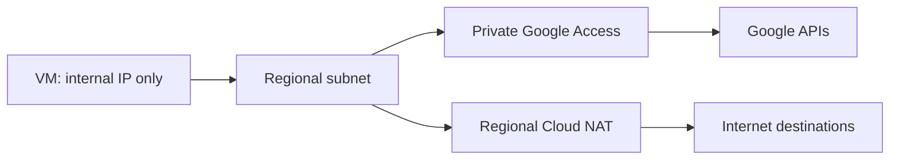
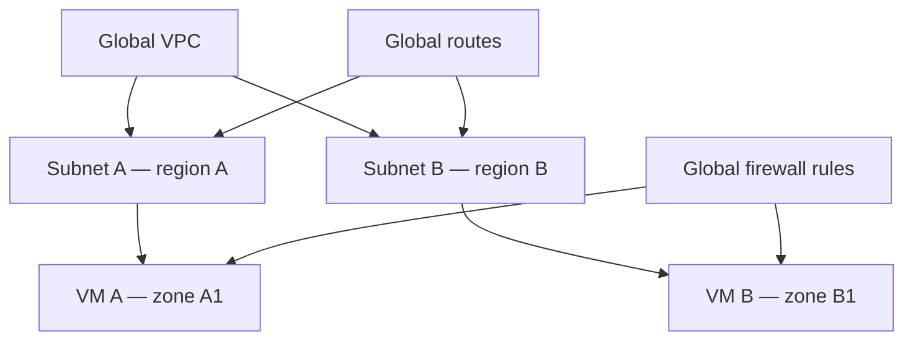
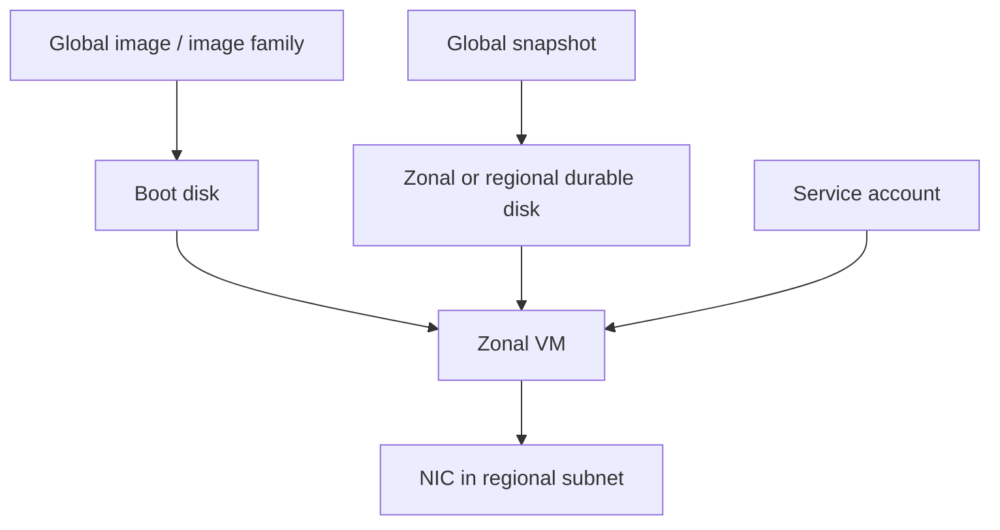

# Essential Google Cloud Infrastructure: Foundation

> 課程：<https://www.skills.google/paths/11/course_templates/50><br>
> 目標：Google Cloud Associate Cloud Engineer（ACE）<br>
> 技術核對日期：2026-08-22<br>
> 建議順序：先讀 Chapter 3、4 與文末「認證重點統整」，再補 Chapter 2 的工具操作。

## 課程定位與涵蓋範圍

公開課程頁顯示本課程約 6 小時 45 分，重點是使用 Google Cloud Console 與 Cloud Shell、部署基礎架構、設定 Virtual Private Cloud（VPC，虛擬私有雲網路），以及建立與管理 Compute Engine VM。

可辨識的課程結構如下：

1. Introduction
2. Interacting with Google Cloud
3. Virtual Networks
4. Virtual Machines

四個模組均與 ACE 官方考綱相關，因此全部納入；其中 Virtual Networks 與 Virtual Machines 為主要篇幅。

!!! ace "ACE 考點"
    建議先讀 Chapter 3 的 VPC scope 與 Chapter 4 的 VM lifecycle，再回到 Chapter 2 補強 Console、Cloud Shell 與 `gcloud` context。

## 來源限制

公開頁面能辨識課程說明、模組與 lesson 名稱，但完整影片、逐字稿、quiz、lab instructions 與 lab terminal output 需要登入或修課權限。本筆記以公開課程目錄為骨架，使用現行 Google Cloud 官方文件補強技術內容；未看到的課程指令、畫面與輸出均未臆造。

!!! update "官方文件更新"
    本頁技術內容核對至 2026-08-22。Console 介面、產品功能、可用 region／zone、quota 與 pricing 可能持續變動；時效性較高的資訊以各段連結的 Google Cloud 官方文件為準。

---

## Chapter 1 — Introduction

中文名稱：課程介紹

### Learning Objectives

- 理解課程在 Google Cloud 基礎架構學習路徑中的位置。
- 建立 ACE 導向的學習框架：scope、connectivity、security、operations、cost。

### 核心概念摘要

本課程以 Compute Engine 為核心，從控制平面工具、VPC 到 VM lifecycle 建立基礎。ACE 題目通常不只問名詞，而是要求判斷應建立哪個資源、放在哪個 scope、用哪個介面管理，以及如何以最小變更排除問題。

### 詳細知識點

#### Cloud architect 與 cloud engineer 視角

架構設計需要把 business requirement 轉成 availability、performance、security、manageability 與 cost 等技術需求；ACE 更偏向正確部署與維運既定方案。讀每個資源時都應回答：

- 它是 global、regional 還是 zonal？
- 它依附於哪個 project、VPC 或 subnet？
- 需要哪些 IAM permissions？
- 停止、刪除或變更後，哪些資源仍持續計費？

### 認證考點

本課程直接對應 ACE 官方考綱中的：設定 project 與 CLI、部署 Compute Engine、建立 VPC/subnet/firewall、管理 VM、disk、image 與 IP address，以及評估 quota 與 cost。

### 本章快速複習

情境題先依序找：需求 → resource scope → connectivity → IAM/firewall → lifecycle/cost。

---

## Chapter 2 — Interacting with Google Cloud

中文名稱：與 Google Cloud 互動

### Learning Objectives

- 使用 Google Cloud Console、Cloud Shell、Google Cloud CLI 與 API 管理資源。
- 理解 active account、active project、region、zone 與 configuration。
- 從 Cloud Marketplace 部署並檢視基礎架構。

### 核心概念摘要

Google Cloud Console 適合探索、單次操作與視覺化；`gcloud` 適合可重現的命令列作業；Cloud Shell 是 Google 管理的暫時性運算環境，預裝 Google Cloud CLI，並提供少量持久化的 home directory。自動化或正式環境應避免只靠人工點選 Console。

### 詳細知識點

#### Project context

Project 是多數 Google Cloud 資源、API、billing、quota 與 IAM 的管理邊界。常見識別值：

- Project name：顯示名稱，可重複且可修改。
- Project ID：全域唯一，建立後不能修改，CLI 最常使用。
- Project number：Google 產生的數字識別值。

在執行命令前確認 active account 與 project，可避免把資源建到錯誤環境。

#### Console、Cloud Shell、gcloud 與 API

| 介面 | 適用情境 | 注意事項 |
|---|---|---|
| Google Cloud Console | 探索、監控、少量人工管理 | 頁面標籤可能改動；確認 project selector |
| Cloud Shell | 快速執行 CLI、教學與故障排查 | VM 是暫時性的，不當作正式主機 |
| Google Cloud CLI | 可重現的日常管理與 scripting | 注意 configuration、account、project、region、zone |
| REST/client libraries | 應用程式與系統整合 | 需設計 authentication、retry 與 error handling |

#### gcloud configuration

`gcloud` 支援多組 named configurations。不同帳號或環境可分開保存設定，不必反覆覆寫同一組 properties。`--project` 等 command-level flag 通常可覆蓋 configuration property。

#### Cloud Marketplace

Marketplace 提供可部署的 solution 與範本，例如 LAMP stack。部署後仍會在自己的 project 建立資源並產生費用；刪除 Marketplace deployment 不一定代表所有底層資料或資源都已刪除，應檢查 VM、disk、IP、firewall rule 等實際資源。

### Resource Scope

| Resource | Scope | 說明與影響 |
|---|---|---|
| Project | Global management boundary | 多數資源、IAM、API、quota 與 billing 的容器 |
| Cloud Shell session VM | Session-temporary | session 結束後運算環境不保證保留 |
| gcloud configuration | Local user environment | 保存 account、project、region、zone 等 properties |
| Marketplace deployment | Project | 底層資源可能分散在 global/regional/zonal scope |

### Google Cloud Console

- Project 選擇：`Console > Top navigation > Project selector`
- API：`Console > APIs & Services > Library`
- Marketplace：`Console > Marketplace > Search solution > Launch`
- Cloud Shell：`Console > Top navigation > Activate Cloud Shell`

Console 導覽名稱可能隨介面更新；操作前先確認目前 project。

### Cloud Shell / gcloud

#### 檢視與設定 context

```bash
gcloud auth list
```

- Command group：`gcloud auth`
- Resource：credentialed accounts
- Action：`list`
- Flags：無
- Parameters：無

```bash
gcloud config list
```

- Command group：`gcloud config`
- Resource：active configuration properties
- Action：`list`

```bash
gcloud config set project PROJECT_ID
```

- Command group：`gcloud config`
- Resource：active configuration
- Action：`set`
- Parameter：`PROJECT_ID` 是 project ID placeholder

```bash
gcloud config set compute/region REGION
gcloud config set compute/zone ZONE
```

- Resource：default Compute Engine location properties
- Parameters：`REGION`、`ZONE` 是 placeholders，例如 `asia-east1`、`asia-east1-b`
- 注意：default 只減少輸入，資源真正 scope 仍由建立命令決定。

#### 檢視 project

```bash
gcloud projects describe PROJECT_ID
```

- Command group：`gcloud projects`
- Resource：project
- Action：`describe`
- Parameter：`PROJECT_ID` 是 placeholder

### Command Output

本課程的實際輸出未提供，因此不製造範例結果。執行 `describe` 一般會回傳資源欄位；實際內容依 project 與權限而定。

### 認證考點

- 命令作用到錯誤 project：先查 `gcloud config list` 與 `gcloud auth list`。
- 只想單次覆蓋 project：命令加 `--project=PROJECT_ID`，不一定要更改全域預設。
- 自動化部署：優先 CLI、API 或 Infrastructure as Code，而不是重複手動點 Console。
- API 呼叫出現未啟用錯誤：確認正確 project、啟用對應 API，再檢查 IAM。
- Marketplace solution 仍是你的資源與費用責任；用完要清查底層資源。

### 教材與現行文件差異

| 類型 | 內容 | 官方來源 |
|---|---|---|
| 教材內容 | Console、Cloud Shell、Marketplace、Projects | 課程公開目錄 |
| 現行官方文件 | Cloud Shell VM 是暫時性環境，home directory 與 session VM 的保存特性不同 | [Cloud Shell how it works](https://docs.cloud.google.com/shell/docs/how-cloud-shell-works) |
| 備考建議 | 每次 lab 先確認 account/project/region/zone，這也是排錯起點 | 推論，非官方考綱聲明 |

### 本章快速複習

- Project ID ≠ project name ≠ project number。
- Console 適合探索；CLI 適合重現與自動化。
- Default region/zone 不會改變資源本身的 scope。
- Marketplace 部署完成後仍要管理底層資源、IAM 與費用。

---

## Chapter 3 — Virtual Networks

中文名稱：虛擬網路

### Learning Objectives

- 建立 auto mode 與 custom mode VPC、subnet、IP address、route 與 firewall rule。
- 理解 VPC 與 subnet scope、routing order、stateful firewall 行為與 implied rules。
- 分辨 Private Google Access 與 Cloud NAT。
- 了解 VPC 網路成本的主要來源。

### 核心概念摘要

VPC 是 global resource；subnet 是 regional resource；VM NIC 連到某個 subnet。VPC 並不提供傳統資料中心式的單一實體 router 或 firewall appliance，而是 software-defined、distributed 的網路。Route 決定封包的 next hop，firewall rule 決定封包是否允許；兩者缺一不可。

### 詳細知識點

#### VPC、project 與 subnet

一個 project 可有多個 VPC network；VPC network 不跨 project，但可透過 Shared VPC、VPC Network Peering、Cloud VPN 等方式提供跨 project/network connectivity。

- Auto mode VPC：Google 在可用 regions 自動建立 subnet，IPv4 ranges 來自預先定義範圍；方便入門，但大型或長期架構較難精準規劃位址。
- Custom mode VPC：自行選 region 與 IP ranges，適合 production、hybrid、peering 與避免 CIDR overlap。

同一 VPC 不同 regions 的 resources 可經 Google network 以 internal IP 通訊，但仍受 effective routes 與 firewall rules 控制。

#### Subnet 與 CIDR expansion

Subnet 定義 regional IP ranges。IPv4 primary range 建立後可擴大 prefix 範圍，但不能縮小；擴大前要確認不與同 VPC 或連線網路的既有 ranges 衝突。

例：`10.10.0.0/24` 可擴成包含原範圍的較大 range，例如 `/20`，不能改成不包含原範圍的另一段，也不能縮成 `/25`。

#### Internal、external、static、ephemeral IP

- Internal IP：VPC 內部通訊；internal IPv4 address 本身通常不收取 IP address 費用。
- External IP：供 internet-routable connectivity；仍需 route、firewall 與服務 listening。
- Ephemeral external IP：隨資源生命週期配置；VM stop 後通常釋放，restart 可能取得不同位址。
- Static external IP：預先 reserve，適合 DNS、allowlist 或固定 endpoint；不用時也可能計費。

Static/ephemeral 描述 allocation lifecycle；internal/external 描述可達範圍，兩組概念不可互換。

#### DNS 與 IP mapping

公開 domain 通常使用 Cloud DNS public zone 或其他 DNS provider 將 hostname 對映到 external IP / load balancer frontend。VM internal DNS 供 VPC 內名稱解析；不要依賴 ephemeral external IP 建長期 DNS record。

若後端 VM 可能替換，通常應將 DNS 指向 load balancer，而不是直接綁單一 VM。

#### Routes

VPC route 由 destination range、priority、next hop 等資訊組成。重要來源：

- Subnet routes：建立 subnet 時自動產生，使 VPC 知道該 IP range 位於哪個 subnet。
- Default route：常見為 `0.0.0.0/0` 指向 default internet gateway；只有 route 並不代表 VM 必然能上網。
- Static routes：管理者建立到特定 destination 的 next hop。
- Dynamic routes：Cloud Router 透過 BGP 學習/公告，常搭配 Cloud VPN 或 Cloud Interconnect。

選路先看是否符合，通常以 longest prefix match（最具體目的範圍）為優先，再依 route type/priority 等 routing order 規則處理。Firewall 不負責選 next hop。

#### Firewall rules

VPC firewall rules 是 global resource，套用到 VPC 中符合 target 的 VM network interfaces。傳統 VPC firewall rule 可依 network tag 或 service account 指定 target。

- Ingress：來源 → target；檢查 destination VM 的 ingress。
- Egress：target → destination；檢查來源 VM 的 egress。
- Priority：數字越小優先度越高。
- Stateful：允許一條連線方向後，對應的 established response traffic 可自動返回。

每個 VPC 有 implied rules：最低優先級的 deny ingress 與 allow egress。建立 VPC 不代表 internet 可直接連入 VM；需要 ingress allow rule、可達 IP/route，以及 VM 上服務監聽。

常見陷阱：只建 firewall rule 而沒有 route，或只建 route 而 firewall/OS firewall 阻擋；兩者都會導致連線失敗。

#### Common network designs

- 多環境隔離：常以不同 projects/VPCs 分離 production 與 development。
- Shared VPC：host project 擁有集中管理的 VPC/subnets，service projects 部署使用這些 subnets 的 resources；適合組織內集中網路治理。
- VPC Network Peering：兩個 VPC 交換 routes，administration 仍分開；不具 transitive routing，且不交換 firewall rules。
- Hybrid：Cloud VPN 或 Cloud Interconnect 連線地端，Cloud Router 提供 dynamic route exchange。

#### Private Google Access

沒有 external IP 的 VM，若其 subnet 啟用 Private Google Access，可使用 internal source IP 存取支援的 Google APIs 與 services。它是 **subnet-level setting**，不是一般 internet egress 方案；對已有 external IP 的 VM 沒有效果。

#### Cloud NAT

Public NAT 讓沒有 external IPv4 的 resources 對 internet 建立 outbound connections，共用 NAT external IPs。Cloud NAT 是 regional、distributed managed service，設定在 Cloud Router control plane 上，但封包不經過 proxy VM 或 Cloud Router VM。

Cloud NAT 只允許既有 outbound connection 的 response packets，不允許 unsolicited inbound connections。它不等同 firewall；egress firewall rules 仍然生效。



#### VPC pricing

VPC network、subnet、route 與基本 VPC firewall rule 本身通常不是主要費用來源；成本多來自實際資源與 traffic pattern。讀定價題時辨識：

- Data transfer in 通常不收費，但需以當期 SKU 與例外為準。
- 跨 zone、跨 region、internet data transfer out 可能收費，費率依來源/目的地與服務而異。
- Internal IP address 一般不收費；static 與 ephemeral external IPv4 address 現行皆可能按小時計費。
- Reserved 但未使用的 static external IPv4 通常費率更高。
- Cloud NAT 包含 gateway 使用、processed data 與 Public NAT external IP 等費用。
- VPC Flow Logs、Firewall Rules Logging 等產生的 logs 可能產生 Cloud Logging 費用。

定價會變動，考試與實務都應以 [VPC network pricing](https://cloud.google.com/vpc/network-pricing) 與 Pricing Calculator 的當期資料為準，不背固定美元數字。

### Resource Scope

| Resource | Scope | 說明與影響 |
|---|---|---|
| VPC network | Global | 同 VPC 可包含多 regions 的 subnets |
| VPC firewall rule | Global | 套用到 VPC 中符合 target 的 VM NIC |
| VPC route | Global | 對 VPC 中適用 resources 提供 next hop |
| Subnet | Regional | 一個 subnet 不跨 region，可涵蓋該 region 的 zones |
| VM internal IP | Zonal VM NIC, allocated from regional subnet | VM NIC 從 subnet range 取得位址 |
| Regional static external IPv4 | Regional | 可用於相容的 regional resources |
| Global static external IP | Global | 用於相容的 global resources，如部分 load balancer frontend |
| Cloud Router | Regional | BGP 與 Cloud NAT configuration control plane |
| Cloud NAT gateway | Regional | 服務指定 region 中的 subnet ranges |
| Private Google Access | Subnet setting | 對無 external IP 的 VM 存取 Google APIs 生效 |

### Architecture



### Google Cloud Console

- VPC：`Console > VPC network > VPC networks > Create VPC network`
- Subnet：`Console > VPC network > VPC networks > Select network > Add subnet`
- IP addresses：`Console > VPC network > IP addresses`
- Firewall：`Console > Network Security > Firewall policies` 或 `Console > VPC network > Firewall`
- Cloud NAT：`Console > Network services > Cloud NAT > Create Cloud NAT gateway`
- Routes：`Console > VPC network > Routes`

Console 導覽可能更新；先確認 project、network 與 region。

### Cloud Shell / gcloud

#### 建立 custom mode VPC 與 subnet

```bash
gcloud compute networks create NETWORK_NAME \
  --subnet-mode=custom
```

- Command group：`gcloud compute networks`
- Resource：VPC network
- Action：`create`
- Flag：`--subnet-mode=custom`
- Parameter：`NETWORK_NAME` 是 placeholder

```bash
gcloud compute networks subnets create SUBNET_NAME \
  --network=NETWORK_NAME \
  --region=REGION \
  --range=10.10.0.0/24 \
  --enable-private-ip-google-access
```

- Command group：`gcloud compute networks subnets`
- Resource：subnet
- Action：`create`
- Flags：VPC、region、primary IPv4 range、Private Google Access
- Parameters：`SUBNET_NAME`、`NETWORK_NAME`、`REGION` 是 placeholders；CIDR 是示例 literal

#### 擴大 subnet

```bash
gcloud compute networks subnets expand-ip-range SUBNET_NAME \
  --region=REGION \
  --prefix-length=20
```

- Action：`expand-ip-range`
- Flag：`--prefix-length=20` 指定新的較大範圍 prefix
- 注意：只能擴大，需確認不重疊；執行前先 describe subnet。

#### 建立 firewall rule

```bash
gcloud compute firewall-rules create allow-ssh-from-admin \
  --network=NETWORK_NAME \
  --direction=INGRESS \
  --action=ALLOW \
  --rules=tcp:22 \
  --source-ranges=ADMIN_CIDR \
  --target-tags=ssh-server
```

- Command group：`gcloud compute firewall-rules`
- Resource：VPC firewall rule
- Action：`create`
- Flags：direction、action、protocol/port、source、target
- Parameters：`NETWORK_NAME`、`ADMIN_CIDR` 是 placeholders
- 安全：不要為方便將 SSH source 設為 `0.0.0.0/0`。

#### 建立 Cloud Router 與 Public NAT

```bash
gcloud compute routers create ROUTER_NAME \
  --network=NETWORK_NAME \
  --region=REGION
```

```bash
gcloud compute routers nats create NAT_NAME \
  --router=ROUTER_NAME \
  --region=REGION \
  --nat-all-subnet-ip-ranges \
  --auto-allocate-nat-external-ips
```

- Command group：`gcloud compute routers nats`
- Resource：Cloud NAT configuration
- Action：`create`
- Flags：router、region、served subnet ranges、automatic NAT IP allocation
- Parameters：`NAT_NAME`、`ROUTER_NAME`、`REGION` 是 placeholders

#### 檢視 routes 與 IP addresses

```bash
gcloud compute routes list \
  --filter="network:NETWORK_NAME"
```

```bash
gcloud compute addresses list
```

### Command Output

使用者未提供 lab 執行紀錄，因此不建立「我的實際操作」或虛構 terminal output。`list` 命令實際欄位會依 CLI 版本與 `--format` 設定而異。

### 認證考點

- 同一 VPC、不同 regions 的 VM 以 internal IP 通訊：確認 subnet routes 與 firewall，不需要為此建立 VPN。
- VM 無 external IP，只需存取 Google APIs：subnet 啟用 Private Google Access。
- VM 無 external IP，需要下載 internet 套件：Public NAT；PGA 不提供一般 internet access。
- Internet 無法主動連入 Cloud NAT 後 VM：這是預期行為；Cloud NAT 不支援 unsolicited inbound。
- VPC firewall priority 數字越小越優先；要同時理解 ingress/egress 與 target。
- Auto mode 適合快速開始；有 hybrid/peering/CIDR 規劃時通常選 custom mode。
- VPC Peering 不 transitive、不交換 firewall rules；CIDR overlap 會阻擋 peering。
- Shared VPC 是同 organization 下集中網路治理，不等同 VPC Peering。
- DNS 需要固定 endpoint 時，reserve static IP 或指向 load balancer；不要依賴 ephemeral IP。

### 教材與現行文件差異

| 類型 | 內容 | 官方來源 |
|---|---|---|
| 教材內容 | VPC、projects/networks/subnetworks、IP、routes、firewall、pricing、Private Google Access、Cloud NAT | 課程公開目錄 |
| 現行官方文件 | VPC、routes、firewall rules 是 global；subnets 是 regional | [VPC networks](https://docs.cloud.google.com/vpc/docs/vpc) |
| 現行官方文件 | Private Google Access 以 subnet 為單位啟用，讓無 external IP 的 VM 存取支援的 Google APIs | [Private Google Access](https://docs.cloud.google.com/vpc/docs/private-google-access) |
| 現行官方文件 | Cloud NAT 是 distributed managed service，只接受 outbound 連線的 response，不接受 unsolicited inbound | [Cloud NAT overview](https://docs.cloud.google.com/nat/docs/overview) |
| 現行官方文件 | External IPv4 與 network transfer 的費用規則會變動；static/ephemeral external IP 現行皆可能計費 | [VPC network pricing](https://cloud.google.com/vpc/network-pricing) |
| 備考建議 | 不背美元數字，記住費用構成與 unused static external IP 風險 | 推論，非官方考綱聲明 |

### 本章快速複習

- Global：VPC、route、firewall rule；Regional：subnet、Cloud Router、Cloud NAT。
- Route 決定去哪裡；firewall 決定允不允許。
- PGA → Google APIs；Public NAT → general internet outbound。
- Static/ephemeral 是生命週期；internal/external 是可達性。
- VPC Peering 不 transitive，也不交換 firewall rules。

---

## Chapter 4 — Virtual Machines

中文名稱：虛擬機器

### Learning Objectives

- 建立、連線、停止、啟動、修改與刪除 Compute Engine VM。
- 選擇 machine family、machine type、image 與 disk。
- 理解 VM、disk、snapshot、image 的 scope 與 lifecycle。
- 依 workload 與生命週期選擇計價方式。

### 核心概念摘要

Compute Engine VM 是 zonal resource。建立 VM 時至少要決定 zone、machine type、boot disk/image、network interface、service account 與 access scope/IAM。VM stop 不等於刪除所有資源；attached durable disks、static external IP 與其他保留資源可能繼續計費。

### 詳細知識點

#### Compute Engine 與 VM 建立

VM 由 vCPU/memory、boot disk、NIC、metadata、service account 等構成。建立流程的核心決策：

1. 選 region/zone，考慮 latency、availability、quota 與服務支援。
2. 選 machine family/type，符合 CPU、memory、GPU 或成本需求。
3. 選 OS image 與 boot disk。
4. 選 VPC/subnet、internal/external IP 與 firewall target。
5. 綁定專用 service account 並授予最小 IAM roles。

#### VM access

Linux VM 常用 SSH；Windows 常用 RDP。生產環境優先考慮 OS Login、IAM、IAP TCP forwarding 或受控 bastion，而非將管理 port 對全 internet 開放。

連線問題排查順序：VM state → IP/route → firewall rule → OS firewall/service → IAM/OS Login → SSH key/IAP permissions。

#### VM lifecycle

- Stop：停止 vCPU/memory 計費，但 attached durable disks、static IP 等可能繼續計費；ephemeral external IP 通常會釋放。
- Start：需 zone 有足夠 capacity；ephemeral IP 可能改變。
- Reset：近似硬體 reset，不是 graceful OS reboot。
- Suspend：保存 VM memory state，支援與費用依 machine/configuration 而異。
- Delete：刪除 VM resource；disk 是否自動刪除取決於 auto-delete 設定，static IP 等獨立資源需另行確認。

停止前，應用應處理 shutdown signal；Local SSD data 在 stop/terminate 等事件的保存條件與 durable disk 不同，不能把它當唯一持久資料來源。

#### Machine families 與 machine types

常見思路而非死背型號：

- General-purpose：多數 web/app、開發與一般 workload。
- Compute-optimized：高 CPU 密度、HPC 或 compute-bound。
- Memory-optimized：大型 in-memory database/analytics。
- Accelerator-optimized：GPU workload。
- Custom machine type：調整 vCPU/memory，避免固定 type 過度配置。

Machine series 支援的 zone、CPU platform、disk、GPU、live migration 與 pricing 不同；實務上以現行 machine series 文件核對。

#### Compute pricing

主要成本來源：VM vCPU/memory runtime、OS license、GPU、disk capacity/performance、external IP 與 network data transfer。

- On-demand：依使用計費，彈性最高。
- Sustained use discounts：對部分 eligible resources 自動套用，規則依 machine series/計價模式。
- Committed use discounts：承諾一定期間/用量換取折扣，適合穩定 predictable workload；需承擔使用不足風險。
- Spot VMs：大幅折扣但可隨時被終止，適合 fault-tolerant batch、CI、可重試 workload，不適合無容錯的單一關鍵服務。

不要背固定折扣百分比；以 [Compute Engine pricing](https://cloud.google.com/compute/vm-instance-pricing) 與 Pricing Calculator 核對。

#### Special compute configurations

- Shielded VM：Secure Boot、vTPM、integrity monitoring 等 boot security 能力。
- Confidential VM：對使用中的資料提供 memory encryption 類保護，會影響支援的 machine/configuration。
- Sole-tenant nodes：VM 專用實體 host，適合特定 compliance、licensing 或 isolation requirement，成本通常較高。
- GPUs：需選支援 zone/machine type、quota、driver 與 maintenance behavior。

選型依 requirement，不是所有 VM 都需要最高階安全或 dedicated host。

#### Images、snapshots 與 machine images

- Public OS image：Google、OS vendor 或社群提供。
- Custom image：從 disk、snapshot、image 或 Cloud Storage image file 建立，可用於標準化 VM boot disk。
- Image family：指向 family 中最新且未 deprecated 的 image；方便 rolling update，但 production 應先測試新版本。
- Snapshot：disk 的 point-in-time incremental backup，主要用於備份/還原 disk。
- Machine image：保存 VM configuration、metadata、permissions 與多 disks 資訊，適合較完整的 VM backup/clone。

題目問「建立許多相同 OS/軟體的 VM」通常選 custom image 或 instance template；題目問「還原 disk 資料」通常是 snapshot。

#### Disk options

現行 Compute Engine block storage 大方向：

- Hyperdisk：durable network block storage，可獨立設定部分類型的 IOPS/throughput；現行文件優先建議，支援依 machine series。
- Persistent Disk：durable network block storage；效能通常受 disk size/type 與 VM limits 影響。
- Regional Persistent Disk / Hyperdisk Balanced High Availability：同步複寫到同 region 兩個 zones，保護 disk data 免於單一 zone failure；不會自動讓應用完成 failover。
- Local SSD：host-local temporary block storage，高 IOPS/低 latency，但 durability 與 lifecycle 不同，必須由應用 replication/checkpoint。

Zonal durable disk 通常只能與相容 zone 的 VM 使用；regional disk 與 VM 必須位於同 region。刪除 VM 前確認 data disk 的 auto-delete 設定。

#### Common Compute Engine actions

- Resize disk：通常只能擴大，之後還要擴充 guest OS partition/filesystem。
- Change machine type：一般需先 stop VM。
- Create snapshot/image：注意 application consistency 與 IAM。
- Attach/detach disk：先處理 guest OS mount/unmount，避免 filesystem corruption。
- Add labels：利於 inventory 與 billing analysis。
- Move workload：不能把 zonal VM 直接「改 zone」；通常透過 image/snapshot/template 在新 zone 重建。

### Resource Scope

| Resource | Scope | 說明與影響 |
|---|---|---|
| Compute Engine VM | Zonal | VM 位於單一 zone |
| Machine type | Zonal availability | type/series 是否可用依 zone 而異 |
| Zonal Persistent Disk / Hyperdisk | Zonal | 與相容 zone 的 VM 使用 |
| Regional durable disk | Regional | 同步複寫至同 region 的兩個 zones |
| Local SSD | Host/zonal VM lifecycle | host-local temporary storage |
| Snapshot | Global | 可用於跨 region/zone 建 disk，實際 storage location 依設定 |
| Image | Global | 可用於多 zones 建立 boot disk |
| Instance template | Global or regional | 依 template 類型供 managed instance group 使用 |

### Architecture



### Google Cloud Console

- VM：`Console > Compute Engine > VM instances > Create instance`
- Disks：`Console > Compute Engine > Disks`
- Snapshots：`Console > Compute Engine > Snapshots`
- Images：`Console > Compute Engine > Images`
- Machine images：`Console > Compute Engine > Machine images`

Console labels 可能調整；建立前確認 project、zone、VPC/subnet 與 service account。

### Cloud Shell / gcloud

#### 建立 VM

```bash
gcloud compute instances create VM_NAME \
  --zone=ZONE \
  --machine-type=MACHINE_TYPE \
  --subnet=SUBNET_NAME \
  --no-address \
  --image-family=debian-12 \
  --image-project=debian-cloud \
  --service-account=SERVICE_ACCOUNT_EMAIL
```

- Command group：`gcloud compute instances`
- Resource：VM instance
- Action：`create`
- Flags：zone、machine type、subnet、無 external IPv4、image family/project、service account
- Parameters：大寫值是 placeholders；`debian-12`、`debian-cloud` 是示例 literals
- 注意：service account 還需在目標資源上取得最小 IAM role。

#### 檢視、停止與啟動 VM

```bash
gcloud compute instances describe VM_NAME \
  --zone=ZONE
```

```bash
gcloud compute instances stop VM_NAME \
  --zone=ZONE
```

```bash
gcloud compute instances start VM_NAME \
  --zone=ZONE
```

- Resource：zonal VM
- Actions：`describe`、`stop`、`start`
- Parameter：`--zone` 不可誤填 region

#### SSH

```bash
gcloud compute ssh VM_NAME \
  --zone=ZONE
```

- Action：`ssh`
- 注意：實際連線方式受 external IP、IAP、OS Login、IAM 與 firewall configuration 影響。

#### 建立與掛載 disk

```bash
gcloud compute disks create DISK_NAME \
  --zone=ZONE \
  --size=DISK_SIZE \
  --type=DISK_TYPE
```

```bash
gcloud compute instances attach-disk VM_NAME \
  --zone=ZONE \
  --disk=DISK_NAME
```

- Command groups：`gcloud compute disks`、`gcloud compute instances`
- Resources：durable disk、VM
- Actions：`create`、`attach-disk`
- Parameters：`DISK_SIZE` 例如 `100GB`；`DISK_TYPE` 需依 zone/machine 支援選擇
- 注意：attach 後仍需在 guest OS partition/format/mount；不要對有資料的 disk 誤做 format。

#### 建立 snapshot 與 custom image

```bash
gcloud compute snapshots create SNAPSHOT_NAME \
  --source-disk=DISK_NAME \
  --source-disk-zone=ZONE
```

```bash
gcloud compute images create IMAGE_NAME \
  --source-disk=BOOT_DISK_NAME \
  --source-disk-zone=ZONE \
  --family=IMAGE_FAMILY_NAME
```

- Resources：snapshot、custom image
- Actions：`create`
- 注意：production workload 應考慮 application-consistent backup 流程。

### Command Output

未提供 Cloud Shell execution record，因此不虛構 command output。實際操作後可將原始 command 與 output 原樣補入「我的實際操作」。

### 認證考點

- VM 是 zonal；VPC global；subnet regional。題目常利用三者 scope 混淆。
- 要改 machine type：通常先 stop；stop 後 disk/static IP 仍可能計費。
- 固定 public endpoint：reserve static external IP；ephemeral IP 在 stop/start 後可能改變。
- 無 external IP 的 VM：Google APIs 用 PGA；一般 internet outbound 用 Cloud NAT。
- 快速建立相同 VM：image + instance template；大量自動管理則再搭 managed instance group。
- 備份 disk：snapshot；標準化 boot disk：custom image；較完整 VM configuration backup：machine image。
- 高效暫存 scratch：Local SSD，但應用需容忍資料遺失。
- 單 zone VM 不是高可用；regional disk 只提升 disk data availability，不會自動重建/切換應用。
- 可被中斷且能重試的 batch：Spot VM；不可中斷的單一 stateful workload 不適合。

### 教材與現行文件差異

| 類型 | 內容 | 官方來源 |
|---|---|---|
| 教材內容 | Compute Engine、VM lifecycle、compute options/pricing、special configurations、images、disk options、common actions | 課程公開目錄 |
| 現行官方文件 | Stop VM 後，attached storage 與其他保留資源仍可能計費 | [Stop or restart an instance](https://docs.cloud.google.com/compute/docs/instances/stop-start-instance) |
| 現行官方文件 | Hyperdisk 與 Persistent Disk 都是 durable block storage；現行文件建議支援時優先評估 Hyperdisk | [Choose a disk type](https://docs.cloud.google.com/compute/docs/disks) |
| 現行官方文件 | Image family 指向最新且未 deprecated 的 image，production 應先測試更新 | [OS images](https://docs.cloud.google.com/compute/docs/images)、[Image family best practices](https://docs.cloud.google.com/compute/docs/images/image-families-best-practices) |
| 備考建議 | 舊教材偏重 Persistent Disk 時，仍要理解現行 Hyperdisk 定位，但以考綱要求的 storage selection 原則作答 | 推論，非官方考綱聲明 |

### 本章快速複習

- VM：zonal；image/snapshot：global；subnet：regional。
- Stop 不等於免費，也不等於 delete。
- Snapshot 備份 disk；image 標準化 OS；machine image 保存較完整 VM 狀態。
- Durable：Hyperdisk/Persistent Disk；temporary high performance：Local SSD。
- Spot 便宜但可被終止，workload 必須可重試。

---

## 認證重點統整

### ACE 重點

本課程直接對應目前 ACE 官方考綱的下列能力：

1. 安裝與設定 CLI，包括 default project。
2. 使用 Console 與 `gcloud` 建立 Compute Engine VM。
3. 選擇 disk、availability policy、SSH 與 machine configuration。
4. 建立 custom mode VPC、subnets、internal/external IP 與 firewall rules。
5. 管理 VM start/stop/edit/delete、snapshot、image 與 instance inventory。
6. 增加 subnet、擴大 subnet range、reserve static IP、管理 Cloud NAT 與 firewall。
7. 評估 compute quota、network/data transfer 與持續存在資源的費用。

官方範圍：[Associate Cloud Engineer exam guide](https://cloud.google.com/learn/certification/guides/cloud-engineer)

### 服務選型與比較

| 情境 | 建議服務或設定 | 判斷理由 | 常見誤解 |
|---|---|---|---|
| 精準規劃 production CIDR | Custom mode VPC | 自行建立 regional subnets | Auto mode 不利複雜 CIDR 規劃 |
| 無 external IP VM 存取 Google APIs | Private Google Access | subnet-level Google API access | 不提供一般 internet access |
| 無 external IP VM 存取 internet | Public NAT | shared outbound NAT | 不允許 unsolicited inbound |
| 跨 project 集中網路治理 | Shared VPC | host/service project model | 不等同 VPC Peering |
| 兩個 VPC 私網互通 | VPC Network Peering | 交換可用 routes | 不 transitive、不交換 firewall |
| 固定 VM public endpoint | Static external IP | stop/start 後保持位址 | Reserved unused IP 仍可能計費 |
| 相同 OS/軟體建立多台 VM | Custom image + instance template | 可重現、標準化 | Snapshot 主要是 disk backup |
| 高速可丟失 scratch data | Local SSD | host-local 低延遲 | 不是 durable storage |
| 穩定長期 VM workload | On-demand + 評估 CUD | predictable usage 可承諾 | 承諾過多會浪費 |
| 可中斷、可重試 batch | Spot VM | 顯著降低 compute cost | 不適合無容錯 stateful service |

### Resource Scope 速查

| Resource | Scope | 記憶法 |
|---|---|---|
| VPC network | Global | 一張全球邏輯網路 |
| Firewall rule / route | Global | 跟著 VPC |
| Subnet | Regional | 一個 region 一段 IP range |
| VM | Zonal | VM 落在單一 zone |
| Cloud Router / Cloud NAT | Regional | 服務該 region subnets |
| Image / snapshot | Global | 可在不同 locations 建 VM/disk |
| Zonal disk | Zonal | 跟 zone |
| Regional disk | Regional | 同 region 兩 zone 複寫 |

### 常見陷阱

- Route 與 firewall 是兩個不同判斷：有 route 不代表允許，有 allow rule 也不代表可達。
- Firewall priority 數字越小越優先。
- Implied deny ingress、allow egress 位於最低優先級。
- `0.0.0.0/0` 是所有 IPv4 destinations/sources，不應隨意用於 SSH/RDP ingress。
- Private Google Access 不是 Cloud NAT；Cloud NAT 不是 firewall。
- Stop VM 後仍可能有 disk、static IP、license 或其他費用。
- Static/ephemeral 與 internal/external 是不同維度。
- Subnet 只能擴大不能縮小；擴大與 peering/hybrid ranges 都要避免 overlap。
- VPC Peering 不 transitive，且兩端各自管理 firewall。
- Regional disk 不會自動讓單一 zonal VM 變成高可用架構。

### 建議實作清單

1. 建立 custom mode VPC 與兩個 regional subnets。
2. 建立只允許管理來源 CIDR 的 SSH firewall rule。
3. 建一台無 external IP VM，分別測試未啟用與啟用 Private Google Access。
4. 建 Cloud Router + Public NAT，測試一般 internet outbound。
5. 使用 `gcloud compute routes list` 與 `firewall-rules list` 排查 connectivity。
6. Stop/start VM，觀察 ephemeral IP、disk 與 resource 狀態。
7. 建 snapshot、custom image，再由 image 建新 VM。
8. 建 data disk、attach、在 guest OS format/mount，最後安全 detach。
9. 在 Billing report 觀察 VM、disk、external IP 與 network SKU。

### 待補材料與限制

- 未取得完整影片 transcript、quiz 題目與 lab instructions。
- 未取得使用者的 Cloud Shell commands/output，因此未建立「我的實際操作」。
- Console UI、machine series、可用 regions/zones、quota 與定價持續更新；已對時效性較高內容附上現行官方來源。
- 若後續提供字幕、PDF、課程截圖或 lab 執行紀錄，可在同一份筆記加入逐 lesson 對照、原始 command 解析與 terminal output。

### 官方來源

- [課程頁：Essential Google Cloud Infrastructure: Foundation](https://www.skills.google/paths/11/course_templates/50)
- [Associate Cloud Engineer exam guide](https://cloud.google.com/learn/certification/guides/cloud-engineer)
- [VPC networks](https://docs.cloud.google.com/vpc/docs/vpc)
- [Routes](https://docs.cloud.google.com/vpc/docs/routes)
- [VPC firewall rules](https://docs.cloud.google.com/firewall/docs/firewalls)
- [Private Google Access](https://docs.cloud.google.com/vpc/docs/private-google-access)
- [Cloud NAT overview](https://docs.cloud.google.com/nat/docs/overview)
- [VPC network pricing](https://cloud.google.com/vpc/network-pricing)
- [Compute Engine VM instances](https://docs.cloud.google.com/compute/docs/instances)
- [Stop or restart VM](https://docs.cloud.google.com/compute/docs/instances/stop-start-instance)
- [VM instance pricing](https://cloud.google.com/compute/vm-instance-pricing)
- [OS images](https://docs.cloud.google.com/compute/docs/images)
- [Choose a disk type](https://docs.cloud.google.com/compute/docs/disks)
- [`gcloud compute` reference](https://docs.cloud.google.com/sdk/gcloud/reference/compute)

## 最後更新

2026-08-22
