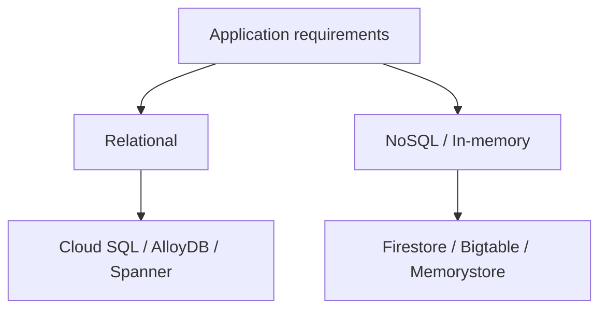
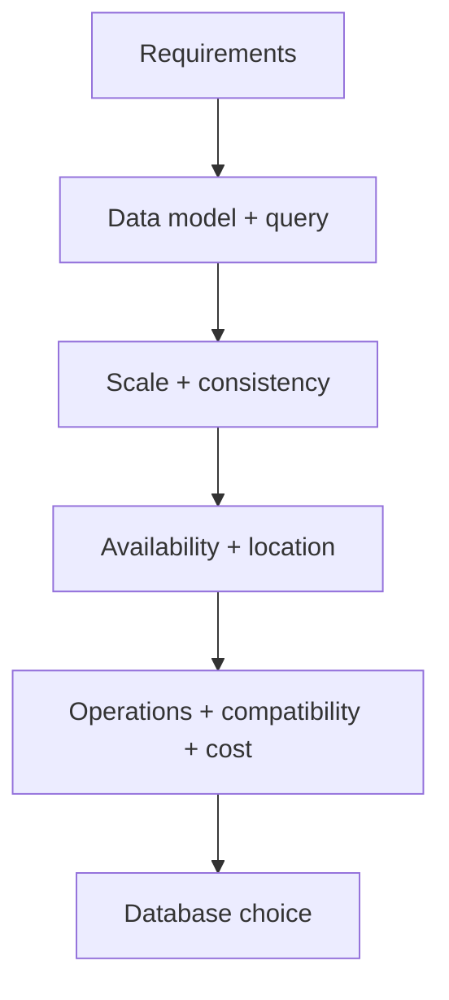
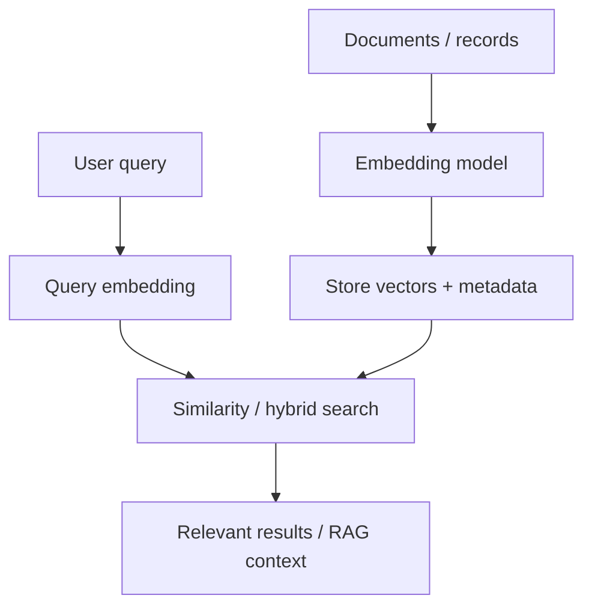
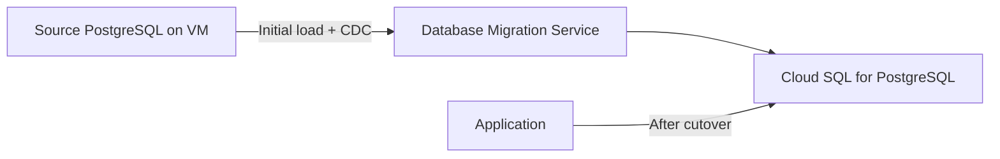

# Select a Google Cloud Database for Your Applications

> 課程連結：https://www.skills.google/paths/11/course_templates/1234<br>
> 課程長度：Google Skills 公開頁面目前標示約 6 小時<br>
> 難度：Introductory<br>
> 適用證照：Associate Cloud Engineer（ACE）<br>
> 整理與官方文件校正日期：2026-08-24<br>
> 說明：依公開課程綱要與可存取 Lab 說明整理，並以現行 Google Cloud 官方文件校正。未取得的影片逐字稿、Quiz 題目與個人 Lab 終端輸出不臆造。

### 課程結構與 ACE 優先度

| Module | 課程章節 | ACE 優先度 | 重點 |
|---:|---|---:|---|
| 1 | Introduction | 低 | 課程目標與選型框架 |
| 2 | Google Cloud database solutions for developing applications | 很高 | Relational／NoSQL、Cloud SQL、AlloyDB、Spanner、Bigtable、Firestore、Memorystore |
| 3 | Which database is right for your application? | 很高 | OLTP／OLAP、資料模型、一致性、擴充性、可用性與 Gen AI 需求 |
| 4 | Build generative AI apps with Google Cloud databases | 中至高 | Vector Search、AlloyDB／Cloud SQL／Spanner Lab、Database Migration Service |

依現行 [ACE 官方考試指南](https://cloud.google.com/learn/certification/guides/cloud-engineer)，考生需規劃資料儲存產品選型，並能初始化、查詢、備份及還原 Cloud SQL、Firestore、Spanner、Bigtable 等資料服務。本課程的「資料庫選型」與 ACE 直接相關；Vector Index 的 SQL 細節較偏資料庫／開發者能力，本筆記將其標示為延伸實作，不宣稱是 ACE 必考細節。

## Chapter 1 — Introduction
中文名稱：課程介紹

### 1. Learning Objectives

- 理解課程的資料庫選型目標。
- 建立從 Application requirement 推導 Database service 的流程。
- 分清 Operational database、Analytics platform、Cache 與 Object storage。

### 2. 核心概念摘要

資料庫選型不能只看「是否支援 SQL」。應先釐清資料模型、交易、一致性、查詢方式、讀寫量、全球分布、可用性、相容性、維運能力、成本及未來擴充，再選擇符合需求的 Managed database。

BigQuery 雖支援 SQL，但主要是分析型 Data warehouse；Memorystore 是 In-memory store／Cache；Cloud Storage 是 Object storage。它們不應因同樣能存資料而被視為可任意互換。

### 3. 詳細知識點

#### 3.1 選型問題順序

1. 資料是 Relational、Document、Wide-column、Key-value 還是 Vector？
2. 工作負載是 OLTP、OLAP、HTAP、Cache 還是 Streaming lookup？
3. 是否要求多資料列 ACID Transaction 與 Referential integrity？
4. 需要單區域、跨 Zone HA，還是全球多區域一致性？
5. 尖峰讀寫量、容量、延遲與成長速度如何？
6. 是否必須相容 MySQL、PostgreSQL、SQL Server 或既有 Driver／Extension？
7. 團隊能承擔多少 Schema、Capacity、Backup、Patch 與 Failover 管理？
8. RTO、RPO、Backup retention、Migration downtime 與成本限制為何？

### 9. 認證考點

- ACE 題目通常提供明確需求線索，應選「最符合且維運最少」的服務，不是功能最多或最昂貴者。
- HA、Read replica、Backup、PITR 與 Cross-region DR 解決不同問題，不可互相替代。
- Cache 不應作為唯一 Durable system of record。

### 11. 本章快速複習

- 先定義資料模型與 Workload，再選產品。
- 再評估一致性、Scale、Location、HA／DR、相容性、維運與成本。
- Database、Data warehouse、Cache、Object storage 是不同角色。

## Chapter 2 — Google Cloud Database Solutions for Developing Applications
中文名稱：應用程式開發的 Google Cloud 資料庫方案

### 1. Learning Objectives

- 比較 Relational 與 NoSQL Database。
- 說明 Cloud SQL、AlloyDB、Spanner 的適用情境。
- 說明 Bigtable、Firestore、Memorystore 的資料模型與用途。
- 辨認容易混淆的服務界線。

### 2. 核心概念摘要

Google Cloud Relational Database 主要包括 Cloud SQL、AlloyDB for PostgreSQL 與 Spanner；課程中的 NoSQL／非關聯式選項包括 Firestore、Bigtable 與 Memorystore。產品並非由「SQL vs NoSQL」一條軸線決定，還需考慮規模、一致性、查詢、相容性與基礎設施模型。

### 3. 詳細知識點

#### 3.1 Relational vs Non-relational

| 面向 | Relational | NoSQL／Non-relational |
|---|---|---|
| 資料模型 | Table、Row、Column、Relation | Document、Wide-column、Key-value 等 |
| Schema | 通常明確且受約束 | 視產品而定，常較彈性 |
| 查詢 | SQL、Join、Aggregation | 依 Access pattern 與 API 設計 |
| Transaction | 常見多資料列／多表 ACID | 能力依產品而異；Firestore 也支援 ACID Transaction |
| 適用 | 交易、完整性、複雜關係 | 大規模特定存取模式、Document、低延遲 Key lookup |

常見陷阱：NoSQL 不代表沒有 Schema，也不代表沒有 Transaction；Relational 不代表只能垂直擴充。Spanner 就是可水平擴充且具交易一致性的 Relational database。

#### 3.2 Cloud SQL

Cloud SQL 是全代管 Relational database，支援 MySQL、PostgreSQL 與 SQL Server。適合既有商用／開源資料庫相容需求、一般 Web／企業 OLTP，以及希望減少 Patch、Backup、Failover 與基礎設施管理的工作負載。

依現行 [Cloud SQL overview](https://cloud.google.com/sql/docs/mysql/introduction)，Cloud SQL 提供 Backup、HA／Failover、Encryption、Connectivity、Replication、Maintenance、Monitoring 與 Logging；但 Schema、Query、Index、Database user 與應用程式連線仍由使用者負責。

##### 重要觀念

- Instance 是 Regional 資源；Primary VM 位於 Zone。
- HA 設定以另一 Zone 的 Standby 提供自動 Failover，不用 Read replica 取代。
- Read replica 用於讀取擴充或 DR 設計，不等同自動 HA Standby。
- Backup／PITR 用於資料復原；HA 用於服務可用性。
- 可用 Public IP 或 Private IP；應搭配 Cloud SQL Auth Proxy／Language Connector、IAM 或資料庫原生帳密。

#### 3.3 AlloyDB for PostgreSQL

AlloyDB 是 PostgreSQL-compatible 的全代管 Database，使用 Google-built engine 與 Compute／Storage 分離架構，適合高效能、Mission-critical PostgreSQL、HTAP 與低延遲 AI／Vector workload。

依現行 [AlloyDB overview](https://cloud.google.com/alloydb/docs/overview)：

- Cluster 是 Region 內的頂層邏輯容器。
- Primary instance 提供 Read／Write；Read pool instance 提供水平讀取擴充。
- HA Primary 具有跨 Zone Active／Standby nodes。
- Distributed storage 跨多 Zone 並自動擴充。
- Columnar engine 可加速對即時交易資料的 Analytical query。
- AlloyDB AI 支援 Vector、ScaNN index、Embedding／Model integration 等功能。

Cloud SQL for PostgreSQL 著重相容性與一般受管資料庫需求；AlloyDB 著重要求更高的 PostgreSQL 效能、可用性、讀取擴充及 HTAP／AI 能力。不能只因兩者都相容 PostgreSQL 就視為完全相同。

#### 3.4 Spanner

Spanner 是全代管、分散式、Mission-critical Database，提供全球規模的 Transactional consistency、自動同步複寫及水平擴充，支援 GoogleSQL 與 PostgreSQL dialect。

依現行 [Spanner documentation](https://cloud.google.com/spanner/docs)，它同時整合 Relational、Graph、Key-value 與 Search 能力。ACE 選型仍應記住其經典強項：需要高可用、強一致 Transaction 與大規模水平擴充的關鍵應用。

##### 重要觀念

- Instance configuration 決定 Regional／Dual-region／Multi-region 拓樸。
- Database 繼承 Instance 的 Compute capacity、Storage 與 Location configuration。
- Schema／Primary key 設計會影響資料分布；單調遞增 Hotspot 是常見風險。
- Multi-region 可降低特定區域讀取延遲並提高可用性，但跨區同步寫入可能增加 Write latency 與成本。

#### 3.5 Firestore

Firestore 是 Serverless、全代管 Document database，使用 Collection／Document 資料模型，適合 Web／Mobile backend、User profile、Catalog、即時應用與彈性 Document data。

現行 [Firestore overview](https://cloud.google.com/firestore/native/docs/overview)指出 Firestore 提供自動擴充、Strongly consistent query、Atomic batch 與 ACID Transaction。Firestore 亦有 Native、MongoDB compatibility、Datastore compatibility 等介面；建立時應依應用程式 API 需求選擇，不能事後假設可無成本互換。

##### 重要觀念

- Serverless，不需預先 Provision nodes。
- Query 通常需要 Index；複合查詢可能要求 Composite index。
- Web／Mobile Client 常使用 Firebase Security Rules；Server application 多使用 IAM 與 Server SDK。
- Document data model 不適合大量任意 Join 的關聯式查詢。

#### 3.6 Bigtable

Bigtable 是大規模 Wide-column／Sorted key-value Database，適合大量 Single-keyed data、低延遲、高吞吐讀寫、Time series、IoT、Telemetry、Financial tick 與大量事件資料。

依現行 [Bigtable overview](https://cloud.google.com/bigtable/docs/overview)，Table 以 Row key 排序；Row key 決定資料共置與流量分布。Bigtable 能擴充至十億 Rows 與 PB 級資料，但不提供傳統 Relational Join。順序遞增 Row key 可能造成 Hotspot。

##### 一致性

- Single-cluster instance 提供 Strong consistency。
- Multi-cluster 預設可能是 Eventual consistency；可依 App profile／Routing 選擇其他一致性行為。
- 新增 Cluster 可提供 Replication 與 Failover，但需要考慮一致性、Routing 與成本。

#### 3.7 Memorystore

Memorystore 是全代管 In-memory database／Cache 服務，現行產品家族包括 Valkey、Redis Cluster、Redis，以及已標示 Deprecated 的 Memcached。適合 Cache、Session、Leaderboard、Rate limit 與低延遲即時資料。

依現行 [Memorystore documentation](https://cloud.google.com/memorystore/docs)與 [Redis overview](https://cloud.google.com/memorystore/docs/redis/memorystore-for-redis-overview)，Memorystore for Redis 使用 Private IP，Standard Tier 可提供跨 Zone Replica 與 Automatic failover。

##### 常見陷阱

- In-memory 服務不是自動等於 Durable system of record。
- 應用程式需位於可連線的 Authorized VPC／Network path。
- Failover 會中斷既有 Connection，Client 要能 Reconnect。
- Basic Tier 與 Standard Tier 的 HA 能力不同。

### 4. Resource Scope

| Resource | Scope | 說明與影響 |
|---|---|---|
| Cloud SQL instance | Regional | Primary 位於 Zone；HA Standby 位於同 Region 不同 Zone |
| AlloyDB cluster | Regional | Primary／Read pool instances 位於 Cluster Region |
| Spanner instance configuration | Regional／Dual-region／Multi-region | 決定複寫拓樸、可用性與延遲 |
| Firestore database | Regional／Multi-regional | 建立時選 Location；影響延遲、可用性與費用 |
| Bigtable instance | 邏輯容器 | Cluster 是 Zonal；多 Cluster 可跨 Zone／Region Replicate |
| Memorystore instance | Regional | Nodes 分布與 Tier 決定跨 Zone HA；透過 Private network 連線 |

### 5. Architecture



### 6. Google Cloud Console

- `Console > SQL > Instances`：Cloud SQL。
- `Console > AlloyDB for PostgreSQL > Clusters`：AlloyDB。
- `Console > Spanner > Instances`：Spanner。
- `Console > Firestore > Databases`：Firestore。
- `Console > Bigtable > Instances`：Bigtable。
- `Console > Memorystore`：Valkey／Redis 產品。

Console 標籤會更新；建立前先確認 Project、Region／Configuration、Network、HA、Backup 與刪除保護設定。

### 7. Cloud Shell / gcloud

下列命令用於列出既有資源，適合 ACE 操作與盤點：

```bash
gcloud sql instances list
gcloud alloydb clusters list --region=REGION
gcloud spanner instances list
gcloud firestore databases list
gcloud bigtable instances list
gcloud redis instances list --region=REGION
```

- Command group：分別為 `sql`、`alloydb`、`spanner`、`firestore`、`bigtable`、`redis`。
- Resource：各服務的 Instance／Cluster／Database。
- Action：`list` 列出 Project 中可見資源。
- `--region`：需要時限制 Regional resource。

`REGION` 是 Placeholder。Memorystore 新產品可能使用不同命令群組；應依題目指定的 Valkey、Redis Cluster 或 Redis 選擇相應 CLI，不把所有產品都當成 `gcloud redis`。

### 8. Command Output

未提供課程 Lab 實際輸出，因此不建立「我的實際操作」。列出資源後應檢查 Resource name、Region／Zone、State、Edition／Tier、HA、Network 與 Backup；實際欄位依命令與版本為準。

### 9. 認證考點

- MySQL／PostgreSQL／SQL Server 相容的一般 Managed Relational：Cloud SQL。
- 高要求 PostgreSQL、HTAP、Columnar、AI／Vector：AlloyDB。
- 全球規模、強一致、水平擴充 Relational Transaction：Spanner。
- Serverless Document：Firestore。
- PB 級 Wide-column、Time series、高吞吐：Bigtable。
- Cache／Session／Leaderboard：Memorystore。
- BigQuery 是 OLAP Data warehouse，不是一般 OLTP 替代品。

### 10. 教材與現行文件差異

| 類型 | 內容 | 官方來源 |
|---|---|---|
| 教材內容 | Relational／NoSQL 差異與六項 Google Cloud Database 的常見用途 | Module 2 |
| 現行官方文件 | Firestore 現行同時提供 Native、MongoDB compatibility 與 Datastore compatibility；能力持續演進 | [Firestore overview](https://cloud.google.com/firestore/native/docs/overview) |
| 現行官方文件 | Memorystore 家族包含 Valkey、Redis Cluster、Redis；Memcached 已標示 Deprecated | [Memorystore docs](https://cloud.google.com/memorystore/docs) |
| 備考建議 | 以核心資料模型與管理責任記憶，不死背可能變動的 Edition／Preview 功能 | 推論，非官方考綱原文 |

### 11. 本章快速複習

- Cloud SQL：一般 Managed MySQL／PostgreSQL／SQL Server。
- AlloyDB：高效能 PostgreSQL、HTAP、AI。
- Spanner：水平擴充、強一致、Mission-critical。
- Firestore：Serverless Document。
- Bigtable：Wide-column、高吞吐、低延遲。
- Memorystore：In-memory Cache／Data structure store。

## Chapter 3 — Which Database Is Right for Your Application?
中文名稱：哪一種資料庫適合你的應用程式？

### 1. Learning Objectives

- 區分 Transactional、Analytical 與 Hybrid workload。
- 依應用需求使用一致的 Database selection process。
- 評估 Generative AI Application 的 Vector、Metadata 與 Operational data 需求。

### 2. 核心概念摘要

同一系統可能同時需要多個資料服務：Cloud SQL／Spanner 儲存交易資料，BigQuery 進行 Analytics，Memorystore Cache 熱資料，Cloud Storage 保存 Object。Polyglot persistence 是依需求分工，不是把資料任意複製到越多服務越好。

### 3. 詳細知識點

#### 3.1 OLTP、OLAP 與 HTAP

| Workload | 特徵 | 典型選項 |
|---|---|---|
| OLTP | 大量短 Transaction、Point read/write、低延遲、完整性 | Cloud SQL、AlloyDB、Spanner、部分 Firestore |
| OLAP | 大範圍 Scan、Aggregation、歷史分析 | BigQuery |
| HTAP | 同一份即時交易資料同時執行分析 | AlloyDB + Columnar engine 等情境 |
| High-throughput key access | 依 Row key 的大量低延遲讀寫 | Bigtable |
| Cache | 極低延遲、可重建熱資料 | Memorystore |

不要用 Read replica 當作大型 Data warehouse；複雜分析通常應輸送到 BigQuery，避免影響 Transactional workload。

#### 3.2 Database selection factors

| 因素 | 要問的問題 | 影響 |
|---|---|---|
| Data model | 關係、Document、Wide-column、Key-value？ | Schema、Query 與產品種類 |
| Transaction | 單筆、多 Row、多 Table、全球 Transaction？ | 一致性與服務選擇 |
| Access pattern | Point lookup、Range scan、Join、Aggregation？ | Index／Row key／Query engine |
| Scale | Data size、QPS、Read／Write 比？ | 垂直／水平擴充與成本 |
| Availability | SLA、RTO、RPO、區域故障？ | HA、Replica、Backup、Multi-region |
| Latency | 使用者與資料在哪裡？ | Region／Replica／Cache |
| Compatibility | Engine、Driver、Extension、SQL dialect？ | Migration effort |
| Operations | Patch、Backup、Capacity、Sharding 能力？ | Managed level |
| Security | Private IP、IAM、DB auth、CMEK、Audit？ | Network 與治理 |
| Cost | Baseline、Storage、IO、Egress、Replica？ | TCO 而非只看單價 |

#### 3.3 HA、Replica、Backup、DR

| 機制 | 主要目的 | 不能取代什麼 |
|---|---|---|
| HA Standby | Instance／Zone 故障快速 Failover | 不能取代 Backup 防止邏輯刪除 |
| Read replica | 分擔 Read、部分 DR／Migration | 不一定等於同步 HA |
| Backup／PITR | 回復誤刪、毀損或歷史狀態 | 不提供持續 Serving capacity |
| Cross-region replica | Region disaster recovery、就近讀取 | 需設計 Promotion、RPO／RTO 與成本 |

#### 3.4 Consistency trade-offs

- Strong consistency：Read 能看到已提交的最新資料，適合金融餘額、Inventory 等正確性需求。
- Eventual consistency：Replica 最終收斂，常換取可用性、延遲或規模優勢。
- Transaction isolation 與 Consistency 並非同一概念；應依產品正式保證設計。

#### 3.5 Generative AI database considerations

Gen AI 應用通常包含：

- 原始 Operational data 與 Metadata。
- Embedding vector。
- Vector similarity search。
- Keyword／Structured filter，形成 Hybrid search。
- Model、Embedding dimension／version 與資料更新流程。
- Tenant isolation、PII、Access control、Grounding freshness。

選擇 Cloud SQL、AlloyDB 或 Spanner Vector Search 時，應先考慮原有交易資料位置與規模。若 Vector search 只是附加需求，將 Embedding 與 Operational data 共置可減少 ETL；若是獨立大型搜尋平台，仍需評估專門搜尋服務與 Retrieval 架構。

#### 3.6 選型決策範例

| Requirement | 建議服務 | 理由 |
|---|---|---|
| 小中型既有 MySQL 電商 | Cloud SQL for MySQL | 相容、Managed、HA／Backup |
| 高效能 PostgreSQL + 即時分析 + Vector | AlloyDB | PostgreSQL compatibility、Columnar、AlloyDB AI |
| 全球金融帳務與水平擴充 Transaction | Spanner | Strong consistency、Multi-region、Horizontal scale |
| Mobile profile／Catalog／即時 Document | Firestore | Serverless Document、SDK 與自動擴充 |
| PB 級 IoT time series | Bigtable | 高吞吐、低延遲、Row-key access |
| Session 與熱門查詢 Cache | Memorystore | In-memory low latency |
| 大規模 Business analytics | BigQuery | OLAP Columnar warehouse |

### 4. Resource Scope

| Resource | Scope | 說明與影響 |
|---|---|---|
| HA Database deployment | 通常 Regional／Multi-zonal | 防 Zone failure，不必然防 Region failure |
| Cross-region replica | Multi-regional topology | 增加 DR／Read locality，同時增加費用與複寫複雜度 |
| Backup | Location policy 依產品而異 | Retention、Encryption、Restore target 需預先驗證 |

### 5. Architecture



### 6. Google Cloud Console

選型後建立資源前，依產品畫面確認：

- Region／Instance configuration。
- Engine／Version／Dialect／Edition。
- HA、Replica、Backup／PITR、Deletion protection。
- Public／Private connectivity 與 Authorized network。
- Encryption、IAM、Database user 與 Audit logging。
- Capacity、Storage autoscaling、Maintenance window。

### 7. Cloud Shell / gcloud

```bash
gcloud sql instances describe CLOUD_SQL_INSTANCE
gcloud alloydb clusters describe ALLOYDB_CLUSTER --region=REGION
gcloud spanner instances describe SPANNER_INSTANCE
gcloud bigtable instances describe BIGTABLE_INSTANCE
gcloud redis instances describe REDIS_INSTANCE --region=REGION
```

- Command group：對應各 Database service。
- Resource：Instance 或 Cluster。
- Action：`describe` 查看單一資源設定。
- Parameters：資源 ID 與必要 Region。

ACE 排錯時先 Describe 現況，不要直接修改或重建。

### 8. Command Output

沒有使用者實際輸出。預期 Describe 結果會包含 Location、State、Configuration、Network、Capacity 或 HA 相關欄位；不同服務格式不相同，本文不製造範例值。

### 9. 認證考點

- OLTP vs OLAP 是核心第一步。
- HA ≠ Backup；Read replica ≠ HA Standby。
- Relational + 全球水平擴充 + Strong consistency → Spanner。
- Engine compatibility 優先且規模一般 → Cloud SQL。
- PostgreSQL 高效能／HTAP／Vector → AlloyDB。
- Gen AI Vector requirement 不會自動讓所有資料都應搬離原 Operational database。

### 10. 教材與現行文件差異

| 類型 | 內容 | 官方來源 |
|---|---|---|
| 教材內容 | Transactional／Analytical、選型因素、Gen AI Database consideration | Module 3 |
| 現行官方文件 | Spanner 現行也整合 Graph、Key-value 與 Search；ACE 基礎仍以強一致分散式 Relational 選型為主 | [Spanner docs](https://cloud.google.com/spanner/docs) |
| 備考建議 | 先答核心 Requirement，再用新功能補充，不因產品功能擴張而模糊主要定位 | 推論，非官方考綱原文 |

### 11. 本章快速複習

- Workload：OLTP／OLAP／HTAP／Key access／Cache。
- Selection：Model、Transaction、Query、Scale、Consistency、HA／DR、Location、Compatibility、Ops、Cost。
- 多服務組合要有明確責任邊界與資料同步策略。

## Chapter 4 — Build Generative AI Apps with Google Cloud Databases
中文名稱：使用 Google Cloud 資料庫建置生成式 AI 應用程式

### 1. Learning Objectives

- 理解 Embedding 與 Vector similarity search。
- 說明 Cloud SQL、AlloyDB、Spanner Vector Search 的共同流程。
- 理解 Database Migration Service 的 Continuous migration 流程。
- 分辨課程 Lab 實作與 ACE 核心範圍。

### 2. 核心概念摘要

Vector Search 將文字、圖片等內容轉為固定維度 Embedding，使用 Distance／Similarity 找到語意相近資料。課程提供三個替代 Lab：AlloyDB、Cloud SQL for PostgreSQL 或 Spanner；另有一個以 Database Migration Service（DMS）把 VM 上 PostgreSQL 持續遷移至 Cloud SQL for PostgreSQL 的 Lab。

### 3. 詳細知識點

#### 3.1 Vector Search pipeline



#### 3.2 核心術語

- Embedding：將內容映射成數值 Vector。
- Dimension：Vector 的長度；Query 與 Stored vector 必須相容。
- Distance／Similarity：衡量 Vector 接近程度，例如 Cosine、Dot product、Euclidean；支援情況依 Database／Index。
- Exact search：比較所有候選，Recall 高但成本大。
- Approximate nearest neighbor（ANN）：使用 Index 加速，通常在 Recall、Latency、Memory 間取捨。
- Metadata filter：先／同時以 Tenant、Category、Date、Permission 過濾。
- Hybrid search：結合 Vector semantic 與 Keyword／Structured filter。

#### 3.3 三種 Database Vector 選項

| 選項 | 適合情境 | ACE 備考層次 |
|---|---|---|
| Cloud SQL for PostgreSQL | 既有 PostgreSQL 應用、規模一般，希望靠近交易資料 | 理解用途；Extension／SQL 細節非本筆記主軸 |
| AlloyDB | 高效能 PostgreSQL、HTAP、AI／Vector latency 要求高 | 認識 AlloyDB AI、Vector／ScaNN 與 Columnar 能力 |
| Spanner | 大規模分散式、強一致 Transaction 與 Vector／Search 共存 | 先掌握 Spanner 核心選型，再補 Vector 能力 |

不要僅因三者都能 Vector Search 就忽略主要 Operational requirement。

#### 3.4 Vector index 維運

- Embedding model 或 Dimension 變更通常需要重新產生 Vector／Index migration。
- Index 建立會消耗時間與資源；資料更新後需確認 Index freshness。
- 使用 Recall、Latency、QPS、Cost 與 Grounded answer quality 評估，不只看 Query 成功。
- Metadata filter 必須包含授權條件，避免跨 Tenant／敏感資料洩漏。

#### 3.5 Database Migration Service

課程 Lab 公開說明為：將 VM 上 Standalone PostgreSQL 透過 Continuous DMS job 與 VPC peering 遷移到 Cloud SQL for PostgreSQL。

典型流程：

1. Inventory source engine、version、extensions、schema 與 size。
2. 建立 Destination Cloud SQL、Network path 與 Connection profile。
3. 建立 Continuous migration job，執行 Initial load。
4. DMS 持續複寫 Source changes。
5. 驗證 Row count、Application query、Latency、Permissions 與 replication lag。
6. 安排 Cutover，停止／限制 Source writes。
7. Promote destination 並切換 Application connection。
8. 驗證後再依計畫 Decommission source。

#### 3.6 Migration concepts

- Homogeneous migration：相同／相容 Engine，例如 PostgreSQL → Cloud SQL for PostgreSQL。
- One-time migration：一次搬移，適合可接受較長 Downtime。
- Continuous migration：Initial load 後持續 CDC／Replication，降低 Cutover downtime。
- Connection profile：保存 Source／Destination 連線資訊；密碼與 Network 要安全管理。
- Cutover：不可逆或高風險步驟前必須完成驗證與 Rollback plan。

### 4. Resource Scope

| Resource | Scope | 說明與影響 |
|---|---|---|
| Vector index | Database／Table-level object | 受 Database Location、Capacity 與 Schema 影響 |
| DMS migration job | Regional | Source／Destination／Job Region 與 Connectivity 需相容 |
| DMS connection profile | Regional | 保存連線設定；權限與 Secret 要保護 |
| VPC peering／Private services access | Network-level | 路由不可傳遞，CIDR 不可重疊，DNS／Firewall 仍需檢查 |

### 5. Architecture



### 6. Google Cloud Console

Vector Lab 入口依所選 Database：

- `Console > AlloyDB for PostgreSQL > Cluster > AlloyDB Studio`。
- `Console > SQL > PostgreSQL instance > Cloud SQL Studio`。
- `Console > Spanner > Instance > Database > Spanner Studio`。

DMS：

- `Console > Database Migration > Connection profiles`。
- `Console > Database Migration > Migration jobs > Create migration job`。
- 檢查 Source／Destination、Connectivity、Migration type、Validation、Job status、Lag，再執行 Promote／Cutover。

### 7. Cloud Shell / gcloud

課程未公開三個 Vector Lab 的完整 SQL 與實際 Resource ID，因此不拼湊可能不相容的指令。DMS Lab 也涉及 Source IP、Credential、VPC Peering 與 Job-specific settings，應使用 Lab 提供值或現行官方精靈。

可安全用於盤點的命令：

```bash
gcloud database-migration migration-jobs list --region=REGION
gcloud database-migration connection-profiles list --region=REGION
gcloud sql instances describe DESTINATION_INSTANCE
```

- Command group：`gcloud database-migration` 與 `gcloud sql`。
- Resource：Migration job、Connection profile、Destination instance。
- Action：`list`／`describe`。
- `--region`：DMS Regional resource 所在 Region。

### 8. Command Output

未提供四個 Lab 的 Cloud Shell 操作紀錄，因此不虛構 Vector index 名稱、Query result、Migration job ID、Replication lag 或 Promote outcome。應保存實際 Command、Output、Job state、Validation evidence 與 Cutover time。

### 9. 認證考點

- ACE 核心：Database Migration Service 的 Source／Destination、Network、Continuous replication、Validation 與 Cutover 概念。
- Continuous migration 降低停機，但仍需安排最終 Cutover。
- Migration 成功不能只看 Job status；還要驗證 Schema、Data、Users、Extensions、Application 與 Performance。
- Vector Search 是本課程重要實作，但現行 ACE 考綱主要明列 Database product selection／deployment／management；SQL Index 細節宜視為延伸。

### 10. 教材與現行文件差異

| 類型 | 內容 | 官方來源 |
|---|---|---|
| 教材內容 | 三選一 Vector Search Lab，以及 PostgreSQL VM → Cloud SQL Continuous DMS Lab | Module 4 |
| 現行官方文件 | AlloyDB AI／Vector、Cloud SQL Vector、Spanner Search 能力持續演進，Index 語法與支援項目應以產品文件為準 | [AlloyDB overview](https://cloud.google.com/alloydb/docs/overview)、[Cloud SQL overview](https://cloud.google.com/sql/docs/postgres)、[Spanner docs](https://cloud.google.com/spanner/docs) |
| 備考建議 | ACE 先熟悉服務選型、Location、IAM、HA、Backup 與 Migration；Vector SQL 作為加分實作 | 推論，非官方考綱原文 |

### 11. 本章快速複習

- Vector pipeline：Content → Embedding → Index → Query embedding → Similarity／Hybrid search。
- 先選 Operational database，再看 Vector capability。
- Continuous DMS：Initial load → Ongoing replication → Validate → Cutover。
- Migration 必須包含 Network、Security、Data validation 與 Rollback plan。

## 認證重點統整

### ACE 重點

#### 服務選型速查

| 情境 | 建議服務 | 理由 | 常見誤解 |
|---|---|---|---|
| 一般 MySQL／PostgreSQL／SQL Server OLTP | Cloud SQL | Engine compatibility、Managed HA／Backup | Read replica 不等於 HA Standby |
| 高效能 PostgreSQL、HTAP、AI／Vector | AlloyDB | Google-built engine、Columnar、Read pool、AlloyDB AI | 不只是另一個 Cloud SQL Tier |
| 全球規模、強一致、高可用 Relational Transaction | Spanner | Synchronous replication、Horizontal scale | 不是一般小型 SQL 的最低成本選擇 |
| Serverless Document、Mobile／Web backend | Firestore | Document model、自動擴充、Transaction | NoSQL 不等於沒有一致性或 Index |
| PB 級 Time series／IoT、高吞吐 Key access | Bigtable | Wide-column、Row-key、低延遲 | 不適合任意 Join／傳統 Relational query |
| Cache、Session、Leaderboard | Memorystore | In-memory、極低延遲 | Cache 不應是唯一 Durable record |
| 大型 Analytics／Data warehouse | BigQuery | OLAP、Columnar、Serverless analytics | 不適合高頻單筆 OLTP |

#### 高頻比較

| 容易混淆 | 正確區分 |
|---|---|
| HA vs Backup | HA 維持可用；Backup 回復歷史資料 |
| Standby vs Read replica | Standby 服務 Failover；Read replica 分擔讀取／DR，複寫模型依產品 |
| Cloud SQL vs AlloyDB | 一般 Engine compatibility vs 高效能 PostgreSQL／HTAP／AI |
| AlloyDB vs Spanner | PostgreSQL-compatible regional cluster vs 分散式全球規模強一致 Database |
| Firestore vs Bigtable | Document／Query／Serverless vs Row-key／Wide-column／高吞吐 |
| Bigtable vs BigQuery | Operational key access vs Analytical scan／aggregation |
| Memorystore vs Database | Cache／Ephemeral acceleration vs Durable system of record |

#### ACE 解題流程

1. 辨認 OLTP、OLAP、HTAP、Wide-column、Document 或 Cache。
2. 找出 Engine／API compatibility。
3. 判斷 Transaction 與 Consistency。
4. 判斷 Scale、QPS、Latency、Read／Write ratio。
5. 判斷 Regional／Multi-region、HA、RTO／RPO。
6. 判斷 Network、IAM、Encryption 與 Connectivity。
7. 判斷 Backup、PITR、Replica、Migration 與 Maintenance。
8. 最後比較成本與維運負擔。

### 常見陷阱

- 看到 SQL 就選 Cloud SQL，忽略 Spanner 的水平擴充或 AlloyDB 的高效能 PostgreSQL需求。
- 看到 NoSQL 就認為沒有 Transaction／Strong consistency。
- 將 BigQuery 當作交易型 Database。
- 將 Bigtable Row key 設為單調遞增，造成 Hotspot。
- 只建 Read replica 卻沒有 HA／Backup。
- 將 Memorystore 當成永久資料唯一來源。
- 只追求 Multi-region，忽略 Write latency、Egress 與成本。
- Migration 只複製資料，沒有驗證 User、Extension、Schema、Application 與 Cutover。
- 因為需要 Vector Search 就忽略原本最重要的 Transaction／Scale requirement。

### 指令速查

```bash
# 列出主要 Database 資源
gcloud sql instances list
gcloud alloydb clusters list --region=REGION
gcloud spanner instances list
gcloud firestore databases list
gcloud bigtable instances list
gcloud redis instances list --region=REGION

# DMS 盤點
gcloud database-migration migration-jobs list --region=REGION
gcloud database-migration connection-profiles list --region=REGION
```

### 考前自我檢查

- [ ] 能從 Requirement 選出 Cloud SQL、AlloyDB、Spanner。
- [ ] 能區分 Firestore、Bigtable、Memorystore。
- [ ] 能區分 OLTP、OLAP、HTAP、Cache。
- [ ] 能解釋 HA、Read replica、Backup、PITR、Cross-region DR。
- [ ] 能判斷 Regional、Zonal、Multi-regional Resource scope。
- [ ] 能說明 Private IP、Authorized VPC 與 Database authentication。
- [ ] 能描述 DMS Continuous migration 與 Cutover。
- [ ] 能解釋 Embedding、Vector index 與 Hybrid search 的基本關係。
- [ ] 能用 Console／gcloud 盤點 Database resource 與狀態。

### 待補材料與限制

- 公開頁面可取得四個 Module、Lesson 及 Lab 名稱，但完整影片逐字稿與 Quiz 題目不可存取。
- 未提供四個 Lab 的個人 Cloud Shell 操作紀錄，因此本文沒有虛構「我的實際操作」、SQL Output、Resource ID 或 Migration result。
- 三個 Vector Search Lab 的 SQL、Extension、Index type 與 Resource configuration 會因所選 Database 及版本不同；需有 Lab instructions／Transcript 才能逐步忠實重建。
- 課程公開頁面與 Coursera 顯示的總時數略有差異，本筆記以 Google Skills 課程頁面標示為主。
- Preview／Edition、Vector、Firestore compatibility、Memorystore 產品線與 CLI 會更新；考前應重查官方文件。

### 官方參考資料

- [Google Skills 課程頁面](https://www.skills.google/paths/11/course_templates/1234)
- [Associate Cloud Engineer Exam Guide](https://cloud.google.com/learn/certification/guides/cloud-engineer)
- [Cloud SQL overview](https://cloud.google.com/sql/docs/mysql/introduction)
- [AlloyDB overview](https://cloud.google.com/alloydb/docs/overview)
- [Spanner documentation](https://cloud.google.com/spanner/docs)
- [Firestore overview](https://cloud.google.com/firestore/native/docs/overview)
- [Bigtable overview](https://cloud.google.com/bigtable/docs/overview)
- [Memorystore documentation](https://cloud.google.com/memorystore/docs)
- [Memorystore for Redis overview](https://cloud.google.com/memorystore/docs/redis/memorystore-for-redis-overview)
- [Database Migration Service documentation](https://cloud.google.com/database-migration/docs)
