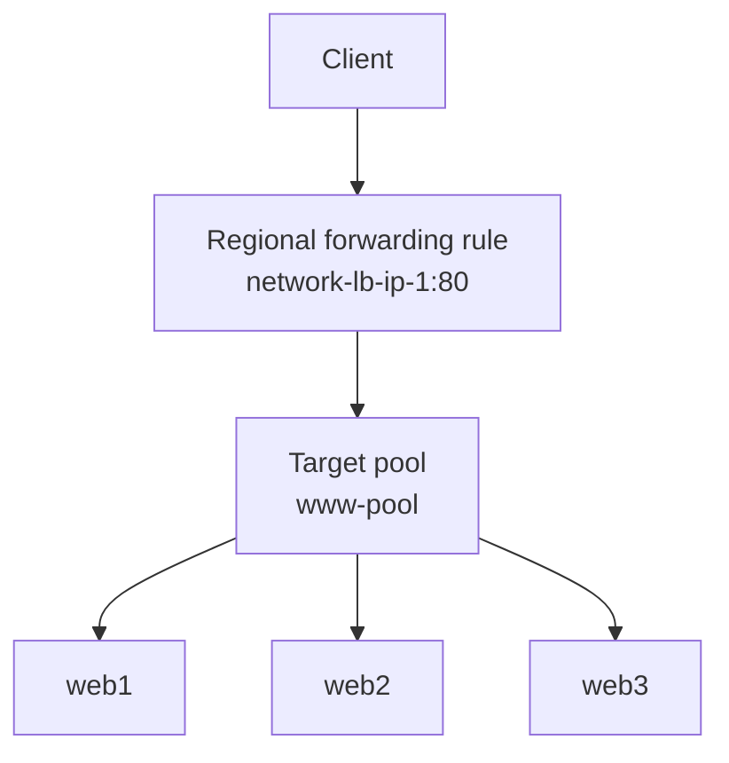
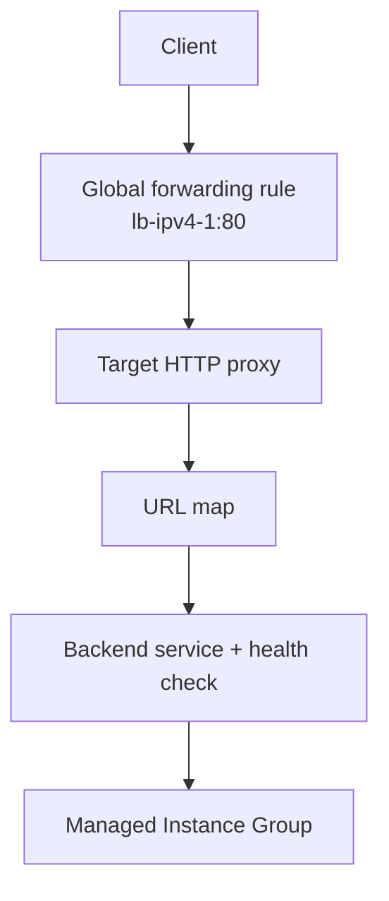

# Implement Load Balancing on Compute Engine: Challenge Lab (GSP313)

中文名稱：在 Compute Engine 導入負載平衡器—挑戰研究室

> 課程路徑：Google Cloud Skills Boost `course_templates/648/labs/613025`<br>
> Lab ID：GSP313<br>
> 備考目標：Associate Cloud Engineer（ACE）<br>
> 驗證日期：2026-08-25<br>
> 文件類型：Lab 任務解析、Cloud Shell 操作範本、ACE 考點

---

## 1. Learning Objectives

完成本 Lab 後，應能：

1. 在 `default` VPC network 建立三台 Compute Engine VM，並透過 startup script 安裝 Apache。
2. 使用 network tag 與 VPC firewall rule 開放 TCP/80。
3. 使用 regional static external IP、target pool 與 forwarding rule 建立區域型 Layer 4 負載平衡。
4. 使用 instance template 與 Managed Instance Group（MIG）建立可重複部署的 Web backend。
5. 設定 health check firewall rule、HTTP health check、backend service、URL map、target HTTP proxy 與 global forwarding rule。
6. 分辨 passthrough Network Load Balancer 與 proxy-based Application Load Balancer。
7. 依資源 scope 正確選用 `--zone`、`--region` 或 `--global`。

---

## 2. 核心概念摘要

這個 challenge lab 有三個評分任務：

| 任務 | 配分 | 核心資源 |
|---|---:|---|
| Task 1：Create multiple web server instances | 20 | VM、startup script、network tag、firewall rule |
| Task 2：Configure the load balancing service | 35 | regional external IP、target pool、regional forwarding rule |
| Task 3：Create an HTTP load balancer | 45 | instance template、MIG、health check、backend service、URL map、proxy、global forwarding rule |

### Lab 的兩條負載平衡路徑

| 比較 | Task 2 | Task 3 |
|---|---|---|
| 現行名稱 | Regional external passthrough Network Load Balancer | External Application Load Balancer／教材常稱 HTTP Load Balancer |
| OSI 層 | Layer 4 | Layer 7 |
| 流量處理 | Passthrough，不終止 TCP 連線 | Proxy-based，終止並代理 HTTP 連線 |
| Backend | 三台獨立 VM 加入 target pool | MIG 加入 backend service |
| Frontend scope | Regional | Lab 使用 Global |
| 路由能力 | 依 IP、protocol、port | 可依 host/path 等 HTTP 屬性路由 |
| Backend 看見的來源 | 保留原始封包來源特性 | Backend 連線來自 Google Front End／proxy 基礎架構 |

> **教材內容**：Task 2 使用 target pool。<br>
> **現行官方文件**：target pool 是 regional external passthrough Network Load Balancer 的 legacy backend；新建部署時，Google Cloud 建議優先使用 regional backend service。Lab 為配合評分仍應照題目使用 target pool。

---

## 3. Lab 前置資訊與占位符

公開 Lab 頁面的 `Region`、`Zone` 與 `image-family` 目前由動態模板帶入，離開已啟動的 Lab 工作階段時可能顯示空白或未展開字串。因此不要直接假設固定為 `us-central1`、`us-east1` 或其他位置。

開始 Lab 後，先從左側 Lab Details 或任務表格取得實際值：

```bash
export REGION="<LAB_ASSIGNED_REGION>"
export ZONE="<LAB_ASSIGNED_ZONE>"
export IMAGE_FAMILY="<LAB_ASSIGNED_DEBIAN_IMAGE_FAMILY>"
export PROJECT_ID="$(gcloud config get-value project)"

gcloud config set compute/region "$REGION"
gcloud config set compute/zone "$ZONE"
```

### 占位符說明

| 占位符 | 必須替換為 |
|---|---|
| `<LAB_ASSIGNED_REGION>` | Lab 指定 region，例如 `us-west1`；僅為格式示例，不代表本次答案 |
| `<LAB_ASSIGNED_ZONE>` | Lab 指定 zone，例如 `us-west1-b`；僅為格式示例 |
| `<LAB_ASSIGNED_DEBIAN_IMAGE_FAMILY>` | Lab 任務表指定的 Debian image family |

檢查目前設定：

```bash
gcloud config list project
gcloud config get-value compute/region
gcloud config get-value compute/zone
```

> Challenge lab 會檢查資源名稱、region/zone、machine type、tag 與關聯。資源能運作不代表一定符合評分器要求。

---

## 4. 詳細知識點

### 4.1 Startup script

Compute Engine startup script 會在 VM 啟動時由 guest environment 執行，適合安裝 Apache、啟動服務與建立測試頁面。它不是 image：每次新 instance 仍須執行初始化步驟。

常見陷阱：

- VM 已進入 `RUNNING`，不代表 `apt-get` 與 Apache 已完成。
- Debian image family 會指向該系列的最新非淘汰 image；Lab 評分仍可能要求指定 family。
- Script 的引號或換行錯誤，可能造成 Apache 安裝成功但首頁未被正確寫入。
- 應查看 serial port output 或 SSH 進 VM 確認 script 狀態。

### 4.2 Network tag 與 firewall rule

Network tag 是套用 VPC firewall rule 的目標條件之一。Tag 本身不會開放流量；必須搭配具有相同 `target-tags` 的 ingress rule。

Task 1 的關聯：

```text
VM tag: network-lb-tag
        ↓
Firewall target tag: network-lb-tag
        ↓
Allow ingress TCP/80
```

Task 3 的 health check 則使用另一個 tag：`allow-health-check`。兩組 tag 的目的不同，不應混淆。

### 4.3 Static external IP

負載平衡 frontend 使用 static external IP，可避免 frontend 位址因資源重建而改變：

- Task 2：`network-lb-ip-1` 是 regional external IPv4 address。
- Task 3：`lb-ipv4-1` 是 global external IPv4 address。

Regional address 不能直接拿給 global forwarding rule 使用，反之亦然。

### 4.4 Target pool

Target pool 是一組位於同一 region 的 backend VM。Regional external passthrough Network Load Balancer 的 forwarding rule 把 TCP/UDP 流量導向 target pool。

重要行為：

- Target pool 為 regional resource。
- Backend VM 必須位於相同 region。
- 流量傳送至 VM 的 `nic0`。
- 選擇 backend 時會根據來源與目的 IP/port 等資訊計算 hash；連續 `curl` 不一定每次輪到不同 VM。
- Target pool 是 legacy backend；新架構通常優先考慮 backend service-based Network Load Balancer。

### 4.5 Instance template 與 MIG

Instance template 是建立 VM 的不可變設定藍圖；MIG 根據 template 維持指定數量的同質 VM。

MIG 提供：

- 自動建立與替換 VM。
- Autohealing（需另外設定適當的 application health check）。
- Autoscaling（需另外設定 policy）。
- Rolling update。
- 與 backend service 整合。

> Load balancer health check 用來判斷是否把流量送到 backend；MIG autohealing health check 用來判斷是否重建 VM。兩者目的相關但動作不同。

### 4.6 Named port

Named port 是 instance group 的服務名稱到 port 的對應，例如 `http:80`。Backend service 的 `--port-name=http` 會參照這個名稱。

Named port 不會自動開啟 firewall，也不會讓應用程式開始監聽 port 80；三者都要分別成立：

1. Apache 正在 TCP/80 監聽。
2. Firewall 允許 health check 或 client 流量。
3. Backend service 與 instance group 對 port 的設定一致。

### 4.7 Health check

HTTP health check 定期向 backend 的指定 port/path 發送請求。只有 healthy backend 才會接收新流量。

Lab 要求 health check firewall rule：

```text
Source ranges: 130.211.0.0/22, 35.191.0.0/16
Target tag: allow-health-check
Protocol/port: TCP/80
Direction: ingress
```

不要把來源設成負載平衡器的 frontend IP；health check probe 來自 Google 指定的 probe ranges。

### 4.8 URL map 與 target HTTP proxy

- **URL map**：根據 host/path 將 HTTP request 導向 backend service。本 Lab 只有 default service。
- **Target HTTP proxy**：接收 forwarding rule 的 HTTP 流量，套用 URL map。
- **Global forwarding rule**：將 `lb-ipv4-1:80` 綁定至 `http-lb-proxy`。

---

## 5. Resource Scope

| Resource | Scope | 說明與影響 |
|---|---|---|
| VPC network `default` | Global | Subnet、firewall rule 與 VM 共同使用的網路 |
| VPC firewall rule | Global | Rule 屬於 VPC；可用 tag 限制套用的 VM |
| VM `web1`～`web3` | Zonal | 建立時使用 `--zone` |
| Target pool `www-pool` | Regional | Backend VM 必須位於相同 region |
| Address `network-lb-ip-1` | Regional | 搭配 regional forwarding rule |
| Task 2 forwarding rule | Regional | 必須與 target pool、IP 位於同一 region |
| Instance template `lb-backend-template` | Global（本 Lab 建立方式） | 可供不同 zone 的 MIG 使用 |
| MIG `lb-backend-group` | Zonal（本 Lab） | 以 `--zone` 建立 |
| HTTP health check `http-basic-check` | Global | 供 global backend service 使用 |
| Backend service | Global | 連結 instance group 與 health check |
| URL map `web-map-http` | Global | 將 request 導向 backend service |
| Target HTTP proxy `http-lb-proxy` | Global | 參照 URL map |
| Address `lb-ipv4-1` | Global | 搭配 global forwarding rule |
| Task 3 forwarding rule | Global | External Application Load Balancer frontend |

---

## 6. Architecture

### Task 2：Regional external passthrough Network Load Balancer



### Task 3：External Application Load Balancer



---

## 7. Google Cloud Console

Console 標籤可能更新；以下路徑用來理解資源關係，Challenge Lab 建議以 Cloud Shell 建立，較容易精確控制名稱與 scope。

### Task 1

- VM：`Console > Compute Engine > VM instances > Create instance`
- Firewall：`Console > VPC network > Firewall policies > Create firewall rule`

設定重點：

- Network：`default`
- VM names：`web1`、`web2`、`web3`
- Machine type：`e2-small`
- Network tag：`network-lb-tag`
- Firewall name：`www-firewall-network-lb`
- Target tag：`network-lb-tag`
- Source IPv4 ranges：`0.0.0.0/0`
- Protocol/port：`tcp:80`

### Task 2

- IP：`Console > VPC network > IP addresses`
- Load balancing：`Console > Network services > Load balancing`

需建立 `network-lb-ip-1`、`www-pool` 與 TCP/80 forwarding rule。

### Task 3

- Instance template：`Console > Compute Engine > Instance templates`
- MIG：`Console > Compute Engine > Instance groups`
- Load balancer：`Console > Network services > Load balancing > Create load balancer`

選擇 external Application Load Balancer 時，要核對 frontend 為 global IPv4、protocol 為 HTTP、port 為 80，backend 為 `lb-backend-group`。

---

## 8. Cloud Shell / gcloud

> 下列是依 Lab 公開任務規格整理的操作範本。請先把 `REGION`、`ZONE`、`IMAGE_FAMILY` 設成 Lab 工作階段實際指定值。不要在尚未確認動態值時直接整段執行。

### 8.1 Task 1 — 建立三台 Web VM

建立 startup script 變數：

```bash
read -r -d '' STARTUP_SCRIPT <<'EOF' || true
#!/bin/bash
apt-get update
apt-get install apache2 -y
service apache2 restart
echo "<h3>Web Server: $(hostname)</h3>" | tee /var/www/html/index.html
EOF
```

建立三台 VM：

```bash
for VM_NAME in web1 web2 web3; do
  gcloud compute instances create "$VM_NAME" \
    --zone="$ZONE" \
    --machine-type=e2-small \
    --network=default \
    --tags=network-lb-tag \
    --image-family="$IMAGE_FAMILY" \
    --image-project=debian-cloud \
    --metadata=startup-script="$STARTUP_SCRIPT"
done
```

指令解釋：

- Command group：`gcloud compute`
- Resource：`instances`
- Action：`create`
- `--zone`：VM 的 zone。
- `--machine-type`：使用 Lab 指定的 `e2-small`。
- `--network`：明確放入 `default` VPC。
- `--tags`：讓 firewall rule 只套用到這些 backend。
- `--image-family` / `--image-project`：從 Debian 官方 image project 取得 Lab 指定 family。
- `--metadata=startup-script=...`：開機時安裝並啟動 Apache。

建立 HTTP firewall rule：

```bash
gcloud compute firewall-rules create www-firewall-network-lb \
  --network=default \
  --direction=INGRESS \
  --action=ALLOW \
  --rules=tcp:80 \
  --source-ranges=0.0.0.0/0 \
  --target-tags=network-lb-tag
```

驗證 VM 與 External IP：

```bash
gcloud compute instances list \
  --filter='name=(web1 web2 web3)' \
  --format='table(name,zone.basename(),machineType.basename(),status,networkInterfaces[0].accessConfigs[0].natIP)'
```

逐台測試 Apache：

```bash
for VM_NAME in web1 web2 web3; do
  VM_IP="$(gcloud compute instances describe "$VM_NAME" \
    --zone="$ZONE" \
    --format='get(networkInterfaces[0].accessConfigs[0].natIP)')"
  curl --max-time 10 "http://$VM_IP"
done
```

若第一次失敗，先等待 startup script 完成；不要立刻判斷 firewall 或 Apache 一定設定錯誤。

### 8.2 Task 2 — 建立 Network Load Balancer

保留 regional static external IP：

```bash
gcloud compute addresses create network-lb-ip-1 \
  --region="$REGION"
```

建立 target pool：

```bash
gcloud compute target-pools create www-pool \
  --region="$REGION"
```

把三台 VM 加入 target pool：

```bash
gcloud compute target-pools add-instances www-pool \
  --instances=web1,web2,web3 \
  --instances-zone="$ZONE" \
  --region="$REGION"
```

建立 regional forwarding rule：

```bash
gcloud compute forwarding-rules create www-rule \
  --region="$REGION" \
  --address=network-lb-ip-1 \
  --ip-protocol=TCP \
  --ports=80 \
  --target-pool=www-pool
```

指令關係：

```text
network-lb-ip-1 → www-rule:80 → www-pool → web1/web2/web3
```

取得 frontend IP：

```bash
NETWORK_LB_IP="$(gcloud compute addresses describe network-lb-ip-1 \
  --region="$REGION" \
  --format='get(address)')"

echo "$NETWORK_LB_IP"
```

重複送出流量：

```bash
for REQUEST in {1..10}; do
  curl --max-time 10 "http://$NETWORK_LB_IP"
done
```

> Passthrough Network Load Balancer 依 flow hash 選擇 backend。HTTP keep-alive、來源 IP 與 ports 等條件可能使多次請求落到相同 VM；不要把「每次一定輪替」當作 round-robin 保證。

### 8.3 Task 3 — 建立 HTTP/Application Load Balancer

建立 backend startup script：

```bash
read -r -d '' LB_STARTUP_SCRIPT <<'EOF' || true
#!/bin/bash
apt-get update
apt-get install apache2 -y
service apache2 restart
echo "<h3>Page served from: $(hostname)</h3>" | tee /var/www/html/index.html
EOF
```

建立 instance template：

```bash
gcloud compute instance-templates create lb-backend-template \
  --machine-type=e2-medium \
  --network=default \
  --tags=allow-health-check \
  --image-family="$IMAGE_FAMILY" \
  --image-project=debian-cloud \
  --metadata=startup-script="$LB_STARTUP_SCRIPT"
```

建立 zonal MIG：

```bash
gcloud compute instance-groups managed create lb-backend-group \
  --zone="$ZONE" \
  --template=lb-backend-template \
  --size=2 \
  --base-instance-name=lb-backend
```

設定 named port：

```bash
gcloud compute instance-groups managed set-named-ports lb-backend-group \
  --zone="$ZONE" \
  --named-ports=http:80
```

允許 Google health check probes：

```bash
gcloud compute firewall-rules create fw-allow-health-check \
  --network=default \
  --direction=INGRESS \
  --action=ALLOW \
  --rules=tcp:80 \
  --source-ranges=130.211.0.0/22,35.191.0.0/16 \
  --target-tags=allow-health-check
```

建立 HTTP health check：

```bash
gcloud compute health-checks create http http-basic-check \
  --port=80
```

建立 global backend service：

```bash
gcloud compute backend-services create web-backend-service \
  --protocol=HTTP \
  --port-name=http \
  --health-checks=http-basic-check \
  --global
```

加入 MIG backend：

```bash
gcloud compute backend-services add-backend web-backend-service \
  --instance-group=lb-backend-group \
  --instance-group-zone="$ZONE" \
  --global
```

保留 global external IPv4：

```bash
gcloud compute addresses create lb-ipv4-1 \
  --ip-version=IPV4 \
  --global
```

建立 URL map：

```bash
gcloud compute url-maps create web-map-http \
  --default-service=web-backend-service
```

建立 target HTTP proxy：

```bash
gcloud compute target-http-proxies create http-lb-proxy \
  --url-map=web-map-http
```

建立 global forwarding rule：

```bash
gcloud compute forwarding-rules create http-content-rule \
  --address=lb-ipv4-1 \
  --global \
  --target-http-proxy=http-lb-proxy \
  --ports=80
```

完整資源鏈：

```text
lb-ipv4-1:80
  → http-content-rule
  → http-lb-proxy
  → web-map-http
  → web-backend-service + http-basic-check
  → lb-backend-group
  → MIG instances
```

### 8.4 驗證 HTTP Load Balancer

檢查 backend health：

```bash
gcloud compute backend-services get-health web-backend-service \
  --global
```

取得 frontend IP：

```bash
HTTP_LB_IP="$(gcloud compute addresses describe lb-ipv4-1 \
  --global \
  --format='get(address)')"

echo "$HTTP_LB_IP"
```

測試：

```bash
curl --max-time 10 "http://$HTTP_LB_IP"
```

Load Balancer 與 health check 傳播可能需要數分鐘。若 backend 尚未 healthy，先等候，再檢查 tag、firewall source ranges、named port、Apache 與 instance template startup script。

---

## 9. Command Output

使用者未提供本次 Cloud Shell 實際輸出，因此本節不虛構執行紀錄。以下只說明預期形態：

| 驗證指令 | 預期結果形態 |
|---|---|
| `gcloud compute instances list` | `web1`、`web2`、`web3` 狀態為 `RUNNING`，zone 與 machine type 正確 |
| `curl http://<VM_IP>` | HTML 顯示對應 VM hostname |
| `gcloud compute target-pools describe www-pool` | Instances 欄位包含三台 VM 的 resource URL |
| `curl http://<NETWORK_LB_IP>` | 回傳其中一台 `web1`～`web3` 的頁面 |
| `gcloud compute backend-services get-health ...` | MIG backend 最終顯示 `HEALTHY` |
| `curl http://<HTTP_LB_IP>` | 顯示 `Page served from: lb-backend-...` |

---

## 10. 認證考點

### ACE 重點

#### 考點一：先辨認 Layer 4 或 Layer 7

- 只需要高效能 TCP/UDP passthrough、保留封包特性：Network Load Balancer。
- 需要 HTTP host/path routing、TLS termination、proxy 功能：Application Load Balancer。

#### 考點二：Scope 必須一致

- Regional forwarding rule ↔ regional IP ↔ regional target pool。
- Global forwarding rule ↔ global IP ↔ target HTTP proxy ↔ URL map ↔ global backend service。
- VM/MIG 所在 zone 必須用正確的 `--zone` 或 `--instance-group-zone`。

#### 考點三：Firewall 不會因建立 Load Balancer 自動全部完成

- Client 到 Task 1 backend：`www-firewall-network-lb`、target tag `network-lb-tag`。
- Health checker 到 Task 3 backend：`fw-allow-health-check`、target tag `allow-health-check`、指定 probe ranges。

#### 考點四：健康檢查失敗的排查順序

1. VM 是否 `RUNNING`。
2. Apache 是否安裝完成且監聽 TCP/80。
3. Instance template 是否包含正確 startup script/tag。
4. MIG instance 是否由正確 template 建立。
5. Named port 是否為 `http:80`。
6. Health check 是否使用正確 port。
7. Firewall target tag 與 VM tag 是否一致。
8. Source ranges 是否包含官方 health check ranges。

#### 考點五：Static IP 的目的

Static external IP 提供穩定 frontend 位址，便於 DNS 或 client 使用。刪除 forwarding rule 不一定會刪除已保留的 address；正式環境需管理未使用 IP 的成本。

### 情境題線索

| 題目線索 | 優先答案方向 |
|---|---|
| HTTP path-based routing | External Application Load Balancer + URL map |
| TCP/UDP passthrough、regional backend | Regional external passthrough Network Load Balancer |
| Backend 全部 unhealthy | 檢查服務、health check、firewall ranges 與 tags |
| 需要一致 VM 設定及自動替換 | Instance template + MIG |
| IP 不應隨重建改變 | Reserve static external IP |
| Firewall 只應套用特定 backend | Target tags 或 service account target |
| Load balancer 有 IP 但回應失敗 | 沿 frontend → proxy → URL map → backend service → health check → MIG 排查 |

### 易混淆概念

| 概念 A | 概念 B | 差異 |
|---|---|---|
| Load balancer health check | MIG autohealing health check | 前者停止送流量；後者可觸發重建 VM |
| Network tag | Firewall rule | Tag 只是 selector；rule 才定義 allow/deny |
| Named port | Firewall port | Named port供 backend service 參照；firewall 決定封包是否通過 |
| Instance template | MIG | Template 是 VM 藍圖；MIG 維持一組 instance |
| Regional static IP | Global static IP | 必須搭配相同 scope 的 frontend |
| Target pool | Backend service | Target pool 是 Task 2 的 legacy backend；backend service 功能較完整 |

---

## 11. 教材與現行文件差異

| 類型 | 內容 | 官方來源 |
|---|---|---|
| 教材內容 | Task 2 以 `www-pool` target pool 建立 network load balancing service | [GSP313 Lab](https://www.skills.google/focuses/10258?parent=catalog) |
| 現行官方文件 | Target pool 是 regional external passthrough Network Load Balancer 的 legacy backend；新部署建議使用 backend service | [Passthrough Network Load Balancer overview](https://docs.cloud.google.com/load-balancing/docs/passthrough-network-load-balancer) |
| 教材內容 | Task 3 稱為 HTTP load balancer | [GSP313 Lab](https://www.skills.google/focuses/10258?parent=catalog) |
| 現行官方文件 | 現行產品分類稱 External Application Load Balancer；它是 proxy-based Layer 7 load balancer | [External Application Load Balancer overview](https://docs.cloud.google.com/load-balancing/docs/https) |
| 教材內容 | Health check firewall source ranges 為 `130.211.0.0/22`、`35.191.0.0/16` | [GSP313 Lab](https://www.skills.google/focuses/10258?parent=catalog) |
| 現行官方文件 | Classic Application Load Balancer 的官方設定範例仍列出這兩段 IPv4 ranges | [Set up a classic Application Load Balancer](https://docs.cloud.google.com/load-balancing/docs/https/ext-https-lb-simple) |
| 備考建議 | Lab 指定 target pool 時照規格完成；情境題詢問新架構時應留意 backend service-based 選項 | 推論，非官方考綱聲明 |

---

## 12. 常見錯誤排查

### Check my progress 無法通過

- 使用了錯誤 region 或 zone。
- Resource name、machine type、tag 與題目不一致。
- VM 未放在 `default` network。
- 把 regional IP 建成 global，或把 global IP 建成 regional。
- Firewall rule 名稱正確，但 target tag 或 source range 錯誤。
- Instance template 沒有 `allow-health-check` tag。
- MIG 未使用 `lb-backend-template`。
- URL map 或 proxy 名稱不符合規格。

### VM IP 可以連，但 Network LB IP 不行

- `www-rule` 的 region 與 address/target pool 不一致。
- Target pool 尚未包含三台 VM。
- Forwarding rule 沒有 TCP/80。
- Backend VM 不在 target pool 所在 region。

### HTTP LB frontend 可建立，但 backend unhealthy

- Startup script 還沒完成，或 Apache 未監聽 80。
- `allow-health-check` tag 未進入 template/MIG instance。
- Firewall rule 缺少正確 probe ranges。
- Named port 未設為 `http:80`。
- Backend service 指向錯誤的 health check 或 instance group。

### `curl` 沒有立即輪替 backend

這不一定是錯誤。Task 2 的 passthrough load balancing 使用 flow hash；Task 3 也可能因 connection reuse、backend selection 與健康狀態而連續命中相同 instance。

---

## 13. 本章快速複習

### 資源鏈速記

```text
Task 1：VM + startup script + tag + firewall

Task 2：Regional IP → forwarding rule → target pool → individual VMs

Task 3：Global IP → forwarding rule → HTTP proxy → URL map
        → backend service + health check → MIG → instances
```

### 十個必記項目

1. `web1`、`web2`、`web3` 使用 `e2-small`。
2. Task 1 VM tag 是 `network-lb-tag`。
3. Task 1 firewall 是 `www-firewall-network-lb`，允許 TCP/80。
4. Task 2 IP 是 `network-lb-ip-1`，target pool 是 `www-pool`。
5. Target pool 與 forwarding rule 都是 regional。
6. Task 3 template 是 `lb-backend-template`，machine type 是 `e2-medium`。
7. MIG 是 `lb-backend-group`。
8. Health check tag 是 `allow-health-check`，rule 是 `fw-allow-health-check`。
9. URL map 是 `web-map-http`，proxy 是 `http-lb-proxy`。
10. Task 3 的 `lb-ipv4-1` 與 forwarding rule 是 global。

---

## 認證重點統整

## ACE 重點

### 一句話判斷

- **Layer 4 passthrough**：forwarding rule → target pool/backend service → VM。
- **Layer 7 HTTP proxy**：forwarding rule → proxy → URL map → backend service → MIG。
- **全部 unhealthy**：先查應用程式是否監聽，再查 health check、firewall ranges 與 tags。
- **多台同質 VM**：instance template 定義，MIG 維持數量。
- **指令 scope 錯誤**：檢查 `--zone`、`--region`、`--global`。

### 考前自我檢查

- [ ] 我能解釋 target pool 與 backend service 的差異。
- [ ] 我能畫出 Application Load Balancer 的資源鏈。
- [ ] 我知道 URL map 與 target HTTP proxy 的角色。
- [ ] 我知道 health check firewall 為何不能只允許 client IP。
- [ ] 我能分辨 regional 與 global static IP。
- [ ] 我知道 named port 不等於 firewall rule。
- [ ] 我知道 Load Balancer health check 與 MIG autohealing 的差異。
- [ ] 我會用 `get-health`、`instances list` 與 `curl` 排查問題。

## 待補材料與限制

- 公開頁面未展開本次 Lab 工作階段分配的 region、zone 與 Debian image family，本文刻意保留為占位符。
- 使用者尚未提供 Cloud Shell 實際 command/output，因此未建立「我的實際操作」紀錄，也未虛構成功輸出。
- 若之後提供 Lab 畫面、終端機紀錄或錯誤訊息，可再追加逐步操作證據與錯誤排查結果。

---

## 官方資料來源

- [GSP313：Implement Load Balancing on Compute Engine—Challenge Lab](https://www.skills.google/focuses/10258?parent=catalog)
- [Implementing Cloud Load Balancing for Compute Engine course](https://www.cloudskillsboost.google/course_templates/648)
- [Passthrough Network Load Balancer overview](https://docs.cloud.google.com/load-balancing/docs/passthrough-network-load-balancer)
- [Target pool-based regional external passthrough Network Load Balancer](https://docs.cloud.google.com/load-balancing/docs/network/networklb-target-pools)
- [Set up a target pool-based regional external passthrough Network Load Balancer](https://docs.cloud.google.com/load-balancing/docs/network/setting-up-network)
- [Backend service-based regional external passthrough Network Load Balancer](https://docs.cloud.google.com/load-balancing/docs/network/networklb-backend-service)
- [External Application Load Balancer overview](https://docs.cloud.google.com/load-balancing/docs/https)
- [Set up a global external Application Load Balancer with VM instance group backends](https://docs.cloud.google.com/load-balancing/docs/https/setup-global-ext-https-compute)
- [`gcloud compute target-pools create`](https://docs.cloud.google.com/sdk/gcloud/reference/compute/target-pools/create)
- [`gcloud compute instance-groups managed create`](https://docs.cloud.google.com/sdk/gcloud/reference/compute/instance-groups/managed/create)
- [`gcloud compute instance-groups managed set-named-ports`](https://docs.cloud.google.com/sdk/gcloud/reference/compute/instance-groups/managed/set-named-ports)

> Google Cloud Console 標籤、產品名稱與 `gcloud` 行為可能更新。考試與實作前應再次核對最新官方文件；Challenge Lab 作答時則以當次工作階段顯示的動態值與評分規格為準。
