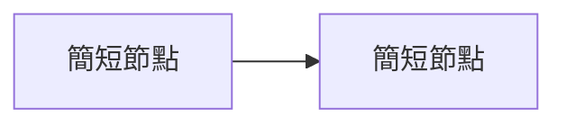

# 課程完整名稱

> 課程：<官方或 Skills Boost 課程連結><br>
> 目標：Google Cloud Associate Cloud Engineer（ACE）<br>
> 技術核對日期：YYYY-MM-DD<br>
> 建議順序：說明最適合的閱讀順序。

## 課程定位與涵蓋範圍

說明課程用途、時數、模組與它在認證學習路線中的位置。

## 來源限制

說明已取得與未取得的課程材料，不捏造逐字稿、lab instruction 或實際 Terminal Output。

!!! update "官方文件更新"
    清楚標示教材和現行 Google Cloud 官方文件的差異與核對日期。

## Chapter 1 — 章節名稱

### Learning Objectives

- 本章完成後能夠理解或操作的事項。

### 先備知識

沒有先備要求時可省略本節。

### 核心概念

#### 細部技術主題

保留官方英文服務名稱，第一次出現時補充繁體中文說明。

### Resource Scope

| Resource | Scope | 說明 |
|---|---|---|
| Resource name | Global／Regional／Zonal | 說明資源邊界 |

### Architecture



圖下補充流量方向、resource boundary 與必要限制。

### Google Cloud Console

1. `Console > Product > Page`
2. 確認 project、region／zone 與預計變更的資源。

### Cloud Shell / gcloud CLI

```bash
gcloud service resource action RESOURCE_NAME \
  --project=PROJECT_ID
```

- Command group：`gcloud service resource`
- Action：`action`
- Parameter：全大寫字串是 placeholder

### Terminal Output

只有實際執行過的內容才能標為「實際執行結果」。下列格式僅供模板示範：

**範例輸出**

```text
FIELD       VALUE
example     example-value
```

### 實際操作紀錄

記錄操作時間、project（避免敏感資訊）、目的、原始指令、結果與清理方式；沒有紀錄時省略。

### 常見錯誤與排查方式

| 現象 | 檢查順序 | 修正方向 |
|---|---|---|
| 錯誤訊息 | account → project → scope → IAM → network | 使用最小變更修正 |

### Pricing 與成本注意事項

說明計費維度與查價入口，不把可能變動的價格硬編碼成永久事實。

### ACE 考試重點

!!! ace "ACE 考點"
    記錄服務選型、resource scope、操作順序與常見陷阱。

### PCA 延伸考點

沒有架構治理延伸時可省略本節。

### 易混淆概念比較

| 概念 A | 概念 B | 判斷方式 |
|---|---|---|
| A | B | 說明差異 |

### 本章摘要

- 用少量條目回顧最重要的技術判斷。

### 複習問題

1. 提出能檢查理解、而非只背名詞的問題。

### 教材與現行文件差異

只有確認存在差異時才保留本節，並附官方來源。

## 認證重點統整

彙整跨 Chapter 的 ACE 選型、scope、指令與常見陷阱。

## 官方來源

- [Google Cloud 官方文件](https://cloud.google.com/docs)

## 最後更新

YYYY-MM-DD
